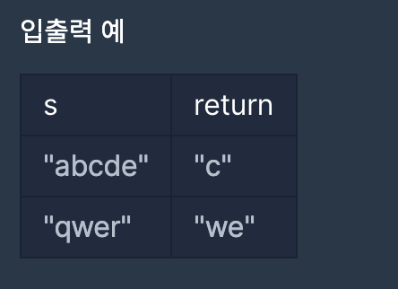

### 문제 설명
단어 s의 가운데 글자를 반환하는 함수, solution을 만들어 보세요. 단어의 길이가 짝수라면 가운데 두글자를 반환하면 됩니다.

***


### 제한사항
- s는 길이가 1 이상, 100이하인 스트링입니다.



***

### 나의 풀이

- `Math.round()` : 정수의 소수점을 반올림 합니다
- `Math.floor()` : 정수의 소수점을 내림 합니다
- `Math.ceil()` : 정수의 소수점을 올림 합니다 <br><br>

문자열 자르기 함수 중 `substr(시작인덱스 , 길이)` 을 사용하였습니다


```jsx
function solution(s) {
  var answer = "";
  let a = s.length;
  if (a % 2 === 0) {
    answer = s.substr(a / 2 - 1, 2);
  } else {
    answer = s.substr(Math.round(a / 2 - 1), 1);
  }
  return answer;
}
```