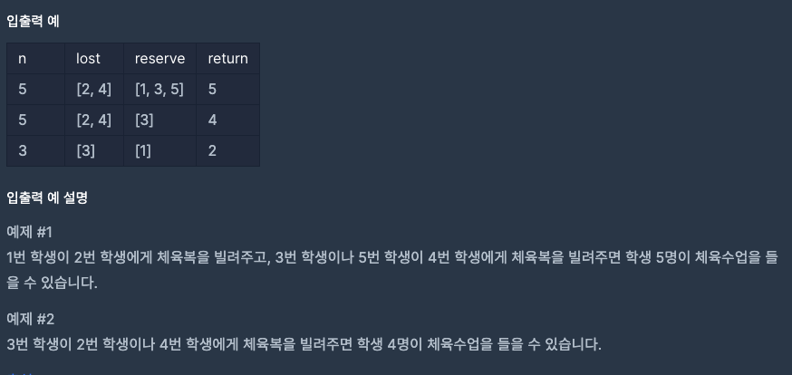

### 문제 설명
점심시간에 도둑이 들어, 일부 학생이 체육복을 도난당했습니다. 다행히 여벌 체육복이 있는 학생이 이들에게 체육복을 빌려주려 합니다. 학생들의 번호는 체격 순으로 매겨져 있어, 바로 앞번호의 학생이나 바로 뒷번호의 학생에게만 체육복을 빌려줄 수 있습니다. 예를 들어, 4번 학생은 3번 학생이나 5번 학생에게만 체육복을 빌려줄 수 있습니다. 체육복이 없으면 수업을 들을 수 없기 때문에 체육복을 적절히 빌려 최대한 많은 학생이 체육수업을 들어야 합니다.<br>

전체 학생의 수 n, 체육복을 도난당한 학생들의 번호가 담긴 배열 lost, 여벌의 체육복을 가져온 학생들의 번호가 담긴 배열 reserve가 매개변수로 주어질 때, 체육수업을 들을 수 있는 학생의 최댓값을 return 하도록 solution 함수를 작성해주세요.

***

### 제한사항
- 전체 학생의 수는 2명 이상 30명 이하입니다.
- 체육복을 도난당한 학생의 수는 1명 이상 n명 이하이고 중복되는 번호는 없습니다.
- 여벌의 체육복을 가져온 학생의 수는 1명 이상 n명 이하이고 중복되는 번호는 없습니다.
- 여벌 체육복이 있는 학생만 다른 학생에게 체육복을 빌려줄 수 있습니다.
- 여벌 체육복을 가져온 학생이 체육복을 도난당했을 수 있습니다. 이때 이 학생은 체육복을 하나만 도난당했다고 가정하며, 남은 체육복이 하나이기에 
- 다른 학생에게는 체육복을 빌려줄 수 없습니다.
<br><br>



***

### 나의 풀이

```jsx
function solution(n, lost, reserve) {
  var answer = 0;

// 잃어버린 사람이 여유가 있는지 확인합니다.
  const losts = lost.filter((x) => !reserve.includes(x));
// 여유 있는 사람이 잃어버렸는지 확인합니다
  const spare = reserve.filter((x) => !lost.includes(x));

// 문제에 배열들이 순차적으로 되어있다는 말이 없으므로 정렬을 합니다
  losts.sort();
  spare.sort();

// 우선 입을 수 있는 사람을 계산합니다 전체 인원수에서 잃어버린 사람을 뺍니다.
  answer += n - losts.length;


  spare.forEach((x) => {
    let a = x + 1; // 뒤에 빌려 줄 사람
    let b = x - 1; // 앞에 빌려 줄 사람

    //여유 있는 사람 중 잃어버린 사람을 빌려줄 수 있는지 확인 합니다
    if (losts.includes(a)) {
      answer++;
      // 중복 방지로 빌려준후 잃어버린 사람 배열에서 삭제 합니다.
      losts.splice(losts.indexOf(b), 1); 
    } else if (losts.includes(b)) {
      answer++;
      losts.splice(losts.indexOf(b), 1);
    }
  });

  return answer;
}
```