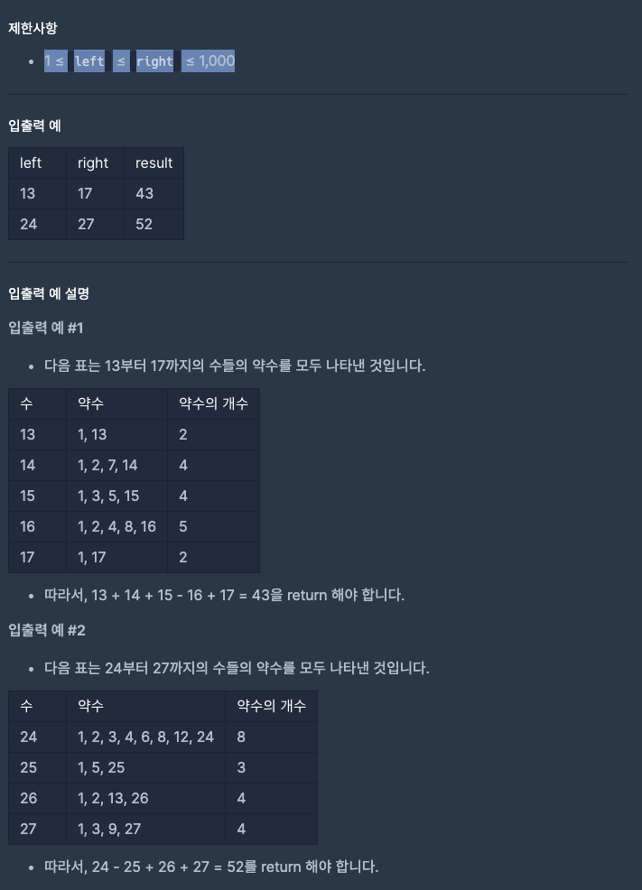

### 문제 설명
두 정수 left와 right가 매개변수로 주어집니다. left부터 right까지의 모든 수들 중에서, 약수의 개수가 짝수인 수는 더하고, 약수의 개수가 홀수인 수는 뺀 수를 return 하도록 solution 함수를 완성해주세요.

***

### 제한사항
- 1 ≤ left ≤ right ≤ 1,000
<br><br>



***

```jsx
function solution(left, right) {
  var answer = 0;
  let count = 0;
  for (let j = left; j <= right; j++) {
    for (let i = 1; i <= j; i++) {
      if (j % i === 0) {
        count++;
      }
    }
    if (count % 2 === 0) {
      answer += j;
      count = 0;
    } else {
      answer -= j;
      count = 0;
    }
  }
  return answer;
}
```

### 다른사람 풀이
다른사람의 코드를 보는 중 짧고 간결하게 작성한 코드가 있어 추가하였습니다.<br>

`Number.isInterger` 는 주어진 값이 정수인지 판단하는 메소드 이며 `Math.sqrt()`

```jsx

function solution(left, right) {
    var answer = 0;
    for (let i = left; i <= right; i++) {
        if (Number.isInteger(Math.sqrt(i))) {
            answer -= i;
        } else {
            answer += i;
        }
    }
    return answer;
}
```