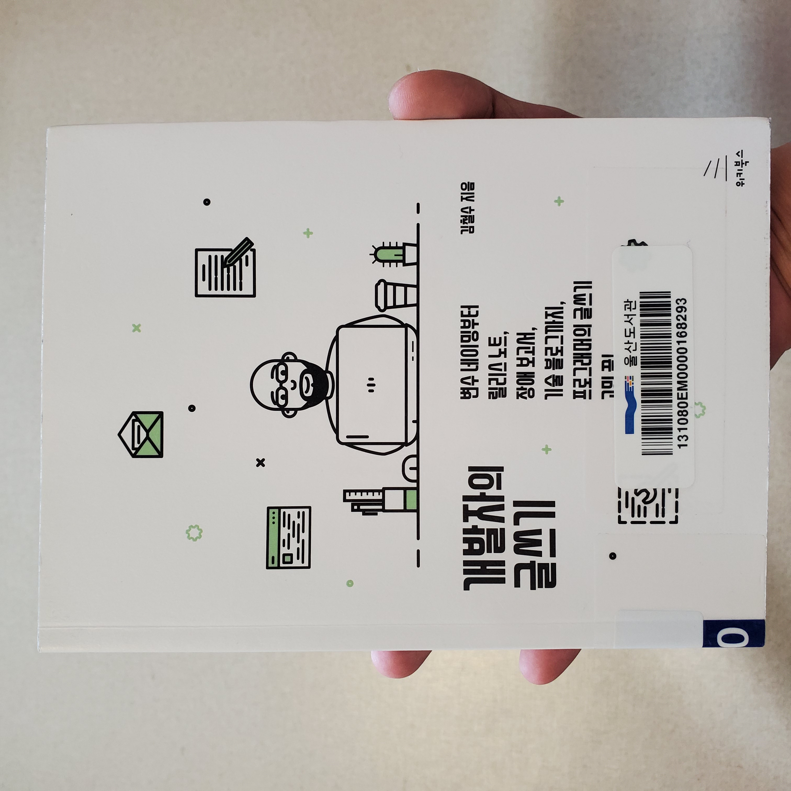
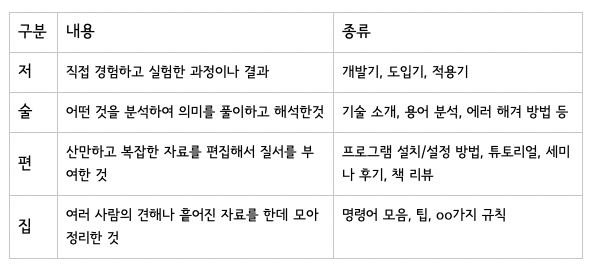

작년부터 개발 공부를 시작해 인터넷 강의로 조금씩 따라 하면서 클론 강의를 듣는데 그 시간에는 코드를 보며 아~ 이게 이렇게 됐구나 아~ 이건 이렇게 된 거구나 하고 눈으로만 따라 쓱 넘어갔더니 며칠이 지나 다시 그 코드를 보면 또 이해가 되지 않았다 주석을 조금씩 달아 놓기는 했지만 그래서 쉽게 이해가 가지 않아 정말 난 개발에 소질이 없는 건가 저번에 배웠는데 왜 기억을 못 하지?라는 생각이 들더라. 

그렇게 남들은 어떻게 개발 공부를 하나 찾던 중 **"TIL"**이라는 것을 배워 나도 그날 하루 배운 것을 매일 기록을 남겨야겠다 생각해 블로그를 찾다 여기저기 다니다 그래도 개발자가 되기 위해 자기만의 기술 블로그를 하나 만들면 좋겠다는 생각이 들어 **jekyll**을 통해 깃허브 블로그를 하나 만들었다

( 정말.. 이지 내가 원하는 기능을 하나 추가할 때마다 기본 1박2일의 시간을 투자해야 한다는 것을 알았더라면...) 

그렇게 차츰차츰 매일의 기록을 옮길 때마다 글을 쓰는 게 너무 단조롭고 내가 썼던 글을 읽어봐도 이해가 되지 않았다.. 머리로는 마음속으로는 이건 이렇게 되는구나 하고 넘어갔지만 막상 글을 써서 남들에게 설명하기가 도통 어려운 게 아니었다 

남들은 또 어떻게 쓰나 열심히 염탐하던 중 "개발자의 글쓰기라는 책을 발견해서 당장 도서관에 달려가 책을 빌렸다 

1. 개발자가 알아야 할 글쓰기 기본
2. 개발 시간을 줄여주는 이름 짓기와 주석 쓰기
3. 사용자와 소통하는 에러 메시지 쓰기
4. 독자 관점에서 릴리스 문서와 장애 보고서 쓰기
5. 설명, 묘사, 논증, 서사로 개발 가이드 쓰기
6. 수주를 돕는 SI 제안서 쓰기
7. 기술 블로그 쉽게 쓰고 운영하기

목차로는 총 7장으로 구성되어 있고 아래에서 기억에 남는 글들을 정리를 해보았다. 

***

### 1장. 개발자의 생각을 글로 표현하는 데는 크게 세 가지 방법
 

1. 서술식
    - ~다 로 끝나는 완전한 문장으로 구성된 글
    - 무엇을 설명하거나 논증할 때로 주로 사용
    - 소설, 신문 기사, 개발 가이드
2. 개조식
    - 신문의 헤드라인을 쓰거나 어떤 사항을 나열 할 때 사용한다.
    - 명사(완료, 증대 등)나 용언의 명사형(~했음)으로 끝내는 것
    - 주로 릴리스 문서나 장애 보고서를 쓸대 사용

3. 도식
    - 사물의 구조나 관계, 상태를 그림이나 서식으로 보여주는 것

 

***

### 2장. 변수 이름 짓기

많은 개발자들이 이름 짓는 것에 힘들어한다고 한다 나 또한 변수 이름을 짓는데 도저히 생각이 안 날 때나 급할 때는 그냥 아무 단어를 집어 넣고 나중에 바꿔야지 하고 생각하다 보면 어느새 코드는 점점 쓰레기통에 들어가기 일보 직전이라는 것을 알게 되었다..

<u>좋은 이름을 짓기위해 5가지 기준 SMART를 제시했는데</u>

- easy to Search 검색하기쉽고
- easy to Mix 조합하기 쉽고
- easy to Agree 수긍하기 쉽고
- easy to Remember 기억하기 쉽고
- easy to Type 입력하기 쉽게

<u>이렇게 5가지 기준을 제시했다 클린 코드가 되기 위해 첫 번째는 이름을 어떻게 짓느냐에 따라 달린 것 같다</u>

 

***

### 4장. 릴리스 문서와 장애 보고서

쉽게 말해 우리가 어플 업데이트할 때 세부사항을 보면 나와있는 것들이 릴리스 문서와 같은 개념이다 4가지 단계를 제시했다

1. **선정하기** → 회사, 개발자, 독자의 관심을 순위나 수준으로 보고 정한다
2. **분류하기** → 비슷한 체인지 로그끼리 묶는다
3. **요약하기** → 문장 단위로 요약
4. **종합하기** → 내용 전체를 종합해서 한 문장으로 만들고 그것을 로그 첫 줄에 작성

카카오톡을 업데이트 할때 보이는 항목들인데 이거와 비슷하다고 생각하면 된다

나는 이것을 깃허브에 바로 적용해 봤는데 버전 관리하기도 쉽고 내가 언제 무엇을 했는지 한눈에 볼 수 있어 도움이 많이 됐다 

원래 깃허브로 커밋을 할 때 뭘 적어야할지도 모르겠고 변경한 것을 하나하나 적기에는 귀찮아서 " . " 이나 그냥 숫자를 적고 말았는데 나중에 코드가 잘 못 됐을 때 이전 코드를 확인하려면 이렇게 커밋을 해버리면 찾지를 못한다..

그래서 이것 또한 잘 한 것은 아니지만 약간 시간이 걸리더라도 이렇게 커밋을 정리하여 큰 주제를 적고 아래에 세부내용을 적으면 나중에 찾아볼 때도 훨씬 편하고 취업을 할 때도 면접관들은 포트폴리오를 크게 유심히 보지 않고 이런 깃허브 커밋 기록을 많이 본다고 들었다

***

### 7장. 기술 블로그

기술 블로그를 쉽게 쓰는 방법 3가지를 제시했다

- **주제 의식을 버리고 소재 의식으로 쓰기**
    - 소재 의식은 독자와 상관없이 대상이나 상황에 맞닥뜨렸을 때부터 그 대상이나 상황에서 벗어날 대까지 겪은 일을 담당하게 정리하면 된다

      누구에게 주제의식을 주지 못하는 입장으로 생각을 할 수 있는 문장을 적기 보다 그저 내 상황에서 겪은 일을 정리하면 되겠다

- **독자 수준이 아니라 자기 수준으로 쓰기**
    - 무조건 쉽게만 쓴 글을 읽은 독자가 그 내용을 얼마나 활용할 수 있을지 알 수 없다. 그러니 차라리 기술 블로그를 쓸 때는 독자 수준이 아니라 작성자 수준으로 쓰는 편이 낫다

      최대한 쉽게 모든 사람이 알아들을 수 있도록 글을 쓰기 위해 단어 선택이라던가 풀이를 하다 보니 글이 점점 더 길어지고 깔끔하지 못하는 거 같았는데 이 글을 읽고 생각이 좀 바뀌었다 너무 쉽게 글을 쓰기보다 내 수준에 맞게 글을 써야겠다

- **재미있게 글을 쓰기**
    - 기술 블로그는 그 글을 쓴 사람의 경험을 독자가 온몸으로 공감하고 끄덕이게 만들어야 한다.

      가장 어려운 부분이기도 하지만 글을 최대한 재미있게 술술 읽히는 글을 써보도록 해야겠다

기술 블로그에는 4종류가 있다

