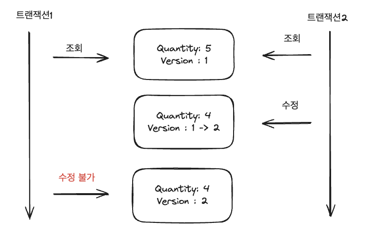
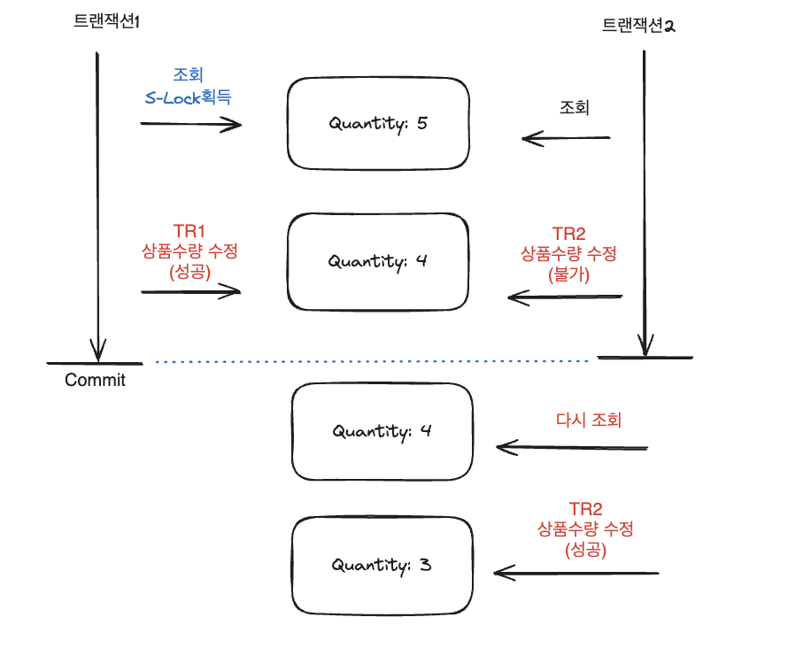
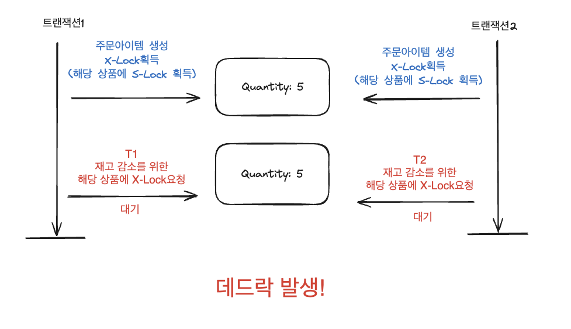

## 재고 감소에 대한 문제점

개인 프로젝트를 진행하면서 재고 감소에 관하여 문제가 발생하였습니다 주문을 하게 되면 해당 상품의 재고를 감소시켜야 되고 주문이 취소가 되면 다시 재고가 증가해야 합니다 하지만 서버가 여러 개라 여러 스레드가 하나의 상품에 대해 재고 감소를 하게 될 때 어떻게 될까? 라는 생각이 들었습니다 이런 문제를 **동시성 문제**라고 하는데 어떤 방법으로 해결할 수 있는지 알아보겠습니다

## 어떻게 해결해야 할까?

보통 데이터베이스를 이용하여 추가, 삭세, 업데이트 등을 작업할 때는 트랜잭션을 사용하여 작업을 하게 됩니다 하지만 동시성 이슈는 트랜잭션만 사용할 경우 문제를 해결할 수는 없습니다 락과 함께 이용하여 해결할 수 있는데 아래의 글에서 락이 무엇인지 그리고 어떤 종류들이 있는지 살펴보겠습니다

<br/>

## 데이터베이스에서의 락

### 락 이란?

트랜잭션을 시작하고 아직 커밋 되기 전에 다른 스레드에서 동시에 같은 데이터를 수정하게 되면 여러 가지 문제가 발생이 되는데 이 부분을 방지하기 위해 사용되는 개념이 락입니다 예를들어 1번 스레드가 데이터를 수정하고 있으면 2번 스레드에서는 1번 스레드에서 참조하고 있는 데이터를 수정할 수 없게 막을 수 있습니다 이를 통해 데이터의 일관성을 보장하고, 동시에 수행되는 여러 트랜잭션 간의 충돌을 방지할 수 있습니다

<br/>

### 락의 종류

**공유 Lock (S-Lock)**
**데이터를 읽을 때 사용되는 Lock**입니다 이 Lock은 공유 Lock 끼리는 동시에 접근이 가능\*\*합니다 즉, 하나의 데이터를 읽는 것은 여러 사용자가 동시에 할 수 있다는 것입니다 하지만 공유 Lock이 설정된 데이터에 베타 Lock을 사용할 수는 없습니다

**베타 Lock (X-Lock)**
**데이터를 변경하고자 할 때 사용**되며, 트랜잭션이 완료될 때까지 유지됩니다 **베타락은 Lock이 해제될 때까지 다른 트랜잭션(읽기 포함)은 해당 리소스에 접근할 수 없습니다** 또한 해당 Lock은 다른 트랜잭션이 수행되고 있는 데이터에 대해서는 접근하여 함께 Lock을 설정할 수 없습니다 주로 INSER, UPDATE, DELETE등의 쿼리문을 실행할때 사용됩니다

<br/>

## JPA에서의 락에 대한 개념

### 낙관적 락

트랜잭션 대부분이 서로 충돌하지 않는다는 가정하는 방법으로 JPA가 제공하는 `Version` 관리 기능을 사용하여 처리하는 것응 말합니다

에시코드를 보기 전에 낙관적락이 어떻게 처리되는지 한번 알아보겠습니다



1. 낙관적 락은 데이터를 조회할 때는 특별한 락을 설정하지 않아 여러 트랜잭션이 동시에 같은 데이터를 자유롭게 읽을 수 있습니다 이때 읽으려고 하는 데이터와 버전 정보를 같이 조회합니다
2. 트랜잭션 2가 재고수량을 감소시킵니다 이때 조회할 때 데이터와 함께 저장했던 버전 정보를 검사합니다 현재 버전과 조회할 때 저장했던 버전과 일치하는지 검사합니다 만약 버전 정보가 일치하다면 수량을 업데이트합니다
3. 트랜잭션 2의 수량 변경은 정상적으로 업데이트가 되었습니다
4. 하지만 트랜잭션 1의 수량은 변경할 수가 없습니다 이미 트랜잭션 2에서 수량을 변경한 후 버전을 올렸기 때문에 트랜잭션 1에서 조회할 때 저장한 버전과 일치하지 않기 때문에 `ObjectOptimisticLockingFailureException` 예외를 던집니다

<br/>

**예시코드**

```java
@Entity
@Getter
@NoArgsConstructor
public class Products extends BaseTimeEntity {
    @Id
    @GeneratedValue(strategy = GenerationType.IDENTITY)
    @Column(name = "product_id")
    private Long id;

	@Version
	private Integer version;

    @Column(name = "quantity")
    private int quantity;

    public void decreaseQuantity(int quantity) {
        this.quantity -= quantity;
    }

    public void increaseQuantity(int quantity) {
        this.quantity += quantity;
    }
}
```

**버전 정보 불일치로 데이터변경 실패시에 관한 로직 처리**

```java
@Service
@RequiredArgsConstructor
public class ProductService {
    private ProductRepository productRepository;

    @Transactional
    public Product decreaseProduct(Long productId, int quantity) {
        try {
            Product product = productRepository.findById(productId);
            product.decreaseQuantity(product.getQuantity() - quantity);

            return productRepository.save(product);
        } catch (ObjectOptimisticLockingFailureException e) {

	        // 충돌 발생시 복구 관련 로직..

            throw new RuntimeException("수량 감소 중 충돌발생");
        }
    }
}
```

<br/>

### 비관적 락

모든 트랜잭션에서 충돌이 발생한다는 것을 가정하고, 우선 락을 거는 방법을 말합니다 JPA에선 이를 `@Lock` 어노테이션을 사용하여 처리할 수 있습니다 **LockModeType** 의 `PESSIMISTIC_WRITE` 으로 `X-Lock` 을, `PESSIMISTIC_READ` 으로 `S-Lock` 을 조회 쿼리에 사용할 수 있습니다. 아래에서 각각의 옵션에 대해서 조금 더 자세하게 알아보겠습니다

**@PESSIMISTIC_READ**



1. **트랜잭션 1과 트랜잭션 2가 `Quantity: 5`를 조회합니다.**
   - `PESSIMISTIC_READ` 락은 이 경우 두 트랜잭션이 데이터를 읽는 것을 허용합니다. 둘 다 `Quantity`가 5임을 확인할 수 있습니다.
2. **트랜잭션 1에서 `Quantity`를 4로 감소시킨 후 아직 커밋 하지 않았습니다.**
   - 이 변경은 트랜잭션 1 내에서만 보이며, 외부에는 아직 반영되지 않았습니다. 트랜잭션 1이 커밋 하기 전까지는 이 변경이 다른 트랜잭션에는 보이지 않습니다.
3. **트랜잭션 1에서 커밋을 수행하기 전에 트랜잭션 2에서 `Quantity` 변경을 시도할 경우, 어떻게 될까요?**
   - `PESSIMISTIC_READ` 락은 다른 트랜잭션에서 데이터를 변경하는 것을 방지합니다. 따라서 트랜잭션 1이 커밋하거나 롤백을 수행하여 락을 해제할 때까지 트랜잭션 2는 `Quantity`의 변경을 시도할 수 없습니다. 트랜잭션2는 락이 해제될 때까지 대기하게 됩니다.
4. 트랜잭션 1에서 커밋이 완료되면 트랜잭션 2에서 `Quantity` 를 수정할 수 있습니다

<br/>

**[ 사용법 ]**

```java
public interface ProductRepository extends JpaRepository<Products, Long> {

    @Lock(LockModeType.PESSIMISTIC_READ)
    @Query("select p from Products p  where p.id = :productId")
    Optional<Products> findByProductId(@Param("productId") Long productId);
}
```

<br/>

**@PESSIMISTIC_WRITE**


1. **트랜잭션 1에서 `Quantity: 5`를 조회하고 `PESSIMISTIC_WRITE` 락을 설정합니다**
   - 트랜잭션 1은 `Quantity` 값을 읽고 해당 데이터에 대한 X-Lock 을 설정합니다. 이 락은 다른 트랜잭션이 해당 데이터를 읽거나 수정하는 것을 방지합니다
2. **트랜잭션 2도 같은 데이터를 조회하려고 시도합니다**
   - `PESSIMISTIC_WRITE` 락이 설정된 상태에서는 트랜잭션 2가 데이터를 읽는 것조차 차단됩니다 따라서 트랜잭션 2는 트랜잭션 1이 락을 해제할 때까지 (즉 커밋하거나 롤백할 때까지) 기다려야 하며 그 동안 데이터에 접근할 수 없습니다
3. **트랜잭션 1에서 `Quantity`를 4로 감소시키고 커밋을 수행합니다**
   - 트랜잭션 1은 변경 사항을 데이터베이스에 성공적으로 반영하고 커밋을 완료합니다 이 때 락이 해제되어 데이터가 다시 접근 가능해집니다
4. **트랜잭션 1이 커밋한 후 트랜잭션 2가 다시 `Quantity`를 조회할 수 있습니다**
   - 이제 트랜잭션 2는 업데이트된 `Quantity: 4` 값을 볼 수 있습니다

<br/>

**[ 사용법 ]**

```java
public interface ProductRepository extends JpaRepository<Products, Long> {

    @Lock(LockModeType.PESSIMISTIC_WRITE)
    @Query("select p from Products p  where p.id = :productId")
    Optional<Products> findByProductId(@Param("productId") Long productId);
}
```

<br/>

## 결론

락에 대한 개념과 비관적, 낙관적 락이 어떻게 흘러가는지 그리고 사용법을 알아보았습니다

### 어떤걸 선택 했는가

저는 비관적락을 통해 동시성 이슈를 해결하였습니다 상품 재고는 동시에 수정을 해야 하는 경우가 많을 거 같아 충돌이 자주 발생할 것 같았습니다 비관적 락은 낙관적 락 보다 무결성 보장이 된다는 장점이 있지만 이에 따른 단점도 있었습니다 데드락 발생 위험과 성능상의 문제인데 아래에서 조금 더 알아보겠습니다

### 데드락 발생 위험

락을 이용하여 트랜잭션을 이용하다 보면 데드락을 만날 확률이 높습니다 데드락은 두 개 이상의 작업 또는 프로세스가 서로가 점유하고 있는 자원을 기다리며 무한히 대기하는 상태를 말합니다

한 가지 예로 외래 키 참조로 인해 데드락 예시를 들어보겠습니다
외래 키 제약 조건으로 인해서 InnoDB의 경우 데이터 무결성을 위한 잠금이 연관된 테이블로 전파되면서 데드락이 발생할 수 있습니다

> **외래 키 제약조건이란?**
> 두 테이블 사이의 관계를 선언함으로써 데이터의 무결성을 보장해 주는 역할을 한다. 외래키 관계를 설정하면 하나의 테이블이 다른 테이블에 의존하게 된다.

> **외래 키 참조 무결성 예시**
> 예를 들어, '주문' 테이블에서 '상품' 테이블을 참조할 때, 각 주문에 대한 상품 ID가 실제로 '상품' 테이블에 존재하는지 확인해야 합니다

주문 아이템 테이블은 상품 테이블의 상품 ID키를 참조키를 사용하고 있습니다 이런 상황에서 어떻게 데드락이 발생되는지 알아보겠습니다



1. **트랜잭션 1과 트랜잭션 2 모두** 주문 번호를 생성하기 위해 `X-Lock`을 겁니다 그리고 주문 아이템은 참조키로 상품 ID값을 받고 있기 때문에 **InnoDB에서 외래 키 참조로 인해 해당 상품 아이템에 `S-Lock`을 겁니다**
2. 트랜잭션 1에서 주문 아이템을 정상적으로 만든 후 해당 상품의 재고를 감소시켜야 하기 때문에 해당 상품 아이템에 `X-Lock`을 요청합니다 **하지만 트랜잭션 2에서 아직 `S-Lock`을 가지고 있어 트랜잭션 1이 대기를 합니다**
3. 트랜잭션 2에서도 주문 아이템을 정상적으로 생성 후 해당 상품의 재고를 감소시켜야 하기 때문에 상품 아이템에 `X-Lock`을 요청합니다 **하지만 트랜잭션1번에서 `S-Lock`을 사용하고 있기 때문에 대기합니다**
4. **두 트랜잭션이 서로의 Lock 해제를 기다리면서 `데드락` 이 발생합니다**

### 해결방법

#### 1. 동일한 잠금 순서 사용

모든 트랜잭션이 동일한 순서로 데이터에 접근하고 잠금을 설정하도록 합니다 예를 들어 상품 테이블을 먼저 잠그고 그 다음에 주문 아이템 테이블에 접근하도록 하는 것입니다 이렇게 하면 서로 다른 트랜잭션이 서로의 잠금을 기다리는 상황이 발생하지 않습니다

**[ 예시 ]**

- **트랜잭션 A와 B 모두**:
  1. 상품 테이블에 접근하여 X-Lock을 획득
  2. 주문 아이템 테이블에 접근하여 X-Lock을 획득
  3. 필요한 작업 수행 후 커밋

<br/>

#### 2. 비관적 잠금 사용

데이터를 조회하는 시점에서 바로 수정을 예정하고 있다면 `SELECT ... FOR UPDATE` 구문을 사용하여 데이터를 처음 읽을 때부터 X-Lock을 획득합니다 이 방식은 데이터를 읽은 후에 다른 트랜잭션이 해당 데이터를 변경할 수 없게 만들어 데이터 일관성을 유지하면서 데드락의 가능성을 줄입니다

**[ 예시 ]**

- **트랜잭션 A**:

  1. `SELECT * FROM 상품 WHERE 상품ID = 1 FOR UPDATE;`
  2. 주문 아이템 추가 및 상품 재고 감소
  3. 커밋

- **트랜잭션 B**:
  1. `SELECT * FROM 상품 WHERE 상품ID = 1 FOR UPDATE;` (트랜잭션 A가 커밋할 때까지 대기)
  2. 주문 아이템 추가 및 상품 재고 감소
  3. 커밋

<br/>

#### 3. 트랜잭션 분리

특정 작업을 수행하는 동안에만 트랜잭션을 사용하고 다른 작업은 독립적인 트랜잭션에서 수행합니다 이를 통해 각 트랜잭션이 필요한 자원만을 잠그고 빠르게 해제할 수 있습니다

**[ 예시 ]**

- **주문 처리**:
  1. 주문 아이템 추가 작업을 별도의 트랜잭션에서 수행
  2. 주문 완료 후 상품 재고 감소를 다른 트랜잭션에서 수행
  3. 각 트랜잭션은 독립적으로 커밋 또는 롤백

<br/>

#### 성능 이슈

데이터 자체에 락을 걸어버리므로 **동시성이 떨어져** 성능 손해를 보게 됩니다 특히 읽기가 많이 이루어지는 데이터베이스의 경우에는 손해 크므로 잘 고민해서 적절하게 쓸 수 있도록 해야 합니다

<br/>
<br/>
