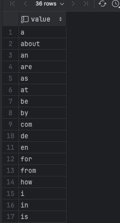

상품 검색 구현을 위해 like 문을 활용하여 상품 검색을 구현하였습니다 하지만 like 문은 풀 인덱스 스캔으로 데이터를 찾다 보니 데이터가 점점 많아지게 되면 검색 속도가 느려지지 않을까? 하는 고민이 들었습니다 그래서 어떻게 하면 조금 더 빠르게 검색할 수 있을까 하다가 레디스 또는 엘라스틱서치를 사용하는 방법도 있었지만 아직 이런 기술들을 사용하는 게 조금 과하다는 판단이 들어 다른 방법을 찾아보던 중 `Full-Text-Index`를 이용하는 방법을 알게 됐습니다 이 방법을 이용하여 검색하는 부분을 최적화해보겠습니다

## Full-Text-Index란?

MySql에서 지원하는 인덱스 중 하나의 타입에 속합니다

한 컬럼 안에서 많은 데이터(텍스트)가 담겨 있어 효율적으로 데이터를 찾고 싶을 때 사용할 수 있는 방법 중 하나입니다 쉽게 말하면 긴 문장의 데이터를 `잘게 쪼개어(파싱)` 진 `데이터(토큰)`를 인덱싱하여 사용자가 검색하게 될 키워드를 빠르게 검색할 수 있게 만듭니다

예를 들어 "나는 오늘 공부를 하였습니다" 라는 문장이 있다면 이 문장을 잘게 쪼개는 과정을 거친 후 잘 개 쪼개어진 단어들을 인덱스에 저장하는 것을 말합니다 이때 해당 문장을 잘 개 쪼개는 것을 파서(Parser)라 하며 파서를 거쳐 쪼개어진 데이터를 토큰이라 합니다 데이터를 쪼개는 과정에서 크게 두 종류의 파서가 있는데 어떤 것이 있는지 알아보겠습니다

### - Built-in parser

가장 기본적인 형태의 파서로, 데이터베이스가 내장하고 있는 기본 파서입니다. 이 파서는 텍스트를 공백 및 구두점(쉼표, 마침표 등) 단위로 분해하고, 파서 과정 중 Stop-word 목록에 포함된 단어를 만나게 된다면 인덱싱 과정에서 제외합니다

예를 들어 "The quick brown fox jumps over the lazy dog"이라는 문장이 있다고 할 때, Built-in parser는 이 문장을 단어 단위로 분해합니다. 만약 "the", "over" 등이 Stop-word 목록에 있다면, 이 단어들은 인덱싱에서 제외되고 나머지 단어들("quick", "brown", "fox", "jumps", "lazy", "dog")만 인덱스에 포함됩니다

한국어로 예를 들게 되다면 아래와 같이 만들어지게 됩니다

> "나는 오늘 공부를 하였습니다"
> -> "나는", "오늘", "공부를", "하였습니다"

<br />

**단점으로는 토큰과 검색 키워드가 정확히 일치해야지만 결과를 가져오게 됩니다**

**Stop-word** 목록은 MySQL에서 기본적으로 등록되어 있습니다 해당 목록이 더 궁금하시면 아래에 있는 sql 문으로 확인이 가능합니다



```sql
select * from INFORMATION_SCHEMA.INNODB_FT_DEFAULT_STOPWORD;
```

---

### - N-gram parser

**Built-in parser** 단점을 해결해 주는 파서입니다 텍스트를 N 개의 연속된 문자열 단위(N-gram)로 분해하여 인덱싱하는 방식을 말합니다 N-gram 파서는 언어의 구조를 몰라도 되며, 텍스트를 일정한 크기의 조각으로 나누어 인덱싱하기 때문에 다양한 언어와 문자 체계에서 효과적으로 사용될 수 있습니다 특히, 단어의 경계를 정확히 알 수 없거나, 공백으로 단어가 구분되지 않는 언어에 유용합니다

토큰 사이즈는 아래 sql 문으로 확인이 가능합니다

```sql
show global variables like 'ngram_token_size';
```

> ngram_token_size=2 기준으로 예시를 들어보겠습니다

<br />

"hello"는 "he", "el", "ll", "lo" 로 분해되어 인덱싱됩니다. 검색 쿼리가 "el"을 포함하고 있다면, "hello"를 포함하는 문장이 검색 결과로 반환될 수 있습니다.

한국어로는 아래와 같이 만들어지게 됩니다

> "나는 오늘 공부를 하였습니다"
> -> "나는", "는오", "오늘", "늘공", "공부", "부를", "를하", "하였", "였습", "습니", "니다"

<br />

---

## 사용 방법

기존 데이터에서 `Full-Text-Index`를 적용해보겠습니다

```sql
// N-gram parser 형태로 인덱스 생성

alter table 테이블명 add fulltext index 인덱스명 (컬럼명) with parser ngram;
```

```sql
// 생성된 인덱스 확인

show index from 테이블;
```

```sql
// 생성된 인덱스 삭제

alter table 테이블 drop index 인덱스명;
```

```sql
// 불리언 모드로 키워드 검색

select * from 테이블명 where match(칼럼명) against ('검색 키워드' in boolean mode);
```

여기서 테이블과 칼럼명은 인덱스를 생성했던 테이블과 칼럼명을 사용해야 합니다

**\*match**는 쉼표로 구분되며 검색할 열을 지정합니다 <br/>
**\*against**는 검색할 문자열과 수행할 검색 모드를 설정합니다

<br />

---

### Search Mode

#### IN NATURAL LANGUAGE MODE (자연어 모드)

해당 모드는 검색 문자열을 공백 단위로 분리한 후 해당 단어가 포함되는 데이터(레코드)를 찾고 등장 빈도, 단어 수, 총 단어 수 등을 기반으로 관련성 점수를 매겨 정렬을 합니다

예를 들어 자연어 모드로 "영화" 라는 검색 키워드로 검색할 때 "영화" 라는 단어가 포함된 데이터를 찾게 됩니다 "영화 배우" ,"재밌는 영화" 라는 데이터는 검색이 되지만 "영화가 좋다", "영화는 재밌다" 라는 데이터는 검색 결과에 포함되지 않는다는 단점이 있습니다

##### 사용 예시

```sql
select * from newspaper where match(article) against('영화');
select * from newspaper where match(article) against('영화' in natural language mode);
```

<br/>

#### IN BOOLEAN MODE (불리언 모드)

해당 모드는 검색한 키워드의 포함 및 불포함을 비교하여 그 결과값을 true/false 형태로 연산하여 최종 일치 여부를 판단하는 방식입니다 LIKE 구문의 "%"와 비슷하며 검색할 키워드와 정확히 일치하지 않아도 검색을 할 수 있습니다 또한 검색 규칙 등을 적용하여 다양한 결과 값을 얻을 수 있습니다

##### 검색 규칙

| 규칙 기호 | 규칙 내용                                                 |
| --------- | --------------------------------------------------------- |
| +         | 반드시 포함하는 단어                                      |
| -         | 반드시 제외하는 단어                                      |
| >         | 포함하면서 검색 순위를 높일 단어                          |
| <         | 포함하지만 검색 순위를 낮출 단어                          |
| ()        | 하위 표현식으로 그룹화                                    |
| ~         | '-' 연산자와 비슷하지만 제외 시키지 않고 검색 조건을 낮춤 |
| \*        | 와일드 카드                                               |

<br />

##### 사용 예시

```sql
-- ex) 우유가 우유는 우유를
select * from 테이블
where match(칼럼) against ('우유*' in boolean mode);

-- 정확히 '신선한 우유' 단어가 들어있는 기사 내용 검색
select * from 테이블
where match(칼럼) against('신선한 우유' in boolean mode);

-- '신선한 우유' 단어가 들어 있는 상품내용 중에서 '유기농' 내용이 들어간 결과
select * from 테이블
where match(칼럼) against('신선한 우유 +유기농' in boolean mode);

```

<br/>

---

## 성능 테스트

데이터 **3만 5천 개** 데이터 기준으로 테스트를 해봤습니다

`Like`문으로 테스트 하였을때

```sql
select * from 테이블 where 칼럼 like '%검색 키워드%'
```


<br/>

`Full-Text-Index`를 적용 하였을 때

> ngram_token_size=2 <br/>
> innodb_ft_min_token_size=2

```sql
select * from 테이블 where match(칼럼) against ('검색 키워드*' in boolean mode)
```


이렇게 나왔습니다 사실 데이터가 작아서 개선한 성능이 작아 보이지만 데이터가 더 많아졌을 때의 성능 차이는 더 커 보입니다

<br/>
<br/>
