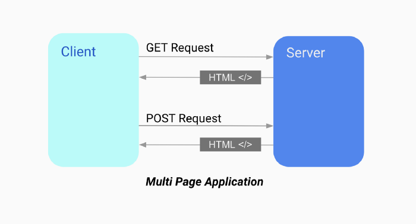
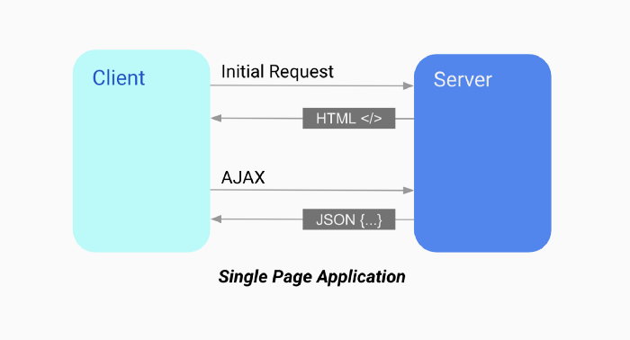

## Ajax란?

자바스크립트를 사용하여 브라우저가 서버에게 비동기 방식으로 데이터를 요청하고 서버가 응답한 데이터를 수신하여 웹페이지를 동적으로 작동하는 것을 말합니다

Ajax가 생기기 전 웹페이지는 html을 서버로부터 전송받아 웹페이지 전체를 처음부터 다시 렌더링 하는 방식으로 동작하였습니다 즉 화면이 전환되면 서버로부터 새로운 html을 전송받아 웹페이지 전체를 처음부터 다시 렌더링을 합니다



이렇게 작업을 하게 되면 몇 가지 단점들이 존재합니다

- 이전 페이지와 차이가 없으매도 불구하고 html을 매번 서버로부터 다시 전송받기 때문에 불필요한 렌더링이 발생합니다
- 변경할 필요가 없는 부분까지 렌더링 하여 화면 전환 시 순간적으로 깜빡임 현상이 발생합니다
- 클라이언트와 서버와의 통신이 동기방식으로 진행되기 때문에 서버로부터 응답이 있을 때까지 다른 작업을 할 수가 없습니다.

이런 단점들을 보완하기 위해 Ajax가 등장하였고 전통적인 방식의 단점들을 보완하였으며 서버로부터 필요한 데이터만 비동기 방식으로 전달받아 불필요한 렌더링이 발생하지 않고 변경된 부분만 렌더링 하는 방식이 가능해져 빠른 퍼포먼스와 부드러운 화면 전환이 가능해졌습니다.



## JSON란?

클라이언트와 서버 간의 HTTP 통신을 위한 텍스트 데이터 포맷입니다

```jsx
{
	"name" : "Jeong",
	"age" : 21,
	"alive" : true
}
```

JSON은 키와 값으로 구성되어 있으며 키는 반드시 큰따옴표로 묶어야 하며 값은 객체 리터럴과 같은 표기법을 그대로 사용할 수 있는데 문자열은 반드시 큰따옴표로 묶어야 한다

### JSON.stringify

클라이언트가 서버로 객체를 전송하려면 객체를 문자열 화해야 하는데 이 작업을 수행하는 메서드가 `JSON.stringify`입니다

```jsx
//자바스크립트 객체를 문자열로 변환 할 수 있습니다

let obj = { name: 'Jeong', age: 21, alive: true }

const json = JSON.stringify(obj)
console.log(json)
/*
{
	"name" : "Jeong",
	"age" : 21,
	"alive" : true
}
*/
```

### JSON.parse

서버가 클라이언트로부터 데이터를 전달할 때는 문자열로 전송이 됩니다 이 JSON 데이터를 객체로 변환해 주는 메서드가 `JSON.parse` 입니다

```jsx
let obj = { name: 'Jeong', age: 21, alive: true }

const json = JSON.stringify(obj)
console.log(json)
/*
{
	"name" : "Jeong",
	"age" : 21,
	"alive" : true
}
*/

const parsed = JSON.parse(json)
console.log(parsed)
/*
{
	name : "Jeong",
	age : 21,
	alive : true
}
*/
```

## Promise(프로미스)

프로미스란? 전통적으로 사용되던 콜백 함수는 콜백 헬로 인해 가독성이 나쁘고 비동기 처리 중 발생한 에러 처리가 힘들며 여러 개의 비동기 처리의 한계를 가지고 있었다. `ES6` 문법부터 프로미스를 도입하여 콜백 함수의 단점들을 보완하였다.

콜백 함수의 단점

```jsx
step1(function(value1) {
  step2(function(value2) {
    step3(function(value3) {
      step4(function(value4) {
        step5(function(value5) {
          step6(function(value6) {
            // Do something with value6
          })
        })
      })
    })
  })
})
```

- 비동기 처리 결과에 대한 후속 처리를 수행하는 비동기 함수가 비동기 처리 결과를 가지고 또다시 비동기 함수를 호출해야 하므로 콜백 헬 이 발생된다

```jsx

try{
	setTimeout(() => { throw new Error("에러 입니다."); }, 2000};
} catch (err) {
	console.error("ERROR NAME =>", err)
} // 에러를 잡지 못한다
```

- 콜백 함수의 가장 치명적인 단점인 에러를 캐치하지 못합니다.

## Promise(프로미스) 사용법

`Promise`는 생성자를 이용해서 생성할 수 있으며, `new` 연산자와 함께 호출한다 그리고 `Promise` 생성자 함수는 비동기 처리를 수행할 콜백 함수인 `resolve` 와 `reject` 함수를 인수로 전달받는다

```jsx
const promise = new Promise((resolve, reject) => {
	if(/* 비동기 처리가 성공 할 경우 */){
		resolve("비동기 처리가 성공하였습니다!")
	} else { // 비동기 처리가 실패할 경우
		reject("비동기 처리가 실패하였습니다")
	}
})
```

`Promise` 생성자 함수를 사용할 때 인수로 전달받은 콜백 함수 내부에서 비동기 처리를 수행하는 데 비동기 처리가 성공할 경우 `resolve` 함수를 호출하고 비동기 처리에 실패할 경우 `reject` 함수를 호출한다

## 프로미스의 후속 처리 메서드

프로미스를 사용하여 비동기 처리 상태가 변화하면 이에 따른 후속 처리를 해야 합니다 비동기 처리가 성공이 되면 그 값을 가지고 무엇인가를 하고 비동기 처리에 실패할 경우 에러를 처리하여야 합니다 이를 위해 프로미스는 `then`, `catch`, `finally` 를 제공합니다

### [ .then ]

`then` 메서드는 두 개의 콜백 함수를 인수로 전달받습니다

첫 번째 콜백 함수는 비동기 처리가 성공 되면 호출되며 그 결과값을 인수로 전달받습니다

두 번째 콜백 함수는 비동기 처리가 실패 되면 호출되며 에러를 인수로 전달받습니다

```jsx
//비동기 처리에 성공하여 그 결과값을 첫번째 콜백 함수 인수로 전달합니다
new Promise(resolve => resolve('비동기 처리 성공!')).then(
  v => console.log(v),
  e => console.error(e)
)
//결과값으로 "비동기 처리 성공! " 이 출력됩니다!

//비동기 처리 실패 하기 위해 임의로 Error를 발생 시켰으며 비동기 처리에 실패하여
//두번째 콜백 함수 인자로 전달 됩니다
new Promise((_, reject) => reject(new Error('비동기 처리 실패!'))).then(
  v => console.log(v),
  e => console.error(e)
)
//결과값으로 "비동기 처리 실패!" 가 출력됩니다!
```

### [ .catch ]

`catch` 메서드는 한 개의 콜백 함수를 인수로 전달받으며 프로미스가 `reject` 상태일 경우에만 호출이 됩니다 콜백 함수의 단점인 에러 추적이 힘든 부분을 `catch`를 사용함으로써 에러 추적을 쉽게 할 수 있으며 에러가 발생하지 않으면 출력되지 않습니다

```jsx
new Promise((_, reject) => reject(new Error('비동기 처리 실패!!'))).catch(e =>
  console.log(e)
)
```

### [ .finally ]

`finally` 메서드는 한개의 콜백 함수를 인수로 전달받으며 프로미스의 성공, 실패 여부와 관계없이 무조건 한번 호출 됩니다. 이 메서드는 성공,실패 와 관계없이 공통적으로 사용할 때 유용합니다

```jsx
new Promise(() => {}).finally(() =>
  console.log('성공,실패 여부에 상관없이 호출!')
)
```

`then`, `catch`, `finally`를 사용하여 비동기 함수 후속을 처리하는 코드를 작성해보자

```jsx
const promise = new Promise((resolve, reject) => {
	if(/* 비동기 처리가 성공 할 경우 */){
		resolve("비동기 처리가 성공하였습니다!")
	} else { // 비동기 처리가 실패할 경우
		reject("비동기 처리가 실패하였습니다")
	}
})

promise.then(res => console.log(res))
	.catch(err => console.error(err))
	.finally(() => console.log("끝!"))
```

`promise` 에서 비동기 처리가 성공할 경우 결과값이 `then`의 인자에 전달되어 <span class="hilight-container" style="background: #fbfea4">"비동기 처리가 성공하였습니다!"</span> 라는 문구가 출력이 될 것이고 비동기 처리가 실패 할 경우 `catch` 인자에 에러가 전달되어 <span class="hilight-container" style="background: #fbfea4">"비동기 처리가 실패하였습니다"</span> 라는 문가가 출력이 됩니다 그리고 비동기 처리 성공, 실패와 상관없이 마지막에 "끝!" 이라는 문구가 출력이 됩니다.

## 프로미스 체이닝

후속처리 메서드인 `then`, `catch`, `finally`는 언제나 프로미스를 반환하므로 연속적으로 호출할 수 있는데 이것을 프로미스 체이닝이라고 합니다

```jsx
const promise = new Promise((resolve, reject) => {
	if(/* 비동기 처리가 성공 할 경우 */){
		resolve("비동기 처리가 성공하였습니다!")
	} else { // 비동기 처리가 실패할 경우
		reject("비동기 처리가 실패하였습니다")
	}
})

promise
	.then(res => console.log(res)) // "비동기 처리가 성공하였습니다!"
	.then(res2 => console.log("정말" + res))// "정말 비동기 처리가 성공하였습니다!"
	.catch(err => console.error(err))
	.finally(() => console.log("끝!"))
```

## 프로미스 정적 메서드

프로미스는 주로 생성자 함수로 사용되지만 함수도 객체이므로 메서드를 가질 수 있습니다.

<span class="hilight-container" style="background: #fbfea4"><u>정적 메서드란?</u> 생성자 함수로 인스턴스를 생성하지 않아도 참조 및 호출할 수 있는 메서드를 말합니다</span>

<span class="hilight-container" style="background: #fbfea4"><u>메서드란?</u> 객체에 저장된 값이 함수일 때 메서드라고 부른다</span>

### Promise.resolve / Promise.reject

두 메서드 모두 이미 존재한 값을 래핑 하여 프로미스를 생성하기 위해 사용합니다.

```jsx
const reslovePromise = Promise.resolve([1, 2, 3, 4])
reslovePromise.then(res => console.log(res)) // 1,2,3,4

const rejectPromise = Promise.reject(new Error('에러입니다!'))
rejectPromise.catch(err => console.log(err)) // "에러입니다!"
```

### Promise.all

여러 개의 비동기 처리를 모두 병렬 처리할 때 사용한다

```jsx
const reqData1 = () => new Promise(resolve => setTimeout(() = resolve(1), 3000))
const reqData2 = () => new Promise(resolve => setTimeout(() = resolve(2), 2000))
const reqData3 = () => new Promise(resolve => setTimeout(() = resolve(3), 1000))

Promise.all([reqData1, reqData2, reqData3])
	.then(console.log) // [1,2,3] 약 3초가 소요된다
	.catch(console.error)
```

`Promise.all` 을 통해 전달받은 모든 프로미스가 성공하게 되면 처리 결과를 배열에 저장해 새로운 프로미스를 반환합니다. 이 메서드는 처리 순서가 보장이 되며 인수로 전달 받은 배열의 프로미스가 하나라도 실패할 경우 나머지 프로미스를 기다리지 않고 즉시 종료됩니다.

### Promise.race

병렬로 받은 프로미스 중 가장 먼저 성공하는 것을 반환하며 `Promise.all` 메서드와 마찬가지로 프로미스가 하나라도 실패할 경우 즉시 종료된다

```jsx
const reqData1 = () => new Promise(resolve => setTimeout(() = resolve(1), 3000))
const reqData2 = () => new Promise(resolve => setTimeout(() = resolve(2), 2000))
const reqData3 = () => new Promise(resolve => setTimeout(() = resolve(3), 1000))

Promise.race([reqData1, reqData2, reqData3])
	.then(console.log) // 3 이 출력된다
	.catch(console.error)
```

### Promise.allSettled

병렬로 받은 프로미스들을 성공, 실패와 상관없이 처리 결과값 모두 반환한 배열에 담겨있다 `Promise.all` 처럼 비동기 처리가 하나로 실패할 경우 바로 `catch` 로 넘어가는 것이 아닌 에러도 배열에 반환을 합니다

```jsx
const reqData1 = () => new Promise(resolve => setTimeout(() = resolve(1), 3000))
const reqData2 = () => new Promise(resolve => setTimeout(() = resolve(2), 2000))
const reqData3 = () => new Promise(resolve => setTimeout(() = resolve(3), 1000))

Promise.allSettled([reqData1, reqData2, reqData3])
	.then(console.log)
//[{3}, {2}, {Error:Error ! ay <anonymous>:3:60}]
	.catch(console.error)
```

<span class ="hilight-container" style="background: #ebb8c1"><strong class="strong-container">[ " 모던 자바스크립트 Deep Dive " 책을 읽고 정리한 글입니다 ]</strong></span>
