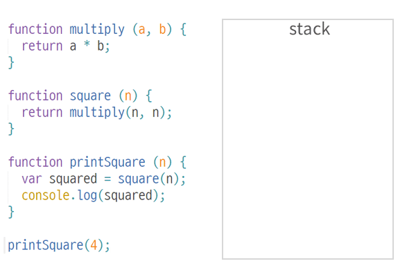

## ✓ 이벤트 루프?
자바스크립트는 싱글 스레드 기반 언어이며. 함수를 실행하면 함수 호출이 스택에 순차적으로 쌓이고 스택의 맨 위에서 부터 아래로 한 번에 하나의 함수만 처리할 수 있습니다. 이처럼 자바스크립트는 동기적으로 작동합니다 이렇게 동기적으로 작동하는 것은 순서가 보장된다는 장점이 있지만 앞의 함수가 종료할 때까지 기다려야 하므로 작업 중단이 발생하는 단점이 있습니다

  

하지만 이벤트 루프를 통해 비동기 작업이 가능하며 어떻게 비동기 처리가 되는지 알아보겠습니다.

먼저 브라우저는 자바스크립트 엔진만으로 동작하지 않고  Web APIs 와 이벤트 큐(테스크 큐) 그리고 이들을 통제하기 위해 이벤트 루프 가 존재합니다. 각 역할에 대해 알아보겠습니다.

  

`콜스택` 
일반적으로 우리가 호출하는 함수를 말하며 스택에 순차적으로 쌓이고 스택의 맨 위에서부터 아래로 한 번에 하나의 함수만 처리할 수 있습니다.

`힙` 
변수와 함수의 저장 그리고 호출 등의 작업이 발생하는 공간이며 메모리 할당을 한는 공간을 말합니다.

`이벤트 루프` 
콜스택과 이벤트큐를 주시하며 콜스택이 비어있다면 이벤트큐에 있는 스택을 콜스택으로 이동한 후 실행하는 것을 말합니다.

`Web APIs` 
우리가 자주 사용하는 setTimeout이나 AJAX 같은 비동기 호출, 이벤트들을 담당하며 콜백 함수를 이벤트 큐(테스크큐)에 저장합니다

`이벤트 큐` 
Web API에서 보내진 비동기 처리가 모이는 곳입니다  

***

  
기본적인 동작원리를 위 사진과 같이 표시할 수 있습니다.  
함수를 호출하게 되면 콜스택에 순차적으로 쌓이며 실행되다가 **AJAX나 setTimeout , 비동기, 이벤트가 호출되다면 콜스택에서** `WebAPIs`로 이동한 후 비동기 작업을 수행하여 콜백 함수를 이벤트큐(테스크 큐)에 넘겨 주고 콜스택에 쌓여 있는 함수가 없을 경우 이벤트 큐에서 콜스택으로 전달하여 실행됩니다.
  
실행 과정을 예로 들어 좀 더 자세히 보겠습니다.

  

1. `console.log(1)` 이 스택에 쌓여 실행됩니다
2. 그다음 `setTimeout` 스택에 추가되어 `Web APIs` 로 이동하여 비동기 작업을 수행합니다
3. `consoe.log(3)` 이 스택에 쌓여 실행됩니다
4. 이제 시간이 흘러 `Web APIs` 에 있던 비동기 작업이 완료되어 콜백 함수(cb)가 이벤트큐(태스크큐)로 이동합니다
5. 콜스택이 비어있다면 이벤트큐(태스크큐)에 있는 함수를 콜스택으로 이동하여 실행합니다.