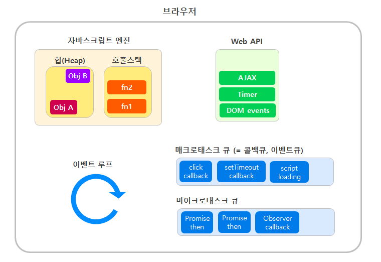

Javascript는 **싱글스레드**로 동작하는 언어입니다. 메인 스레드, 하나의 스레드로 구성되어 있기 때문에 한번에 하나의 작업만 수행할 수 있습니다. 다른 작업이 중간에 끼어들 수도 없고, 기존에 수행하던 작업이 끝나야만 그 다음 작업을 수행할 수 있습니다. 예를들어 20초가 걸리는 일을 수행한다고 하면 그 일을 처리하는 20초 동안 아무것도 할 수 없습니다.

그럼 어떻게 “자바스크립트는 비동기를 처리 할 수 있을까?” 라는 질문이 생기는데 그의 답은 브라우저는 자바스크립트 엔진 자체가 제공하지 않는 웹 API 기능을 제공합니다. 이 API는 DOM API, setTimeout, HTTP requests 등이 포함되고 이것이 비동기 동작을 만드는 데 도움을 줍니다.

### 자바스크립트가 런타임에서 비동기 처리를 하는 방법

  

위 사진은 자바스크립트가 런타임 환경에서 비동기를 어떻게 처리하는지 관한 사진이다. 구성요소 부터 천천히 살펴보자

`Call Stack (콜스택)` 
일반적으로 우리가 호출하는 함수를 말하며 스택에 순차적으로 쌓이고 스택의 맨 위에서부터 아래로 한 번에 하나의 함수만 처리할 수 있습니다.

`Heap (힙)`  \*위 사진에는 없지만 자바스크립트 엔진에 Call Stack과 같이 속해있습니다 
변수와 함수의 저장 그리고 호출 등의 작업이 발생하는 공간이며 메모리 할당을 한는 공간을 말합니다.

`Event Loop (이벤트 루프)` 
콜스택과 이벤트큐를 주시하며 콜스택이 비어있다면 이벤트큐에 있는 스택을 콜스택으로 이동한 후 실행하는 것을 말합니다.

`Web APIs` 
우리가 자주 사용하는 setTimeout이나 AJAX 같은 비동기 호출, 이벤트들을 담당하며 콜백 함수를 이벤트 큐(테스크큐)에 저장합니다

`CallBack Queue, Queue (이벤트 큐)` 
Web API에서 보내진 비동기 처리가 모이는 곳입니다  

여기서 핵심은 자바스크립트가 비동기 처리를 할 수 있는 가장 큰 이유는 이벤트 루프 덕분에 가능합니다 자바스크립트가 이벤트 루프를 통해 어떻게 비동기 처리하는지 설명해보겠습니다.

  

1. `console.log(1)` 이 stack(콜 스택) 에 추가됩니다 그리고 `console.log(1)`이 실행되면 console창에 출력되고 stack(콜 스택)에서 삭제 됩니다.  
2. 그 다음 `setTimeout(function cb() {..})`이 stack(콜 스택)에 추가되는데 `setTimeout`은 Brower에서 제공하는 timer 기능을 실행하여 콜백함수를 `Web APIs` 로 이동 후 stack(콜 스택)에서 삭제 됩니다.  
3. `console.log(3)` 이 stack(콜 스택) 에 추가됩니다 그리고 `console.log(3)`이 실행되면 console창에 출력되고 stack(콜 스택)에서 삭제 됩니다.  
4. 이제 시간이 흘러 `setTimeout` 함수에 전달한 시간 5초가 흐르면 콜백 함수가 바로 stack(콜 스택)에 추가되는 것이 아닌 task queue(이벤트 큐)로 이동하여 기다립니다.  
5. 이벤트 루프는 콜스택이 비어있다는 것을 확인하면 task queue(이벤트 큐)에 있는 함수를 콜스택으로 이동하여 실행합니다.  
6. console창에 `console.log(2)`를 출력한 후 stack(콜 스택)에서 삭제 됩니다.  

<!--
하지만 이벤트 루프를 통해 비동기 작업이 가능하며 어떻게 비동기 처리가 되는지 알아보겠습니다.

먼저 브라우저는 자바스크립트 엔진만으로 동작하지 않고 Web APIs 와 이벤트 큐(테스크 큐) 그리고 이들을 통제하기 위해 이벤트 루프 가 존재합니다. 각 역할에 대해 알아보겠습니다. -->

<!--    -->

---

<!--    -->

<!-- 기본적인 동작원리를 위 사진과 같이 표시할 수 있습니다.  
함수를 호출하게 되면 콜스택에 순차적으로 쌓이며 실행되다가 **AJAX나 setTimeout , 비동기, 이벤트가 호출되다면 콜스택에서** `WebAPIs`로 이동한 후 비동기 작업을 수행하여 콜백 함수를 이벤트큐(테스크 큐)에 넘겨 주고 콜스택에 쌓여 있는 함수가 없을 경우 이벤트 큐에서 콜스택으로 전달하여 실행됩니다.
  
 있던 비동기 작업이 완료되어 콜백 함수(cb)가 이벤트큐(태스크큐)로 이동합니다
실행 과정을 예로 들어 좀 더 자세히 보겠습니다. -->
