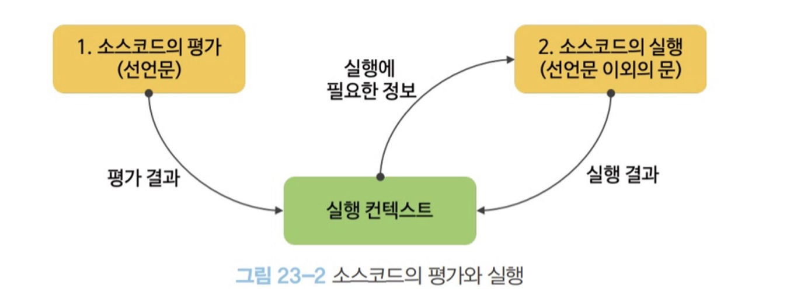
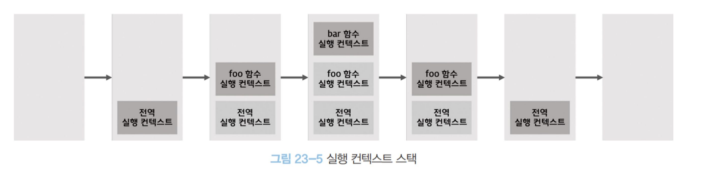

### 소스코드의 평과 실행

모든 소스코드는 실행에 앞서 평가 과정을 거치며 코드를 실행하기 위한 준비를 한다. 자바스크립트 엔진은 소스코드를 `소스코드의 평가` 와 `소스코드의 실행` 이렇게 2개의 과정을 나누어 처리한다

- 소스코드의 평가<br>
  실행 컨텍스트를 생성하고 변수, 함수 등의 선언문만 먼저 실행하여 생성된 변수나 함수 식별자를 키로 실행 컨텍스트가 관리하는 스코프에 등록한다
  <br><br>
- 소스코드의 실행<br>
  소스코드 평가 과정이 끝나면 선언문을 제외한 소스코드가 순차적으로 실행되며 런타임이 시작된다. 이때 소스코드 실행에 필요한 정보 즉 변수나 함수의 참조를 실행 컨텍스트가 관리하는 스코프에서 검색하여 사용하며 변수 값의 변경 등 소스코드의 실행 결과는 다시 실행 컨텍스트가 관리하는 스코프에 등록된다



### 실행 컨텍스트의 역할

코드를 실행하기 위해서는 아래와 같이 스코프, 식별자, 코드 실행 순서 등의 관리가 필요하다

- 선언에 의해 생성된 모든 식별자(변수, 함수, 클래스 등)를 스코프를 구분하여 등록하고 상태 변화(식별자에 바인딩 된 값의 변화)를 지속적으로 관리할 수 있어야 한다
  <br><br>
- 스코프는 중첩 관계에 의해 스코프 체인을 형성해야 한다. 즉 스코프 체인을 통해 상위 스코프로 이동하며 식별자를 검색할 수 있어야 한다
  <br><br>
- 현재 실행 중인 코드의 실행 순서를 변경(예를 들어, 함수 호출에 의해 실행 순서 변경) 할 수 있어야 하며 다시 되돌아갈 수도 있어야 한다.
  <br><br>

이 모든 것을 관리하는 것이 바로 실행 컨텍스트이며 소스코드를 실행하는데 필요한 환경을 제공하고 코드의 실행 결과를 실제로 관리하는 영역을 말한다 좀 더 구체적으로 식별자( 변수, 함수, 클래스 등의 이름)를 등록하고 관리하는 스코프(렉시컬 환경) 와 코드 실행 순서 관리(실행컨텍스트 스택)를 구현한 내부 메커니즘으로, 모든 코드는 실행 컨텍스트를 통해 실행되고 관리된다.

식별자와 스코프는 실행 컨텍스트의 렉시컬 환경으로 관리하고 코드 실행 순서는 실행컨텍스트로 관리 된다

### 실행 컨텍스트 스택

```jsx
const x = 1

function foo() {
  const y = 2

  function bar() {
    const z = 3
    console.log(x + y + z)
  }
  bar()
}

foo() // 6
```

위 코드를 소스코드 타입으로 분류할 때 전역 코드와 함수 코드로 이루어져 있으며 자바스크립트 엔진은 먼저 전역 코드를 평가하여 전역 실행 컨텍스트를 생성하고 함수가 호출되면 함수 코드를 평가하여 함수 실행 컨텍스트를 생성한다 이때 생성된 실행 컨텍스트는 스택 자료구조로 관리되고 이를 실행 컨텍스트 스택이라 부른다


<br>

### 렉시컬 환경

렉시컬 환경은 식별자와 식별자에 바인딩된 값 과 상위 스코프에 대한 참조를 기록하는 자료구조로 실행 컨텍스트를 구성하는 컴포넌트다 실행 컨텍스트 스택이 코드의 실행 순서를 관리한다면 렉시컬 환경은 스코프와 식별자를 관리한다

렉시컬 환경은 키와 값을 갖는 객체 형태의 스코프를 생성하여 식별자를 키로 등록하고 식별자에 바인딩된 값을 관리한다 즉 스코프를 구분하여(전역인지 함수 인지 등) 식별자를 등록하고 관리하는 저장소 역할을 하는 렉시컬 스코프의 실체다

<span class ="hilight-container" style="background: #fbfea4">식별자란? 변수나 함수의 이름이 될 수 있는 프로그래머가 선언하는 단어</span>

실행컨텍스트는 `LexicalEnvironment(렉시컬 환경)` 컴포넌트와 `VariableEnvironment(변수 환경)` 컴포넌트로 구성되어 있는데 생성 초기에는 하나의 동일한 렉시컬 환경을 참조하다 이후 몇가지 상황을 만나면 변수 환경 컴포넌트를 위한 새로운 렉시컬 환경을 생성하고 이때부터는 렉시컬 환경 컴포넌트와 내용이 달라지는데 여기서는 컴포넌트를 구분하지 않고 렉시컬 환경으로 통일해서 간단히 설명하한다

렉시컬 환경도 다음과 같이 두가지 컴포넌트로 구성 되어 있다

- 환경 레코드 ( Environment Record)<br>
  스코프에 포함된 식별자를 등록하고 등록된 식별자에 바인딩된 값을 괸리하는 저장소다. 환경 레코드는 소스코드의 타입에 따라 관리하는 내용에 차이가 있다
  <br><br>
- 외부 렉시컬 환경에 대한 참조 (Outer Lexical Envirnonment Reference)<br>
  상위 스코프를 가리키는데 이때 상위 스코프란 외부 렉시컬 환경 즉 해당 실행 컨텍스트를 생성한 소스코드를
  포함하는 상위 코드의 렉시컬 환경을 말한다 외부 렉시컬 환경에 대한 참조를 통해 스코프 체인을 구현한다.
  <br><br>

<span class ="hilight-container" style="background: #ebb8c1"><strong class="strong-container">[ " 모던 자바스크립트 Deep Dive " 책을 읽고 정리한 글입니다 ]</strong></span>
