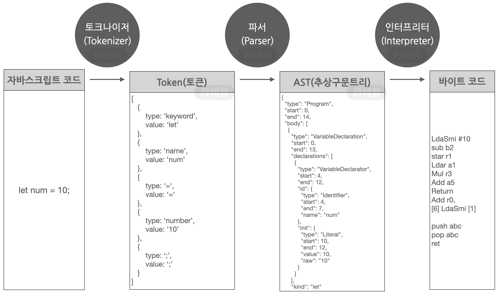
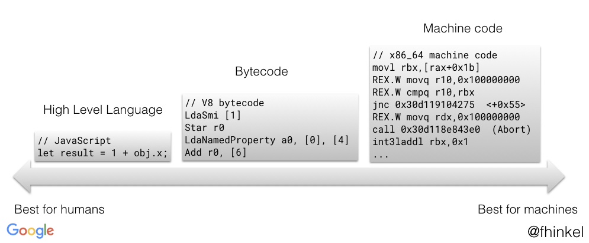
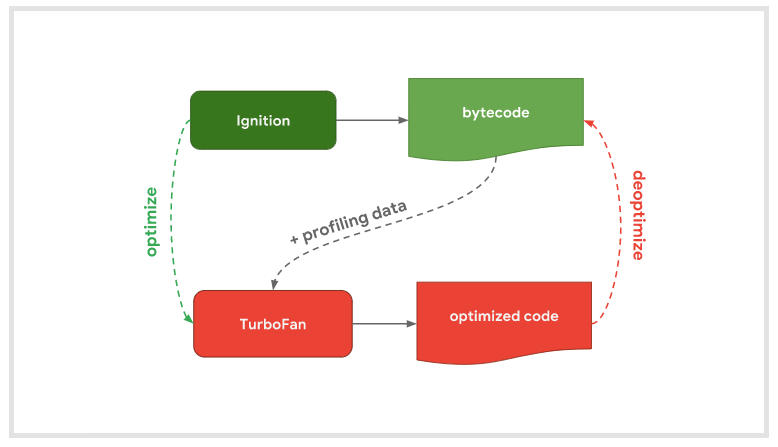

### 자바스크립트의 작동원리

우리가 작성한 자바스크립트 코드는 자바스크립트 엔진을 통해 일련의 과정을 거쳐 컴퓨터에 최적화된 코드로 변환해 전달합니다. 자바스크립트 엔진은 웹 브라우저 내부 또는 Node.js 안에 구성되어 있으며 여러 엔진들이 많이 있지만 대표적으로 많이 사용하는 구글의 `V8 엔진` 에 대해 알아보며 어떻게 작동하는지 알아보겠습니다

**1) 토크나이저(Tokenizer)**

- 우리가 작성한 자바스크립트 코드를 분석하여 '의미를 갖는 최소 단위'인 토큰(Token)으로 분해합니다.
- 이 과정을 토크나이징(Tokenizing)이라고 부릅니다

 

**2) 파서(Parser)**

- 분해한 '토큰'들을 분석하여, 문법적으로 의미를 갖는 Tree 자료구조(AST: Abstract Syntax Tree)를 만듭니다
- 이 과정을 파싱(Parsing)이라고 부릅니다.

 

**3) 인터프리터(Interpreter)**

- 파싱된 결과물인 AST를 **ByteCode**로 변환합니다.

> **인터프리터란?** 코드를 한 줄 한 줄 읽어내려가며 한 줄씩 중간 단계의 Bytecode로 변환하는것을 말하며 자바스크립트는 기본적으로 인터프리터 언어입니다. 

 

바이트코드(ByteCode)는 중간단계의 언어이며 바이트코드를 생성하는 시점에서 자바스크립트 엔진은 실제로 Javascript 코드를 실행됩니다. 특정 하드웨어가 아닌 가상 컴퓨터에서 돌아가는 실행 프로그램을 위한 이진 표현법이며 하드웨어가 아닌 소프트웨어에 의해 처리되기 때문에, 보통 기계어보다 더 추상적입니다. 

여기까지가 자바스크립트로 작성된 코드를 실제로 엔진이 실행하는 부분입니다.  

---

노란색 박스부분이 파이프라인을 가리키는데 이 부분에 대해 알아보겠습니다

 

- 코드를 더 빠르게 실행하기 위해, 바이트코드는 프로파일링 된 데이터와 함께 최적화 컴파일러(optimizing compiler)로 보내집니다.

- 최적화 컴파일러는 프로파일링 데이터를 기반으로 최적화된 코드(Optimized code)를 생성 합니다

- 만약 프로파일링 데이터 중에 **잘못된 부분이 있다면 최적화 해제(Deoptimize)** 를 다시 바이트코드를 실행해서 이전 동작을 반복합니다.   

여기까지가 공통적인 자바스크립트엔진의 과정입니다 아래 사진은 V8 기준으로 파이프라인이며 v8은 컴파일러의 특징과 인터프리터의 특징을 혼합한 JIT 컴파일러를 사용합니다

`JIT 컴파일러` (just in time) : 코드를 기계어로 한번에 변환하는 것이 아니라 중간언어(bytecode) 로 변환 후, 캐싱해두고 인터프리터 방식으로 한 줄씩 읽어 내려가는것을 말합니다

 

V8 엔진의 인터프리터를 `Ignition` 이라고 하며 바이트 코드 생성(Bytecode) 및 실행을 담당하며 컴파일된 `ByteCode`를 최적화 하기 위해 `Turbofan`을 이용합니다

`Turbofan`은 자주 사용되는 Native code와 중복된 코드를 재사용하여 코드 크기, 메모리 오버헤드를 줄이고 속도를 증가시켜 **Optimized Code(최적화 코드)**를 생성합니다

 
 
