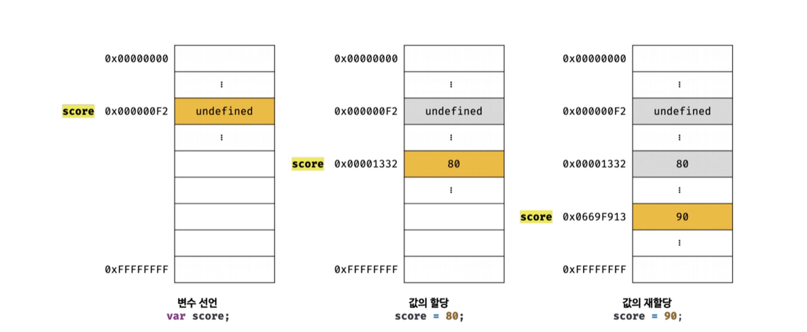
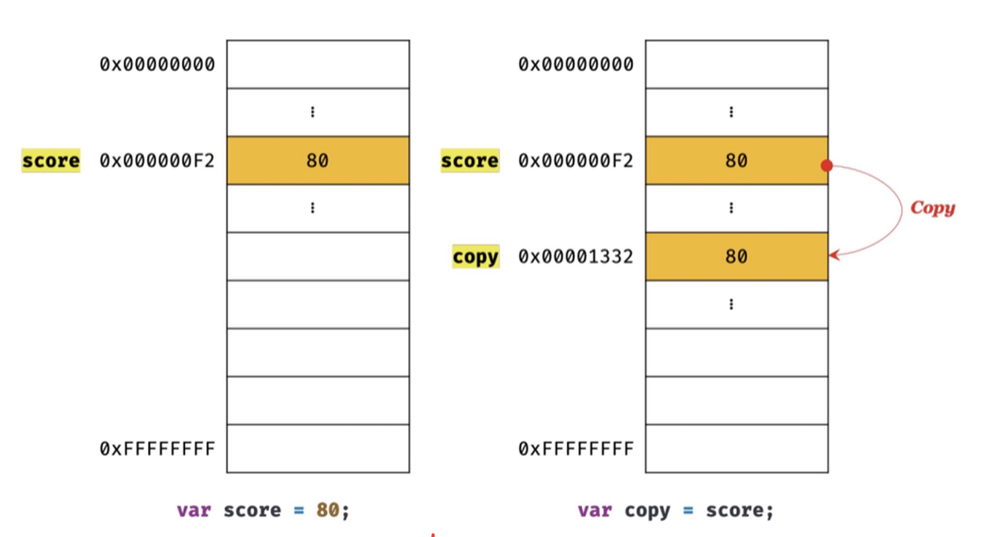
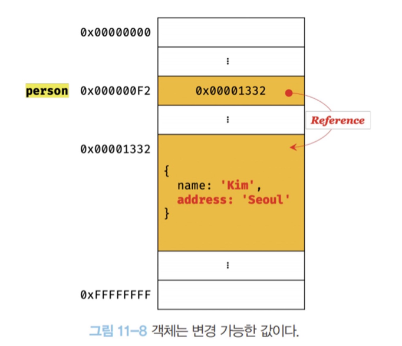

### **객체란?**

자바스크립트를 구성하는 거의 모든 것을 말하며 다양한 타입의 값을 하나의 단위로 구성한 복합적인 자료구조를 말합니다 그리고 원시 타입의 값 즉 원시 값은 변경이 불가능하지만 객체 타입의 값 객체는 변경이가능한 값입니다

```jsx
var person = {
	name : "Jeong" // 프로퍼티
	age : 20 // 프로퍼티
};
// name, age는 프로퍼티 키 이며
// "Jeong", 20은 프로퍼티 값 이다
```

객체는 0개 이상의 프로퍼티로 구성된 집합이며 프로퍼티는 `키(key)` 와 `값(value)` 로 구성되어있다 자바스크립트에서 사용할 수 있는 모든 값은 프로퍼티 값이 될 수 있어 함수도 프로퍼티 값으로 사용할 수 있다. 이처럼 프로퍼티 값이 함수일 경우 메서드라 부른다.

```jsx
var counter = {
	num : 0 // 프로퍼티
	increase : function () { // 메서드
		this.num++.
	}
};
```

- **프로퍼티** : 객체의 상태를 나타내느 값
- **메서드** : 프로퍼티를 참조하고 조작할 수 있는 동작<br><br>

### **원시 값이란?**

원시 타입의 값이며 변경이 불가능한 값을 말한다 즉 한번 생성된 원시 값은 읽기 전용이며 값으로서 변경할 수가 없다 변경이 불가능하다는 것이 무엇인지 구체적으로 알아보기에 앞서 변수와 값이 무엇인지 알아보자

- **변수** : 하나의 값을 저장하기 위해 확보한 메모리 공간 자체이며 그 메모리 공간을 식별하기 위해 붙인 이름
- **값** : 변수에 저장된 데이터로서 변경 불가능하다는 것은 변수가 아니라 값이다.

이렇게 원시 값 자체를 변경할 수 없다는 것이지 변수 값을 변경할 수 없다는 것은 아니다 언제든지 재할당을 통해 변수 값을 변경 할 수 있다

변수의 상대 개념인 상수는 재할당이 금지된 변수를 말하는데 상수도 값을 저장하기 위해 메모리 공간이 필요하므로 변수라 할 수 있지만 단지 재할당을 통해 변수 값을 변경할 수 없다는 것이 변수와 다른 점이다

원시 값을 할당한 변수에 새로운 원시 값을 재할당하면 메모리 공간에 저장되어 있는 재할당 이전의 원시 값을 변경하는 것이 아니라 새로운 메모리 공간을 확보하고 재할당한 원시 값을 저장한 후 변수는 새롭게 재할당한 원시 값을 가리킨다 이때 변수가 참조하던 메모리 공간의 주소가 바뀐다 이러한 특성을 불변성이라 하며 불변성을 갖는 원시 값을 할당한 변수는 재할당 이외에 변수 값을 변경할 수 있는 방법이 없다



코드를 통해 원시값에 대해 더 자세히 알아보자

문자열의 한 문자를 변경해보자 참고로 문자열은 유사 배열 객체이면서 이터러블이므로 배열과 유사하므로 각 문자에 접근할 수 있다

<span class ="hilight-container" style="background: #fbfea4">유사 배열 객체란? 배열처럼 인덱스로 프로퍼티 값에 접근할 수 있고 length 프로퍼티를 갖는 객체를 말한다</span>

```jsx
var str = 'Hello'

str[0] = 'A'
// 문자열은 유사배열이므로 각 문자에 접근 할 수 있지만 문자열은 원시값이므로 변경할 수 없으며
// 에러는 따로 발생하지 않는다

console.log(str) // Hello
```

이렇게 원시 값은 어떤 일이 있어도 불변이므로 예기치 못한 변경으로부터 자유롭다 이는 데이터의 신뢰성을 보장한다

```jsx
var str = 'Hello'

str = 'Hi'

console.log(str) // Hi
```

하지만 변수에 새로운 문자열을 재할당하는 것은 가능하며 이것은 기존 문자열을 변경하는 것이 아니라 새로운 문자열 새롭게 할당하는 것을 꼭 기억하자

### **값에 의한 전달**

```jsx
var score = 80
var copy = score

console.log(score) // 80
console.log(copy) // 80

score = 100

console.log(score) // 100
console.log(copy) // ?
```

변수에 숫자 값 `80` 을 할당하고 `copy` 변수에 `score` 변수를 할당했다 그 후 `score` 변수에 새로운 숫자 값 `100` 을 재할당하면 `copy` 의 변수 값은 어떻게 될것인가? 여기서 핵심은 "변수에 변수를 할당했을 때 무엇이 어떻게 전달되는가?"이다

변수에 원시 값을 갖는 변수를 할당하면 할당받는 `변수(copy)` 에는 할당되는 `변수(score)` 의 원시 값이 복사되어 전달 되는데 이를 값에 의한 전달 이라 한다. 위 코드의 경우 `copy` 변수에 원시 값을 갖는 `score` 변수를 할당하면 할당받는 `변수(copy)` 에는 할당되는 `변수(score)` 의 원시 값 `80` 이 복사되어 전달된다



이때 `score` 변수와 `copy` 변수의 값 `80` 은 다른 메모리 공간에 저장된 별개의 값이라는 것을 알아야한다 그러므로 `score` 변수의 값을 변경해도 `copy` 변수에 값에는 영향을 주지 않는다

```jsx
var score = 80
var copy = score

console.log(score, copy) // 80 80
console.log(score === copy) // true

score = 100

console.log(score, copy) // 100 80
console.log9 score === copy) // false
```

<span class ="hilight-container" style="background: #fbfea4">이처럼 두 변수의 원시 값은 서로 다른 메모리 공간에 저장된 별개의 값이며 어느 한쪽에서 재할당을 통해 값을 변경하더라도 서로 간섭할 수 없다는 점을 기억하자</span>

### **원시값과 객체의 비교**

객체(참조) 타입의 값, 즉 객체는 변경 가능한 값이며 원시 값을 할당한 변수는 원시 값 자체를 값으로 갖지만 객체를 할당한 변수는 변수가 기억하는 메모리 주소를 통해 메모리 공간에 접근하면 참조 값에 접근할 수 있다 참조 값은 생성된 객체가 저장된 메모리 공간의 주소 그 자체를 말한다


위 그림처럼 객체를 할당한 변수에는 생성된 객체가 실제로 저장된 메모리 공간의 주소가 저장되어 있는데 이것을 참조 값이라고 하며 변수는 이 참조 값을 통해 객체에 접근할 수 있다

```jsx
var person = {
  name: 'Lee',
}

//person 변수에 저장되어 있는 참조 값으로 실제 객체에 접근합니다
console.log(person) // {name : "Lee"}
```

객체를 할당한 변수의 경우 "변수는 객체를 참조하고 있다" 또는 " 변수는 객체를 가리키고 있다" 라고 표현 할 수 있다 위 코드에서는 person 변수는 객체 { name : "Lee"}를 가리키고(참조하고) 있다

하지만 객체는 변경이 가능한 값이다 객체를 할당한 변수는 재할당 없이 객체를 직접 변경할 수 있다 재할당 없이 프로퍼티를 동적으로 추가할 수도 잇고 프로퍼티 값을 갱신할 수도 있으며 프로퍼티 자체를 삭제할 수도 있다

```jsx
var person = {
  name: 'Lee',
}

person.name = 'Kim'
person.address = 'Seoul'

console.log(person) // {name : "Kim", address : "Seoul"}
```

<span class ="hilight-container" style="background: #fbfea4">원시 값은 변경 불가능한 값이지만 객체는 변경 가능한 값이므로 메모리에 저장된 객체를 직접 수정할 수 있는데 이때 객체를 할당한 변수에 재할당을 하지않으므로 변수의 참조 값은 변경되지 않는다.</span>



### **참조에 의한 전달**

객체를 가리키는 변수(원본, person)를 다른 변수(사본, copy)에 할당하면 원본의 참조 값이 복사되어 전달되는데 이것을 참조에 의한 전달이라 한다


<span class ="hilight-container" style="background: #fbfea4">person의 참조 값을 복사해서 copy에 저장하면 메모리 주소는 다르지만 동일한 참조 값을 갖는다 이것을 두 개의 식별자가 하나의 객체를 공유한다 라는 의미이다 따라서 원본 또는 사본 중 어느 한쪽에서 객체를 변경하면 서로 영향을 주고받는다</span>

<span class ="hilight-container" style="background: #ebb8c1"><strong class="strong-container">[ " 모던 자바스크립트 Deep Dive " 책을 읽고 정리한 글입니다 ]</strong></span>
