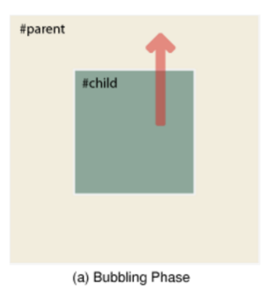
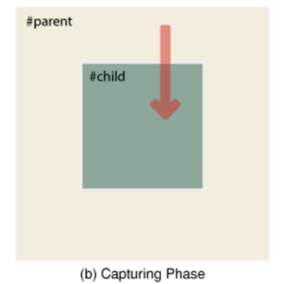

## <span style="color : #184C88 ">자바스크립트의 이벤트에 관하여</span>


전체적인 이벤트의 흐름도이다 `td`를 클릭하면 어떻게 이벤트가 흐르는지 그림으로 표시된것이다. 빨간색 부분은 캡처링 초록색 부분은 버블링이며 아래에서 자세히 알아보도록 하자.


### ✅ 이벤트 버블링이란?


이벤트가 발생했을 때 하위(자식)에 있는 요소가 어떤 이벤트가 발생이 되면 <span style="border-bottom: 2px solid green">상위(부모) 요소들로 전달</span>하는 특성을 가지고 있다

```js
<div class="event-click" onclick="alert('C')"></div>
    <div onclick="alert('B')"></div>
        <div onclick="alert('A')">EVENT-TEST</div>
```

위 코드와 같이 있으면 `EVENT-TEST`의 이벤트가 발생이 되면 상위 요소인 `event-click`까지 이벤트가 전파된다 즉 `EVENT-TEST`를 누르면 알림 창으로 <span style="border-bottom: 2px solid red">A ⇒ B ⇒ C</span> 순서대로 알림 창을 확인해볼 수 있다 이처럼 이벤트 버블링이란 이벤트가 발생하는 곳부터 상위 요소까지 전파가 되는 것이다.


### ✅ 이벤트 캡처링이란?


버블링과 반대로 상위(부모)에서 이벤트가 발생이 되면 <span style="border-bottom: 2px solid green">하위(자식) 요소로 전파</span>가 되는 것이다

```jsx
<div class="event-click" onclick="alert('C')"></div>
    <div onclick="alert('B')"></div>
        <div onclick="alert('A')">EVENT-TEST</div>
```

위 코드에서 상위 요소인 `event-click`에서 이벤트가 발생이 되면 제일 아래에 있는 하위 요소 `EVENT-TEST`까지 이벤트가 전파된다. 즉 버블링과 반대로 <span style="border-bottom: 2px solid red">C ⇒ B ⇒ A</span>로 전파가 된다.


### ✅ event.stopPropagation() 과 event.preventDefault()의 차이점
<br>

**event.stopPropagation()**<br>
만약 원하는 화면 요소의 이벤트만 실행하고 싶어 버블링이나 캡처링을 막고 싶을 때 사용한다 <span style="border-bottom: 2px solid red">즉 이벤트가 상위 요소나 하위 요소로 전파되는 것을 막고 싶을 때 사용한다</span>

**event.preventDefault()**<br>
이 메서드를 알기 위해서는 `a` 태그를 잘 봐야 한다`a` 태그의 본 기능은 `href=""`를 통해 원하는 링크로 이동하는 기능이다 여기서 링크를 이동 시 페이지가 흰 화면이 되었다가 다시 나타나는 것을 누구나 한 번쯤 봤을 것이다 쉽게 말해 이 흰 화면이 되었다가 다시 나타나는 것을 막아주는 것이 `preventDefault()` 메소드이다 기본 이벤트를 막아주어 <span style="border-bottom: 2px solid green">새로 고침 화면이 없어도 페이지 이동이 되는 것을 말한다.</span>

<span style="border-bottom: 2px solid red">두 가지 이벤트를 모두 사용하는 방법도 있으며 "return false"를 반환하면 된다.</span>


### ✅ 이벤트 위임이란?

이벤트 위임이란 쉽게 말해 동적으로 노드를 생성하고 삭제할 때 각 요소에 대한 이벤트를 추가하지 않고, <span style="border-bottom: 2px solid green">상위 요소에서 하위 요소의 이벤트들을 제어하는 방식</span>이다.

```jsx
<ul id="itemList"> 
	<li id="apple">사과</li> 
	<li id="banana">바나나</li> 
	<li id="melon">메론</li> 
	<li id="strawberry">딸기</li> 
</ul>
```

위 코드와 같이 있으면 모든 li에 이벤트를 걸고 싶다면 `li` 하나하나에 모든 이벤트 걸어야 하므로 코드도 길어지고 매우 비효율 적이다 이럴 때 사용 할 수 있는 게 이벤트 위임인데 위에서 배웠던 버블링 또는 캡처링을 활용하는 것이다

```jsx
document.getElementById("itemList").addEventListener("click", function(e) {
  var target = e.target;
  if (target.id === "apple") {
    // id가 apple일때 동작
  } else if (target.id === "banana") {
    // id가 banana일때 동작
  } else if (target.id === "melon") {
    // id가 melon일때 동작
	} else if (target.id === "strawberry") {
    // id가 strawberry일때 동작
	}
});

// ( e.currentTarget : 태그 내용, e.target : 실제 클릭한 태그 내용)
```

이렇게 상위 요소에 이벤트를 걸어 놓고 캡처링을 이용하여 <span style="border-bottom: 2px solid red">하위로 전파되는 속성을 이용하여 if 함수로 원하는 id 값에 맞는 이벤트를 사용할 수 있다.</span>
