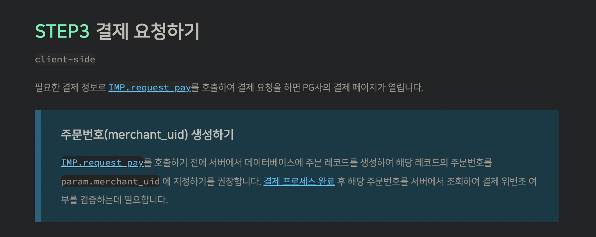

이번에 회사에서 결제 기능을 개발하게 되어 어떻게 개발을 진행하였는지 적어보려고 합니다.

먼저 아임 포트를 통해서 결제 기능을 구현했으며 **pg 사는 kg이니시스**를 선택하였는데 추후 네이버 페이와 카카오페이 등 간편결제를 추가하기 위해서 kg이니시스를 선택했습니다. 생각보다 아임 포트측에서 예제가 정말 잘 나와 있었고 Q&A 부분에서도 궁금한 게 웬만큼 다 있어 빠르게 해결이 가능했습니다. 그리고 카카오톡 고객센터 및 이메일까지 모두 빠르게 응대가 가능해서 굉장히 만족하며 개발을 진행하였습니다.

아래 예제 코드들은 다음과 같은 개발 환경에서 작성하였습니다.

`nextjs`, `typescript`, `react-qeury`, `Tailwind CSS`

## **아임 포트 라이브러리 추가**

기본적으로 next 환경이라 결제 관련 컴포넌트에서 <Head /> 를 이용하여 아임 포트 전용 스크립트를 추가하였습니다.

```tsx
const Home = () => {
  return (
    <>
      <Head>
        <script src="https://code.jquery.com/jquery-1.12.4.min.js" />
        <script src="https://cdn.iamport.kr/js/iamport.payment-1.1.8.js" />
      </Head>

      <div>{/* ... */}</div>
    </>
  )
}

export default Home
```

## 결제 준비 & 결제 요청하기

결제를 요청, 응답 그리고 준비하는 부분을 **Custom hook**으로 만들어서 관리하였으며, 결제를 요청할 때는 `requestPayment` 함수를, 결제에 관한 응답이 필요할 때는 `responsePayment` 함수를 이용하였습니다.

아래 코드는 결제를 할 수 있는 컴포넌트이며 결제하기 버튼을 누를 경우 `requestPayment` 함수가 실행되며 아임 포트에 요청을 합니다 바로 아래에서 해당 함수가 어떻게 작동하는지 알아보겠습니다.

```tsx
const Home = () => {
const {requestPayment} = usePayment()

const onPressPayment = () => {
	requestPayment({
          name: "항목 이름",
          product_name: "상품 이름",
          buyer_tel: "전화번호",
          amount: "가격",
          buyer_name: "아이디"
        })
}

	return (
	<>
	  <Head>
      <script src="https://code.jquery.com/jquery-1.12.4.min.js" />
      <script src="https://cdn.iamport.kr/js/iamport.payment-1.1.8.js" />
    </Head>

		<div>
			<button onClick={onPressPayment}>결제하기</button>
		</div>
	</>
	)

export default Home
```

<br/>

### requestPayment() 함수

<br/>



<br/>

아임 포트 가이드에 따르면 결제 위변조 검증 여부를 위해 **주문번호를 미리 생성하여 서버 데이터베이스에 보관하기를 권장한다.** 그렇기 때문에 `UUID` 를 통해 주문 번호를 미리 생성한 후`requestPayment` 호출에 맞춰 생성한 주문번호(**MerchantUID)** 와 결제 정보를 서버에 전송하여 결제정보들을 가지고 있습니다.

그리고 아임 포트 주문 페이지 부분에 가맹점 식별코드를 이용하여 **IMP 객체를 초기화**하여야 합니다. **결제 정보와 주문번호(MerchantUID)**가 서버에 제대로 전송되면 그때 객체를 초기화하였습니다.

</br>

```tsx
interface IPayReqType {
  product_name: string
  name: string
  buyer_tel?: string
  buyer_email?: string
  amount: number
  buyer_name: number
}

const requestPayment = async ({
  name,
  product_name,
  buyer_tel,
  buyer_email,
  amount,
  buyer_name,
}: IPayReqType) => {
  const merchant_uid = `${product_name}_${uuidv4()}`
  const { IMP } = window

  createMerchantUID.mutate(
    {
      product_name,
      name,
      buyer_tel,
      buyer_email,
      amount,
      buyer_name,
      merchant_uid,
    },
    {
      onSuccess: async () => {
        if (IMP) {
          // 객체 초기화
          await IMP.init(`아임포트에 발급 받은 IMP_UID`)

          IMP.request_pay({
            pg: 'html5_inicis.INIpayTest', // 실 결제는 html5_inicis 까지만 작성합니다.
            pay_method: 'card',
            merchant_uid,
            amount,
            name,
            buyer_name,
            buyer_tel,
            m_redirect_url: ` IP주소 /payment/loading`,
          })
        }
      },
      onError: e => {
        console.log('[APP] 결제 영수증 생성 오류 --> ', e)
      },
    }
  )
}
```

서버에 정상적으로 데이터가 전송이 되면 `IMP.request_pay` 를 호출하여 결제를 진행합니다.

아래는 결제 데이터들이 있으며 필요한 것들만 작성하여 넘겨주면 됩니다.

```tsx
const data = {
  pg: 'html5_inicis',                           // PG사
  pay_method: 'card',                           // 결제수단
  merchant_uid: `mid_${new Date().getTime()}`   // 주문번호
  amount: 1000,                                 // 결제금액
  name: '아임포트 결제 데이터 분석',                  // 주문명
  buyer_name: '홍길동',                           // 구매자 이름
  buyer_tel: '01012341234',                     // 구매자 전화번호
  buyer_email: 'example@example',               // 구매자 이메일
  buyer_addr: '신사동 661-16',                    // 구매자 주소
  buyer_postcode: '06018',                      // 구매자 우편번호
  ...
};
```

kg이니시스는 모바일 웹 환경에서 콜백 함수가 정상적으로 작동하지 않아 `m_redirect_url` 통해 리디렉션 URL을 설정한 후 결제 완료 또는 실패에 따라 리디렉션되는 URL에 있는 **쿼리 스트링(Query String)** 정보로 의미를 파악해야 합니다.

**[ 리디렉션 URL 예시 ]**

```tsx
https://myservice.com/payments/complete?imp_uid=결제건을_특정하는_아임포트_번호&merchant_uid=가맹점_고유_주문번호&imp_success=true
```

## 결제 정보 전달 & 응답 처리하기

### responsePayment()

kg이니시스를 통해 결제가 정상적으로 완료되면 `m_redirect_url`에 설정한 주소로 이동한 후 위변조 검사를 위해 리디렉션 url에 있는 주문 번호와 결제 번호를 서버에 전송을 해야 합니다 이때 `responsePayment` 함수를 이용합니다.

```tsx
//  m_redirect_url: ` IP주소 /payment/loading`

export const getServerSideProps: GetServerSideProps = async context => {
  return { props: { query: context.query } }
}

const PaymentLoading = ({ query }) => {
  const { responsePayment } = usePayment()

  useEffect(() => {
    responsePayment({
      isSuccessPay: query.imp_success,
      type: query.merchant_uid,
    })
  }, [])
  return (
    <>
      <span>로딩중...</span>
    </>
  )
}

export default PaymentLoading
```

`responsePayment` 함수를 이용하여 위변조 검사를 한 후 성공, 여부에 따라 적절한 화면을 보여주면 됩니다.

참고로 PG사 결제 페이지로 넘어가서 닫기 버튼을 누를 경우 **imp_success가 false** 로 변경되기 때문에 false일 경우 보여질 페이지를 else 문에 추가하였습니다.

```tsx
const onCompletePayment = e => {
  console.log('결제 성공! => ', e)
  router.push(' IP주소 /payment/success')
}

const onFailPayment = e => {
  console.log('결제 에러! => ', e)
  router.push(' IP주소 /payment/failure')
}

const responsePayment = ({ isSuccessPay }: string) => {
  if (isSuccessPay === 'true') {
    const imp_uid = router.query.imp_uid
    const merchant_uid = router.query.merchant_uid

    mutate(
      { imp_uid, merchant_uid },
      {
        onSuccess: onCompletePayment,
        onError: onFailPayment,
      }
    )
  } else {
    // 결제 과정에서 문제가 있거나 imp_success가 false 일경우 보여질 페이지 입니다.
    router.push({ pathname: ' IP주소 /payment' })
  }
}
```

<br />

**[ Hooks 전체코드 ]**

```tsx
interface IPayReqType {
  product_name: string
  name: string
  buyer_tel?: string
  buyer_email?: string
  amount: number
  buyer_name: number
}

export const usePayment = () => {
  const router = useRouter()
  const { mutate } = useMutation(postVerifyPayment)
  const createMerchantUID = useMutation(postSendPaymentInformation)

  const requestPayment = async ({
    name,
    product_name,
    buyer_tel,
    buyer_email,
    amount,
    buyer_name,
  }: IPayReqType) => {
    const merchant_uid = `${product_name}_${uuidv4()}`

    const { IMP } = window

    createMerchantUID.mutate(
      {
        product_name,
        name,
        buyer_tel,
        buyer_email,
        amount,
        buyer_name,
        merchant_uid,
      },
      {
        onSuccess: async () => {
          if (IMP) {
            await IMP.init(`아임포트에 발급 받은 IMP_UID`)

            IMP.request_pay({
              pg: 'html5_inicis.INIpayTest',
              pay_method: 'card',
              merchant_uid,
              amount,
              name,
              buyer_name,
              buyer_tel,
              m_redirect_url: ` IP주소 /payment/loading`,
            })
          }
        },
        onError: e => {
          console.log('[APP] 결제 영수증 생성 오류 --> ', e)
        },
      }
    )
  }

  const onCompletePayment = e => {
    console.log('결제 성공! => ', e)
    router.push(' IP주소 /payment/success')
  }

  const onFailPayment = e => {
    console.log('결제 에러! => ', e)
    router.push(' IP주소 /payment/failure')
  }

  const responsePayment = ({ isSuccessPay }: string) => {
    if (isSuccessPay === 'true') {
      const imp_uid = router.query.imp_uid
      const merchant_uid = router.query.merchant_uid

      mutate(
        { imp_uid, merchant_uid },
        {
          onSuccess: onCompletePayment,
          onError: onFailPayment,
        }
      )
    } else {
      router.push({ pathname: ' IP주소 /payment' })
    }
  }

  return { requestPayment, responsePayment }
}
```
