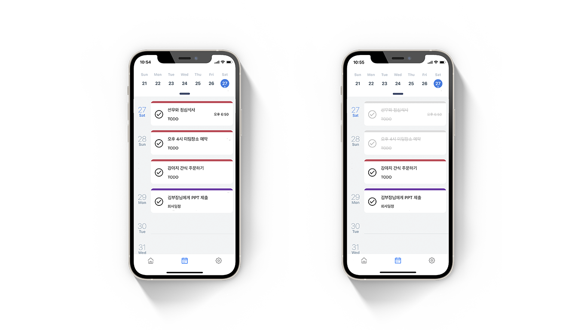
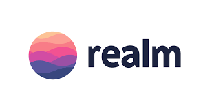
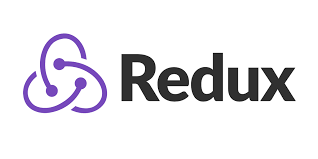
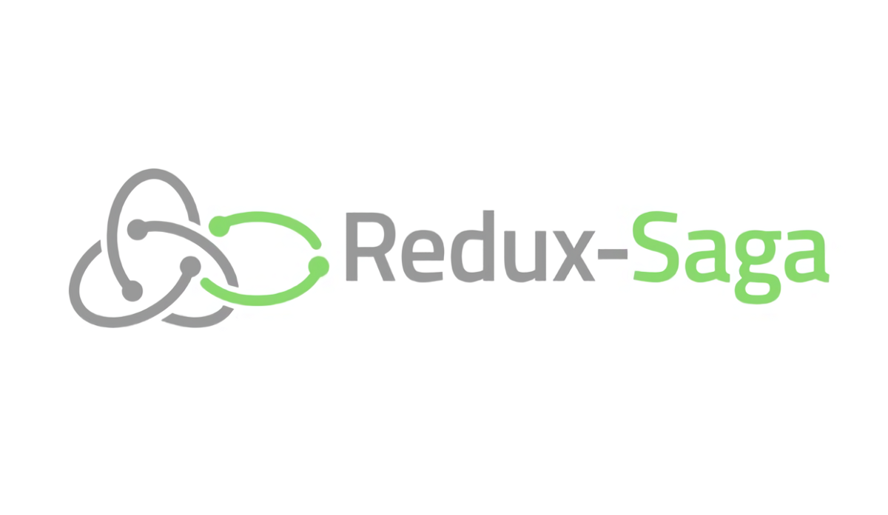

### **간단한 앱 소개**

---

`WEEK` 은 TO DO 기능과 캘린더, 알림 설정을 접목한 생산성 어플리케이션이다. 간단한 목록형 메모에서부터 주간, 월간 일정 조율과 각 일정의 알림 설정 기능까지 한가지 어플리케이션으로 활용할 수 있다. 모든 일정은 오늘, 예정, 중요, 전체로 나누어 확인할 수 있고, 캘린더 기능을 통해 날짜 별 일정을 확인 할 수 있으며 각각의 일정에 알림을 설정할 수 있다. 완료한 일정은 체크 버튼을 클릭하는 TO DO 방식을 활용하여 사용자에게 작은 성취감을 느끼게 할 수 있다.

시험을 준비하는 학생, 매일 할 일을 적고 체크하는 직장인을 포함해 주간 혹은 월간 일정을 계획하는 모든 사용자가 쉽게 활용할 수 있는 생산성 앱을 만들고 싶었다. 단순한 TO DO 목록을 작성하는 것만으로는 업무 효율성 면에서 아쉬움을 느낄 수 있는 사용자를 위해 캘린더, 알림 설정 기능을 추가하여 목적에 맞게 사용하도록 했다. 간단한 기본 TO DO 어플리케이션 구현을 벗어나 다양한 라이브러리를 함께 어울리게 만드는 것에 많은 노력이 필요했다.



[💡 AppStore 에서 앱 구경하기](https://apps.apple.com/kr/app/week/id1568287922)

[💡 PlayStore 에서 앱 구경하기](https://play.google.com/store/apps/details?id=com.week.todocalendar.app)
<br><br>

### **개발 과정**

---

어플리케이션 기술 스택은 아래와 같다.

- `로컬 DB - Realm`
  

  모바일에서 가장 많이 쓰이는 로컬 DB인 Realm을 선택했다. 기존 DB와 다르게 모델 구조 자체가 객체 컨테이너로 구성되어 좀 더 직관적으로 사용이 가능하고 성능 면에서 빠르며 Realm Studio를 이용하여 DB 파일을 쉽게 수정할 수 있는 점과 sql 문법을 몰라도 사용이 가능한 점이 마음에 들었다

<br><br>

- `상태관리 - Redux`
  

코드가 길어지는 단점이 있었지만 react-native-debugger tool과 함께 쓰면 상태 추적이 편하고 action만으로 상태값의 변화를 완전하게 예측할 수 있었다.
<br><br>

- `비동기 처리 - Redux-Saga`
  

realm 사용을 포함하여 데이터를 비동기 처리 해야 할 때 Thunk의 콜백 함수를 사용하는 것보다 saga의 제네레이터와 action이 순수한 객체만 반환할 수 있어 깔끔한 코드를 만들 수 있었다.
<br><br>

- `CSS - styled-componet`
  

변수명을 짓기 어렵지만 재사용이 가능한 점과 props를 전달 받아 조건부 스타일링이 가능하고 Global Style 적용이 간단한 점이 적합하였다.
<br><br>
개발을 시작하기 전 아키텍처를 구상했는데, 어떤 라이브러리를 사용하고 DB를 어떻게 작성할 것인지를 정해두었다. 물론 진행 과정에서 변경하게 될 가능성이 높았지만 아무런 설계 구상 없이 바로 시작하는 것에 비해 소요되는 시간을 아낄 수 있었다. 또한 처음부터 배포를 목적으로 개발하였기 때문에 react-native-cli로 시작하였다.
<br><br>

개발하면서 가장 힘들었고 또 가장 기억에 남는 라이브러리 몇가지를 소개할려고 한다

#### 1. react-native-push-notification

TO DO 어플리케이션의 활용도를 높이기 위해서는 알림 기능이 필수적이었다. 개발 시작에 앞서 알림 기능 라이브러리를 테스트했다. 네이티브 코드를 수정해야 한다는 부담감이 있었지만 해당 라이브러리 readme.md를 활용하여 문제없이 사용할 수 있었다.

앱 특성상 카테고리 하위에 TODO들이 이루어지는데 TODO를 작성하고 난 후 카테고리 이름을 변경하거나 색상 또는 TODO 내용, 시간등을 변경 할 수 있기 때문에 변경된 데이터가 알림으로 올 수 있게 만들어야 했다

만약 변경된 데이터가 있을경우에는 알림을 생성할때 고유의 ID값이 필요한데 기존에 있던 알림의 ID값에다가 수정된 내용을 추가하여 다시 알림을 보내서 변경된 알림을 받을 수 있었다.

또한 `Android`, `IOS` 의 날짜 형식이 달라 각각의 운영체제에 맞게 별도로 구현할 필요가 있었다. 안드로이드는 **"2021/05/18 11:00:00"** 와 같이 /와 날짜 다음 공백이 필요했고 IOS의 경우 **"2021-05-18T11:00:00"** 와 같이 작성해야 했다. 그래서 OS별 날짜를 처리하는 함수들을 따로 만들어 날짜 형식 입력이 필요할 때 활용하였다.

Bage 부분에 있어서 알림이 시간 순서에 맞게 count 할 수 있도록 구현하기 위해 **PushNotification.getScheduledLocalNotifications** 함수를 사용했다. 이것은 현재 등록된 알림 리스트를 확인 할 수 있는 함수로 새 알림을 등록 할 때마다 `sort` 함수를 통해 시간이 빠른 순으로 정렬하여 Bage Number를 재부여하므로 알림을 다시 보낼 수 있었다.

#### 2. react-native-calendars

계획된 일정을 한 눈에 확인하거나 앞 뒤 날짜를 고려하기 위해서 캘린더 기능을 접목했는데, 주간 일정을 한눈에 보기 쉽게 Agenda 기능이 있어 도움이 되었다. saga를 많이 이용했는데 주로 DB에 저장되어 있는 데이터들을 불러와 saga에서 해당 일정에 맞게 데이터를 추가하였다. 그런데 BottomTabNavigator 사용 중 bottomTab을 이동할 때마다 화면이 refresh가 되지않는 오류가 발생하였고 `useEffect` 와 `useIsFocused` 를 사용하여 해결할 수 있었다. 주간일정 Tab이 Focus 되면 redux action이 실행되어 saga에서 데이터를 처리 한 후 그 데이터에 맞게 화면에 표시할 수 있다.

```jsx
const isFocused = useIsFocused()

useEffect(() => {
  if (isFocused) {
    dispatch({ type: AGENDA_DATA_REQUEST, data: Agenda_DATA_timestamp })
  }
}, [isFocused])
```

앞서 적은 것처럼 운영체제 별 날짜(시간)을 인식하는 형식이 달랐기 때문에 각 OS별 필요한 시간 형식을 함수로 만들어 활용했다. 알림을 설정할 때 시간이 필요하므로 `react-native-modal-datetime-picker` 라이브러리를 사용했는데 사용자가 입력한 시간이 24시 형식으로 반환하게 되어있어서 12시간으로 변형하여 적용하였다.

```jsx
const IOS_HOURS = (date.getHours() + 24) % 12 || 12

const IOS_TIMESHEET =
  IOS_HOURS < 10
    ? date.toLocaleTImeString().substring(0, 7)
    : date.toLocaleTImeString().substring(0, 8)
```

IOS 에서 시간을 처리하는 함수는 24시간 기준 시간을 받아와 12시간 기준으로 변경하여 사용했다. `toLocaleTimeString()` 함수를 이용하여 오전, 오후를 구분하였다.

```jsx
const ANDROID_HOURS = ((date.getHours() + 11) % 12) + 1

const ANDROID_MINUNTES = date.getMinutes()

const ANDROID_DAY =
  date.getHours() < 12 && date.getHours() >= 0 ? '오전' : '오후'

const ANDROID_TIMESHEET =
  ANDROID_DAY +
  ' ' +
  ANDROID_HOURS +
  ':' +
  (ANDROID_MINUNTES > 10 ? ANDROID_MINUNTES : '0' + ANDROID_MINUNTES)
```

안드로이드에서는 계산이 추가로 필요했는데 24시간 기준으로 받아온 시간을 완전히 새로 만들 필요가 있었다. 우선 12시간 기준으로 변환하여 오전, 오후를 구분하고 시간이 10시 이전일 경우에는 앞에 0을 추가하였다. 이렇게 함수를 만들어 24시간 기준 시간을 **"오전 9:00"** 와 같은 형식으로 변환하여 사용하였다.
<br><br>

### **UX/UI 디자인**

---

혼자서 개발과 UI/UX 디자인 등을 함께 고민하려니 쉽지 않았다. 하지만 어플리케이션이 심미적 관점에서 '예쁘다'고 받는 인정이 사용자 확보에 중요하게 작용하기 때문에 노력을 많이 기울였다. 특히 폰트와 컬러를 신중하게 고민했다. "초록색" 이라는 단순한 이름 아래 다양한 채도와 명도의 초록이 존재했고 기기 별 디스플레이 사양에 따라 출력하는 색상 값이 달라졌다. 폰트 또한 어울리는 글씨체 뿐만 아니라 굵기와 사이즈 별 느낌 등 고려해야 할 요소가 많았다. '최고'보다는 '최선'을 선택했다.

어플리케이션 초기 설계 단계에서도 UX/UI를 많이 고려했지만 개발 과정에서 추가되는 기능에 따라 수정이 많이 필요했다. 모르는 부분에 있어서는 새로운 지식과 관점을 습득하기 위해 서적 등 관련 자료를 다양하게 찾았다. 또한 디자인 관련 다양한 레퍼런스를 참고하여 생산성 앱에서 활용 가능한 부분을 접목시키려고 노력했다.
<br><br>

### **후기**

---

앱을 개발하기 전에 미리 알았으면 좋았을 점이나 개발하면서 느꼈던 점을 간단하게 써보려고 한다

- 먼저 React-Native는 android 와 ios를 동시에 개발이 가능하다고는 하지만 틈틈이 시뮬레이션을 돌려 결과물 확인이 필요하다 한쪽 OS만 개발하여 다른 한쪽을 나중에 확인한다면 100% 같지 않을 것이다 나는 `Android`, `IOS` 가상은 물론이고 디바이스 테스트까지 하며 자주 결과물을 확인하며 개발을 했다.

  또한 style 부분에서 각자 다른 부분이 있는데 예를 들어 `Button` 은 각 OS 별로 다르게 보여 다들 Button 대신 `TouchableOpacity` 를 사용하는데 앱 개발 전 아키텍처를 구상할 때 Button 이라던가 전체적인 UI 나 디자인들 어느 정도 생각하고 개발을 시작하는 게 좋다. 왜냐면 디자인하는데 시간이 생각보다 많이 들어간다 만약 이 시간을 아끼고 싶다면 UI 라이브러리를 찾아보자.

<br>

- 만약 다른 앱을 개발하게 되거나 이 앱에서도 차츰차츰 타입스크립트를 적용하려고 한다 개발하면서 타입으로 인해 에러가 나오는 경우가 생각보다 많았다 `null` 이나 `undefined` 같이 혹시나 생길 수 있는 타입 버그들을 사전에 방지해 줄 수 있다 그리고 vscode를 이용한다면 타입 에러를 쉽게 확인이 가능하다

<br>

- react 의 최대 장점 중인 컴포넌트를 재활용할 수 있는 점을 잊지 않고 재활용 가능한 코드를 작성하는 게 좋다 그리고 코드 작성 전 고민을 한번 해보는 것도 좋다. 나는 새로운 컴포넌트를 만들기 전 굿노트를 켜놓고 그림으로 그려보거나 어떤 식으로 작성할지 구상한 후 코드를 작성한다

<br>

아직 앱을 출시 한지 얼마 되지 않아 업데이트를 하며 구현하고 싶은 기능들도 있고 좀 더 리팩토링을 하며 최적화에 더 신경을 써야 해 넘어야 할 산이 많이 남았다

개발이 완료된 후에도 바빴다 빌드와 배포하는 과정에서 많은 에러를 만났고 앱 심사에서 리젝트 받지 않게 소개글이며 스크린샷 또한 픽셀에 맞게 꼼꼼하게 준비했다 그 결과 Android 와 ios 모두 리젝트 없이 한 번 만에 승인되어 출시를 할 수 있었다

내가 만든 앱이 이렇게 스토어에 있는 걸 보고 있으니 기분이 너무 묘했다 이 글을 작성하면서 개발 과정에서 수많은 오류를 만나 해결하려고 밤낮 지세워 노력하며 성장한 내 모습이 스쳐 지나갔다

도저히 해결할 수 없을 거 같은 에러를 만나 좌절도 많이 했는데 그걸 모두 해결하고 여기까지 왔다 일주일 내내 고민한 적도 있고, 하루 종일 책상에 앉아 에러를 해결하기 위해 애를 쓴 적도 있다 이제 나 자신을 믿고 언제든 에러를 해결할 수 있는 자신감이 생겼다 결국엔 해결 할 것이니깐.
