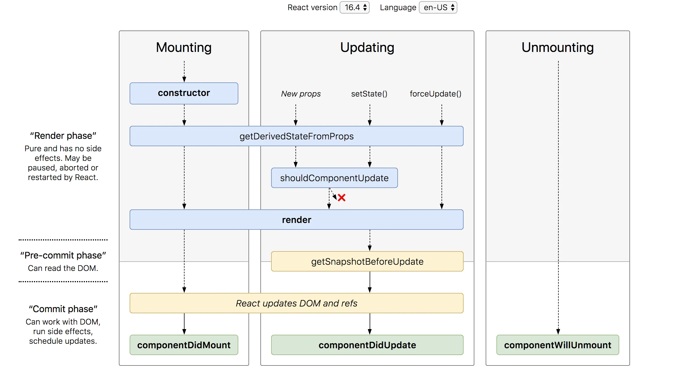

### 라이프 사이클
저번에 라이프 사이클에 관한 글을 올렸지만 간단하게 올린터라 리액트의 렌더링 과정과 흐름을 자세히 이해하기 위해 리액트 라이프 사이클에 대해 자세히 알아볼려고 한다

<u>라이프 사이클이란?</u> 
컴포넌트가 생성되어 소멸될 때까지의 일련의 과정들을 일컫는다. 이러한 **Life Cycle** 안에서 특정 시점에 코드가 호출되도록 설정할 수 있는데, 이 때 사용되는 메소드를 **Life Cycle Method**라고 한다.

위 사진을 보면 크게 세가지가 있는데 <u>Mounting, Updating, Unmounting</u>이 있으며 이 세가지가 어떻게 작동되는지 알아보자

***

## Mount
(마운트란 리액트 컴포넌트가 Instance로 생성되어 DOM tree에 삽입되어 브라우저 상에 나타나는것이며 처음 한번만 실행이 된다)

- **constructor**

    컴포넌트를 새로 만들 때마다 호출되는 클래스 생성자이며 초기 state를 정할 수 있다 혹시 state를 사용하지 않아 state의 초기값 설정이 필요하지 않다면 생성자 함수도 생략이 가능하다. 생성자 함수를 사용할 때는 반드시 super(props)함수를 호출하여 부모 클래스의 생성자를 호출한다. 생성자 함수는 해당 컴포넌트가 생성될 때 한 번만 호출이 된다.

- **render**

    render 함수는 클래스 컴포넌트가 랜더링되는 부분(화면에 표시되는 부분)을 정의한다. 즉, 최종적으로 component에서 작업한 결과물을 return하는 method이다. 그래서 component 라면 반드시 있어야 하는 method이며 render의 결과물로 나올 수 있는 것들은 다음과 같다.

    - <u>React 엘리먼트.</u> : 보통 [JSX](https://ko.reactjs.org/docs/introducing-jsx.html)를 사용하여 생성된다. 예를 들어, `
`와 `<MyComponent />`는 React가 DOM 노드 또는 사용자가 정의한 컴포넌트를 만들도록 지시하는 React 엘리먼트.
    - <u>배열과 Fragment.</u> : `render()`를 통하여 여러 개의 엘리먼트를 반환 자세한 정보는 [Fragments](https://ko.reactjs.org/docs/fragments.html) 문서를 통하여 확인이 가능하다
    - <u>Boolean 또는 null.</u> : 아무것도 렌더링하지 않는다. (대부분의 경우 `return test && <Child />` 패턴을 지원하는 데에 사용되며, 여기서 `test`는 boolean 값이다.)

    이렇게 결과물로 나온 Element들이 가상 DOM에 mount되고 실제 DOM에 업데이트된다. 또한 render 함수는 부모로부터 받는 Props 값이 변경되거나, this.setState로 State의 값이 변경되어 화면을 갱신할 필요가 있을 때 마다 호출된다.

- **componentDidMount**

    클래스 컴포넌트가 처음으로 화면에 표시된 이후 이 함수가 호출된다. 즉 render함수가 처음 한번 호출된 후 componentDidMount함수가 호출된다. 이 함수는 컴포넌트가 화면에 처음 표시된 후 한번만 호출되므로 , ajax를 통해 데이터를 불러와야 한다면, 네트워크 요청을 보내기 적절한 위치이다 또한 componentDidMount 함수는 부모로부터 받는 Props 값이 변경되어도, this.setState로 State값이 변경되어도, 다시 호출되지 않는다. 따라서 render함수와는 다르게 이 함수에 this.setState를 직접 호출할 수 있으며 ajax를 통해 받은 데이터를 this.setState를 사용하여 State에 설정하기 적합하다.

    하지만  내부에서 setState의 사용하지 않도록 하는게 좋다 왜냐하면 `componentDidMount`가 호출된 시점은 tree에 붙은 상태인데, 여기서 `setState`를 호출하게 되면 다시 **rendering**되어 두번이나 렌더링이 된다. 결국 사용자에게 보여지는 view는 setState이후의 redering된 모습이 될것이다 하지만 방법이 전혀 없는 것이 아닌데 **constructor**에서 초기화 해주면 된다 자세한 내용은 아래 링크를 참고하여 읽어보면 된다 

    [참고URL](https://jsdev.kr/t/componentdidmount-setstate/4023)

***

### Update

  컴포넌트를 업데이트 하는 경우는 아래 4가지다.

  1. props가 바뀔때
  2. state가 바뀔때
  3. 부모컴포넌트가 리렌더링 될때
  4. **this.forceUpdate**를 통하여 강제로 렌더링을 트리거할 때

  이렇게 4가지 중 하나라도 업데이가 되면 아래의 메서드가 호출된다

- **getDerivedStateFromProps**

`props`에 있는 값을 `state`와 동기화 시키는 메서드다. 

컴포넌트가 최초 마운팅 됐을 경우와 부모 컴포넌트에서 전달해주는 props가 변경 되었을 경우 호출되며, render() 메서드가 호출되기 전이므로, 변경 된 props 데이터를 state에 반영하는 작업을 이 메서드에서 처리하면 된다.

- **shouldComponentUpdate**

이 메서드는 오직 성능을 최적화하기 위해 중점을 뒀으며 props 또는 state가 새로운 값으로 갱신되어서 렌더링이 발생하기 직전에 호출된다. 기본값은 true이고. 이 메서드는 초기 렌더링 또는 forceUpdate()가 사용되거나 false일때에는 호출되지 않는다 

- **getSnapshotBeforeUpdate**

`Component` 변화를 DOM에 반영하기 전에 호출하는 메서드이며 return하는 값을 componentDidUpdate에서 3번째 파라미터로 받아올 수 있습니다. 

- **componentDidUpdate**

컴포넌트의 업데이트 작업 즉 state나 props가 업데이트 되었을 때 호출하는 메서드이다

***

## Unmount

- componentWillUnmount

  컴포넌트가 마운트 해제되어 제거되기 직전에 호출된다. 이 메서드 내에서 타이머 제거, 네트워크 요청 취소, `componentDidMount()` 내에서 생성된 구독 해제 등 필요한 모든 정리 작업을 수행하면된다 주의할점은 이제 컴포넌트는 다시 렌더링되지 않으므로 **setState()를 호출하면 안된다**