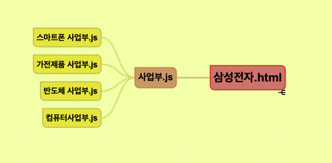
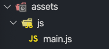
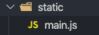

### 웹팩이란?
웹팩은 웹에서 사용되는 모든 자원(assets)을 번들링 해주는 도구. 즉 __"모듈 번들러"__ 라고 합니다 쉽게 말하면 모듈과 번들러 가 합쳐져 있다는 것인데 모듈과 번들러의 개념을 알아보겠습니다

- **Modul**
  - 프로그램을 구성하는 구성 요소의 일부
  - 관련된 데이터와 함수들이 묶여서 모듈을 형성하고 보통 파일 단위로 나뉘는 게 보통이다
  - 예를 들어 삼성전자 회사가 있다면 그 밑에 여러 사업부가 있을 것이다
    - 스마트폰 사업부
    - 가전제품 사업부
    - 반도체 사업부
    - 컴퓨터 사업부
  - 여기서 삼성전자는 하나의 파일이고, 사업부가 모듈이라고 생각하면 된다 이렇게 여러 모듈(사업부)을 만든 후 Main 파일(삼성전자)에추가할 수 있다.
  - 보통 모듈은 기능별로 나눈다


- **Bundler**


  - 위 그림처럼 웹 애플리케이션을 구성하는 수십 개의 파일들을 동일한 타입으로 묶어서 하나의 파일을 만들어 내는 게 모듈 번들링이다


  - 조금 더 보기 쉽게 정리하자면 <br>


    


    위 그림처럼 생각하면 된다 같은 타입의 모듈(각 사업부 들의.js)들을 하나의 모듈(사업부.js) 만든 후 컴파일 해준다
    


웹팩에겐 크게 4가지로 분류할 수 있다

- Entry
- Output
- Loader
- Plugin

하나씩 개념을 정리해보자


## Entry

웹팩이 빌드 할 파일의 시작 위치를 나타내고, Entry로 지정된 파일을 읽어 들이기 시작하며 import 혹은 require 등 다른 파일을 불러오고 있는 파일들을 추적해서 하나의 파일로 만들어 줍니다.<br>

```js
const ENTRY_FILE = path.resolve(__dirname, "assets", "js", "main.js");

entry: ENTRY_FILE,
```

위 코드 대로 경로를 설정하게 되면 `assets`폴더에서 `js`폴더 안에 있는 `main.js`파일을 불러온다 <br>




## Output

웹팩에 의해 생성되는 번들을 내보낼 위치와 파일의 이름을 지정합니다. 번들링 된 파일은 output에 설정한 대로 파일이 생성됩니다.

```js
const OUTPUT_DIR = path.join(__dirname, "static");

output: {
    path: OUTPUT_DIR,
    filename: "[name].js"
  }
```

<br>

## Loader

웹팩이 웹 애플리케이션을 해석할 때 자바스크립트 파일이 아닌 웹 자원(HTML, CSS, Images, 폰트 등)들을 변환할 수 있도록 도와주는 속성입니다.

```js
module: {
    rules: [
      {
        test: /\.css$/,
        use: ["css-loader"],
      },
    ],
  }
```

웹팩 설정 파일인 `webpack.config.js`을 열어 `module`에`rules`배열에 객체 한 쌍을 추가했는데 그 안에는 `test`, `use`의 2개의 속성이 들어가 있는데 각각 아래와 같은 역할을 합니다 <br>

- `test` : 로딩할 파일 형식을 지정 (.scss, .css, .sass 등) 그리고 작성할 때 졍규 표현식을 사용한다)
- `use` : `test`에서 설정한 파일에 대하여 어떤 로더를 사용해야 하는지 설정한다


## Plugin

웹팩의 기본적인 동작에 추가적인 기능을 제공하는 속성. 로더랑 비교하면 로더는 파일을 해석하고 변환하는 과정이라면 플러그인은 그 해당 결과물의 형태를 바꾸는 역할을 한다고 보면 된다.

```js
const webpack = require('webpack')

module.exports = {
  plugins: [
    new webpack.optimize.UglifyJsPlugin(),
  ]
}
```

이런 식으로 사용할 수 있는데 여기서 `UglifyJsPlugin` 은 로더로 처리된 최종 결과물을 난독화(코드를 어렵게 만드는 것. 보안을 위해 사용하는 편이다.)로 처리하는 플러그인이다

**노마드 코더 [We-Tube] 강의를 듣고 작성하였습니다.**