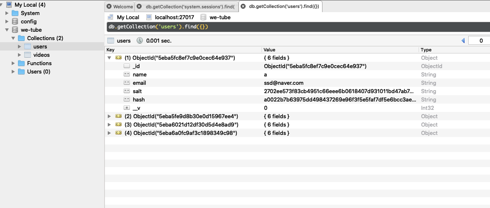

```js
import passport from "passport";
import User from "./models/User";

passport.use(User.createStrategy());
passport.serializeUser(User.serializeUser());
passport.deserializeUser(User.deserializeUser());
```

>passport.serializeUser(User.serializeUser());

코드를 풀어보면

```js
passport.serializeUser(function(user, done) {
  done(null, user.id);
});
```

`serializeUser` : 사용자 정보 객체를 세션에 아이디로 저장하는 기능을 한다.
user(new LocalStrategy에서 로그인이 성공하면 user 값이 여기 콜백 함수로 인자로 넘어온다)를 매개변수로 받아서 done 함수에 두 번째 인자로 user.id를 넘긴다. done 함수의 첫 번째 인자는 에러 발생 시 사용하는 것이므로 두 번째 인자가 중요하다.<br> 
<span style="color: #60b4a6">(보안상의 이유로 쿠키에 user.id만 담는다)</span>

>passport.deserializeUser(User.deserializeUser());

코드를 풀어보면

```js
passport.deserializeUser(function(id, done) {
  User.findById(id, function(err, user) {
    done(err, user);
  });
});
```

`deserializeUser` : 세션에 저장한 아이디를 통해 사용자 정보 객체를 불러오는 기능을 한다 그리고 이 메서드는 serializeUser에서 세션에 저장한 아이디를 받아 DB에서 사용자 정보를 조회한다. 조회한 정보를 req.user에 저장하기 때문에 req.user를 통해 로그인한 사용자의 정보를 가져올 수 있다.


[이제 controller 쪽으로 가보자]

```js
export const postJoin = async (req, res) => {
const {
body: {
name,
email,
password,
password2
}
} = req;

if (password !== password2) {
// 비밀번호가 같지 않다면(true)
res.status(400);
res.render("join", {
pageTitle: "JOIN"
});
} else {
try {
const user = await User({
name,
email
});
await User.register(user, password2);
console.log(user)
} catch (error) {
console.log(error);
}
res.redirect(routes.home);
}
};
```


`postjoin`에서 password와 password2가 같으면 try, cath 구문이 실행이 된다

user 변수에 User 모델 안 name, email을 넣어준다
그다음 register를 사용하여 인자로 user와 password를 추가하면 



User 데이터 베이스에 이런 식으로 저장이 됩니다.<br>
<span style="color: #60b4a6">(salt, hash는 비밀번호를 암호화해주는 것이다)</span>

**노마드 코더 [We-Tube] 강의를 듣고 작성하였습니다.**