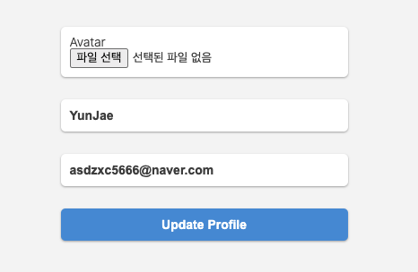

로그인 후 유저의 프로필 설정을 만들어보려고 한다. 우선 페이지를 보여줄 **get 메소드**와 페이지의 있는 정보를 전송해 주는 **post메소드** 두 종류를 만든다

```js
userRouter.get(routes.editProfile, onlyPrivate, getEditProfile);
userRouter.post(routes.editProfile, onlyPrivate, uploadAvatar, postEditProfile);

```
프로필 수정은 로그인한 상태에서만 수정을 할 수 있게 미들웨어로 `onlyPrivate`을 만들고 프로필 사진을 변경할 수 있게 **multer**를 이용한다


```js
const multerAvatar = multer({ dest: "uploads/avatars/" });
export const uploadAvatar = multerAvatar.single("avatar");

```

```js
export const getEditProfile = (req, res) =>
  res.render("editProfile", { pageTitle: "Edit Profile" });

export const postEditProfile = async (req, res) => {
  const {
    body: { name, email },
    file
  } = req;
  try {
    await User.findByIdAndUpdate(req.user.id, {
      name,
      email,
      avatarUrl: file ? file.path : req.user.avatarUrl
    });
    res.redirect(routes.me);
  } catch (error) {
    res.render("editProfile", { pageTitle: "Edit Profile" });
  }
};

```

우선 수정할 정보들을 받아온 다음 try, catch를 이용하여 구문을 작성한다. `User.findByIdAndUpdate`는 User 모델에서 id 값을 찾아 원하는 정보를 업데이트해준다. 첫 번째 인자에는 해당 아이디 값(로그인한 사용자의 id 값)이 들어가고 두 번째에 업데이트할 정보들을 입력하는데 **avatarUrl**은 좀 특수하다. 

프로필 수정 시 사진은 변경하지 않고 그냥 이름만 변경할 경우 사진은 기존 사진 그대로 사용한면<br> 
<span style="color: #574b90">⇒ req.user.avatarUrl을 사용한다</span> 

프로필 사진만 변경하거나 사진과 이름을 같이 변경한다면<br> 
<span style="color: #574b90">⇒ file.path를 사용한다.</span>



프로필을 수정을 하면 name과 email은 원래 기존 값을 넣어 주기 위해 `editProfile` 템플릿을 수정해야 한다

```js
form(action=`/users${routes.editProfile}`, method="post", enctype="multipart/form-data")
            .fileUpload
                label(for="avatar") Avatar
                input(type="file", id="avatar", name="avatar", accept="image/*")
            input(type="text", placeholder="Name", name="name" value=loggedUser.name)
            input(type="email", placeholder="Email", name="email" value=loggedUser.email)
            input(type="submit", value="Update Profile")

```

**name, email input에 value** 값을 주고 **multer**를 사용하기 때문에 form에 `enctype="multipart/form-data` 작성  해준다 
또한 프로필 사진을 올릴 때 이미지만 올릴 수 있게 file type에 `accept="image/*` 추가해 준다

**노마드 코더 [We-Tube] 강의를 듣고 작성하였습니다.**