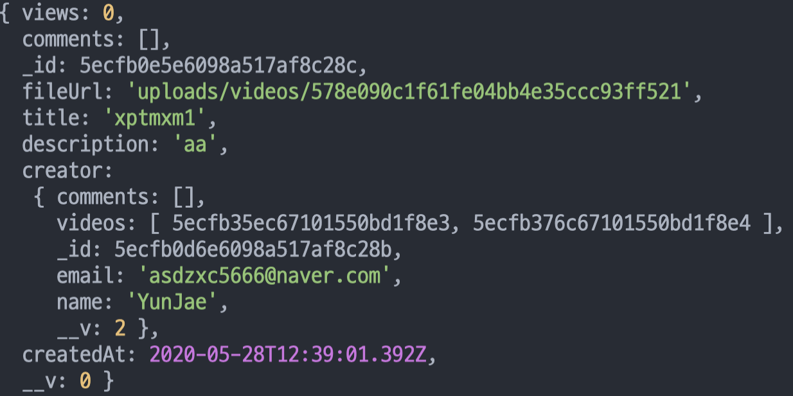
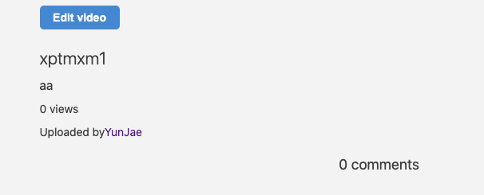

사용자가 비디오를 업로드하면 누가 업로드했는지를 또 업로드 한 사람만이 비디오를 수정할 수 있게 만들려고 한다

우선 모델들을 수정해야 한다

```js
comments: [{
    type: mongoose.Schema.Types.ObjectId,
    ref: "Comment"
  }],
  videos: [{
    type: mongoose.Schema.Types.ObjectId,
    ref: "Video"
  }]

```

User 모델에 comments와 videos 스키마를 추가하고<br>
<span style="color: #60b4a6">(사용자가 어떤 비디오와 댓글을 달았는지 확인할 수 있게)</span>

```js
creator: {
    type: mongoose.Schema.Types.ObjectId,
    ref: "User"
  }

```

Video 모델에 creator 스키마를 추가하고<Br>
<span style="color: #60b4a6">(누가 비디오를 올렸는지 확인할 수 있게)</span>

```js
creator: {
    type: mongoose.Schema.Types.ObjectId,
    ref: "User"
  }

```

Comment 모델에 creator 스카마를 추가한다<br>
<span style="color: #60b4a6">(누가 댓글을 달았는지 확인할 수 있게)</span>

```js
export const postUpload = async (req, res) => {
  const {
    body: { title, description },
    file: { path },
  } = req;
  const newVideo = await Video.create({
    fileUrl: path,
    title,
    description, 
    creator: req.user.id,
  });
  req.user.videos.push(newVideo.id);
  req.user.save();
  res.redirect(routes.videoDetail(newVideo.id));

```

기존에 있던 video를 전부 삭제한 후 로그인 된 상태에서 video를 업로드하여 Video 모델에 사용자(creator)를 추가할 것이다
우선 `postUpload`에서 **Video** 모델에 있는 **creator**스키마에 사용자 **id** 값을 추가한다 

그다음 User 모델에 있는 videos 스키마에 `newVideo.id` 값을 추가한다
<span style="color: #60b4a6">(newVideo.id 값은 video를 업로드하면 자동적으로 id 값이 생성이 되는데 그 값을 추가한다는 것)</span>

그리고 저장을 한 후 **redirect**로 해당 video id의 `videoDetail` 페이지를 불러온다

```js
export const videoDetail = async (req, res) => {
  const {
    params: { id },
  
  } = req;
  try {
    const video = await Video.findById(id).populate("creator");
    console.log(video);
    res.render("videoDetail", {
      pageTitle: video.title,
      video,
    });
  } catch (error) {
    console.log(error);
    res.redirect(routes.home);
  }
};

```

`videoDetail` 페이지를 불러오기 전에 video 변수에 해당 id 값을 찾은 후 거기다 **poulate**를 추가해 준다

<span style="color: #60b4a6">(populate란 객체를 불러오는 것으로 Video 모델 안에는 creator 스키마가 있는데 이걸 그냥 불러오게 되면 creator 스키마에는 그냥 id 값밖에 있지 않지만 populate에 ("creator")를 추가해 주면 creator를 참조한 User 모델의 값까지 전부 받아올 수 있다.)</span>


creator에 보면 User모델의 정보들을 받아왔다

```js
.video__author
                |Uploaded by
                a(href=routes.userDetail(video.creator.id))=video.creator.name

```

이제 creator에 user정보가 있으니 `videoDetail` 템플릿에 위 코드를 추가한다


그럼 views밑에 Uploaded by 이름이 나오는 것을 볼 수가 있다.

**노마드 코더 [We-Tube] 강의를 듣고 작성하였습니다.**