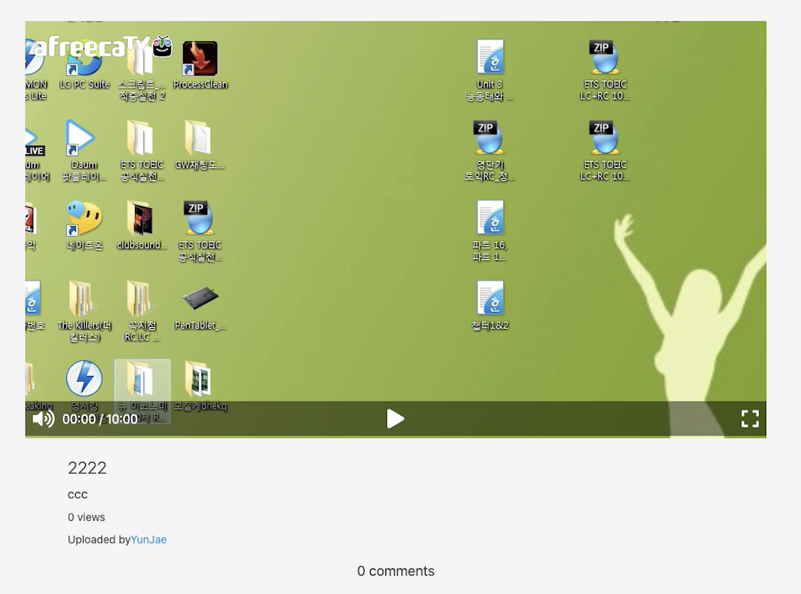

영상 속 video를 컨트롤 할 수 있는 **videoPlayer**를 만들고 디자인을 해보려고 한다 동영상을 재생하기 위해 필요한 옵션들이라 생각하면 쉽다<span style="color: #60b4a6">(재생, 일시정지, 볼륨 버튼, 전체 화면 등)</span>

**videoPlayer**는 한 곳에만 쓸 곳이 아니라 여러 템플릿에서 사용할 예정이기 단독 템플릿에서 만드는 것보다 `mixin`으로 만들어서 활용하는 게 더 좋다 <span style="color: #60b4a6">(home, userDetail, videoDetail 등 video가 있는 곳은 다 사용하려고 한다)</span>

```js
mixin videoPlayer(video ={})
    .videoPlayer
        video(src=`/${video.src}`)
        .videoPlayer__controls
            .videoPlayer__column
                span
                    i.fas.fa-volume-up
                span
                    |00:00 / 10:00
            .videoPlayer__column
                span
                    i.fas.fa-play
            .videoPlayer__column
                span
                    i.fas.fa-expand

```

이렇게 `mixin`을 만든 다음 `videoDetail`에 적용을 시킨다

```js
extends layouts/main
include mixins/videoPlayer

block content
    .video-detail__container
        .video__player
            +videoPlayer({
                src:video.fileUrl
            })
        .video__info
            if loggedUser && video.creator.id === loggedUser.id
                a(href=routes.editVideo(video.id))
                    button Edit video
            h5.video__title=video.title
            p.video__description=video.description
            if video.views === 1
                span.video__views 1 view
            else 
                 span.video__views #{video.views} views
            .video__author
                |Uploaded by
                a(href=routes.userDetail(video.creator.id))=video.creator.name
        .video__comments
            if video.comments.length === 1
                span.video__comment-number 1 comment
            else
                span.video__comment-number #{video.comments.length} comments

```



그럼 이렇게 video에 컨트롤할 수 있는 옵션들이 만들어졌다<span style="color: #60b4a6">(css까지 완료된 상태이다)</span>

**노마드 코더 [We-Tube] 강의를 듣고 작성하였습니다.**