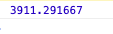

**videoPlayer**에 최종 시간과 재생 중인 시간이 나오도록 해보겠습니다

```js
span
span#currentTime 00:00:00
|/
span#totalTime 00:00:00

```

videoPlayer 템플릿에서 최종 시간에는 `totalTime`이라는 id 값을 추가하고 재생시간에는 `currentTime`의 id 값을 추가한다

```js
videoPlayer.addEventListener("loadedmetadata", setTotalTime);

```

이벤트를 추가하는데 `loadedmetadata` 가 되면 `setTotalTime` 함수가 실행된다 <br>
(loadedmetadata란? 미디어의 메타데이터가 로드되었을 때 실행되는 이벤트)

```js
function setTotalTime() {
  const totalTimeString = formatDate(videoPlayer.duration);
  totalTime.innerHTML = totalTimeString;
  setInterval(getCurrentTime, 1000);
}

```

여기서 `formatDate` 함수를 따로 만들어 놨는데 이건 쉽게 말해 **00:00:00**을 쉽게 계산해 주는 함수다

```js
const formatDate = (seconds) => {
  const secondsNumber = parseInt(seconds, 10);
  let hours = Math.floor(secondsNumber / 3600);
  let minutes = Math.floor((secondsNumber - hours * 3600) / 60);
  let totalSeconds = secondsNumber - hours * 3600 - minutes * 60;

  if (hours < 10) {
    hours = `0${hours}`;
  }
  if (minutes < 10) {
    minutes = `0${minutes}`;
  }
  if (totalSeconds < 10) {
    totalSeconds = `0${totalSeconds}`;
  }
  return `${hours}:${minutes}:${totalSeconds}`;
};

```

`formatDate` 함수에 인자 값으로 `seconds`를 받는다 그리고 `formatDate` 함수안에 `secondsNumber`라는 변수를 만들고 인자로 받은 `seconds`의 초를 10진법 정수로 바꿔준다<span style="color: #60b4a6">
(문자열에서 정수로 바꿔주는 역할을 pareseInt 함수가 해주는데 예를 들어 parseInt( string, n) 가 있으면 string을 n 진법일 때의 값으로 바꾼다. n은 옵션으로 2부터 36까지 입력할 수 있다. 입력하지 않으면 10진수로 처리한다 그리고 소수점 아래는 버린다)</span>

예를 들어 `formatDate` 함수 인자에 10000초에 해당되는 인자를 받으면 `hours`는 1시간 3600초, 10000/3600 = 2.777777778시간(앞에 2는 시간, 소수점 이하  제거(floor함수). `minutes`는 1분 60초, (10000 - (2*3600초))/60초 = 46.6666666분(앞에 46은 분 단위, 소수점 제거) `totalSeconds`는 (10000초 - 7200초(즉, 2시간*3600초) - 2760초(즉, 46분*60초)) = 40초 return의 값은 10000초를 주어진 형식으로 변환하면 02:46:40으로 된다 `formatDate(videoPlayer.duration)`은 videoPlayer의 총 시간을 말한다 (duration은 전체 시간을 알려주는 자체 프로퍼티이다) console.log(videoPlayer.duration);을 찍어보면



이렇게 총 시간이 나오는데 이걸


이런 식으로 01:05:11 이렇게 만들어 주는 함수가 `formatDate` 함수이다

이제 비디오 총 시간(duration)을 템플릿에 `totalTime`에 추가하고 `setInterval`을 통해 매초마다 `getCurrentTime` 함수가 실행이 되도록 하는데 이게 비디오 재생 시간(currentTime)이다 getCurrentTime 함수를 알아보자

```js
function getCurrentTime() {
  currentTime.innerHTML = formatDate(Math.floor(videoPlayer.currentTime));
} 

```

currentTime(템플릿)에 videoPlayer의 재생시간 즉 `currentTime`을 추가한다<br>
( video의 현재 시간을 알려주는 프로퍼티가 있는데 이게 currentTime이다 )

console.log(videoPlayer.currentTime); 콘솔 로그를 통해 확인해보면 아래 사진과 같이 나온다


비디오를 재생 시키면 재생시간이 나오는 `currentTime` 역시 그저 초 단위로만 나오기 때문에 이걸 00:00:00 형식으로 바꾸기 위해 `formatDate` 함수를 사용한다

**노마드 코더 [We-Tube] 강의를 듣고 작성하였습니다.**