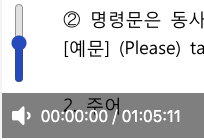

이번엔 볼륨 버튼으로 볼륨을 조절할 수 있게 만들어 보겠습니다

```js
mixin videoPlayer(video ={})
    .videoPlayer#jsVideoPlayer
        video(src=`/${video.src}`)
        .videoPlayer__controls
            .videoPlayer__column
                span#jsVolumeBtn
                    i.fas.fa-volume-up
                span
                    span#currentTime 00:00:00 
                    span  / 
                    span#totalTime 00:00:00
                input.videoPlayer__volume#jsVolume(type="range", min="0", max="1", step="0.1", value="0.5")
            .videoPlayer__column
                span#jsPlayButton
                    i.fas.fa-play
            .videoPlayer__column
                span#jsFullScreen
                    i.fas.fa-expand

```

비디오 시간 뒤에 `input`을 만들고 id 값을 준 후 옵션을 준다

type="range" - input에 여러 타입이 있는데 range 타입을 준다<br>
min="0" - 최소값<br>
max="1" - 최대값<br>
step="0.1"  - 숫자들 사이의 간격(range를 움직이는 간격)<br>
value="0.5" - 기본값

이제 이벤트를 등록한다

```js
videoPlayer.addEventListener("ended", handleEnded);
volumeRange.addEventListener("input", handleDrag);

```

첫 번째 이벤트는 비디오 영상이 끝나면 `handleEnded` 함수가 실행이 된다

```js
function handleEnded() {
  videoPlayer.currentTime = 0;
  playBtn.innerHTML = '<i class="fas fa-play"></i>';
}

```

`handleEnded` 함수는 영상이 끝나면 재생시간이 0초로 변경되고 `playBtn` 버튼이 다시 재생 버튼으로 바뀐다.

두 번째 이벤트는 `input`에 값을 받으면 `handleDrag` 함수가 실행된다

```js
function handleDrag(event) {
  const {
    target: { value }
  } = event;
  videoPlayer.volume = value;
  if (value >= 0.6) {
    volumeBtn.innerHTML = '<i class="fas fa-volume-up"></i>';
  } else if (value >= 0.2) {
    volumeBtn.innerHTML = '<i class="fas fa-volume-down"></i>';
  } else {
    volumeBtn.innerHTML = '<i class="fas fa-volume-off"></i>';
  }
}

```

이번엔 이벤트 핸들러가 이벤트 객체로 사용되는데 이유는 이벤트에 대한 다양한 정보를 갖고 있어 그에 따라 취할 반응을 달리 정할 수 있어서 그렇다.

`event.target.value`라는 뜻인데 이건 이벤트를 발생시킨 요소의 값을 나타낸다<br>
(range를 움직일 때마다 생기는 값. 우리는 템플릿에서 최소, 최대값과 범위를 주었다 즉 볼륨을 올리거나 내릴 때마다 값이 변경되는 그 값을 말한다)

이제 **videoPlayer**의 **Volume** 값은 **value**이다 if 문을 통해 원하는 Volume 값에 맞게 아이콘을 수정할 수 있다.



**노마드 코더 [We-Tube] 강의를 듣고 작성하였습니다.**