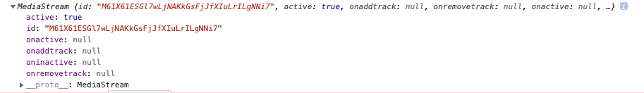
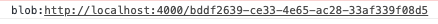

upload에서 파일을 올리는 것뿐만 아니라 카메라를 통해서 바로 녹화하여 파일을 다운로드한 후 업로드할 수 있는 방법을 구현해 봅니다
```js
function init() {
  recordBtn.addEventListener("click", getVideo);
}

if (recorderContainer) {
  init();
}

```

**recorderContainer**에 값이 있으면 `init()` 함수가 실행이 된다 이 함수에는 이벤트가 있는데 **recordBtn**을 클릭하면 `getVideo` 함수가 실행이된다.

```js
let streamObject;
let videoRecorder;

const getVideo = async () => {
  try {
    const stream = await navigator.mediaDevices.getUserMedia({
      audio: true,
      video: {
        width: 1280,
        height: 720,
      },
    });
    videoPreview.srcObject = stream;
    videoPreview.muted = true;
    videoPreview.play();
    recordBtn.innerHTML = "Stop recording";
    streamObject = stream;
    startRecording();
  } catch (error) {
    recordBtn.innerHTML = "🔴 Cant record";
  } finally {
    recordBtn.removeEventListener("click", getVideo);
  }
};

```

**getVideo**는 **async**를 사용하여 `getUserMedia` 메서드를 받을 때까지 기다린다 여기서 `getUserMedia`는 쉽게 말해 이렇게 호출만 하면 웹캠, 마이크 입력을 접근할 수 있다 정확한 정의는 아래와 같다

<span style="color: #60b4a6">(사용자에게 미디어 입력 장치 사용 권한을 요청하며, 사용자가 수락하면 요청한 미디어 종류의 트랙을 포함한 MediaStream을 반환합니다. 스트림은 카메라, 비디오 녹화 장치, 스크린 공유 장치 등 하드웨어와 가장 비디오 소스가 생성하는 비디오 트랙과, 마이크, A/D 변환기 등 물리적과 가상 오디오 장치가 생성하는 오디오 스트림, 그리고 그 외의 다른 종류의 스트림을 포함할 수 있습니다.)</span>

[참조 - Developer_Mozilla](https://developer.mozilla.org/ko/docs/Web/API/MediaDevices/getUserMedia)

이렇게 `getUserMedia()` 메서드를 호출하면 반환값으로 **MediaStream**이 반환하는데 이건 사용자의 디바이스에서 카메라나 마이크 같은 장비들의 스트림을 얻어내는 역할을 한다 즉 가져온 미디어는 여기에 저장된다.



[위 사진이 반환되는 MediaStream 이다] 

`getVideo`함수에서 `videoPreview.srcObject = stream`은 **stream** 자체가 객체이기에 **srcObject**로 **url**를 처리한다 녹화 중에 영상 소리기 나지 않게 muted 처리를 해준 후 `play()`를 하면 `startrecording()` 함수가 실행된다

**streamObject** 글로벌 변수에 `stream`을 대입시켜준다 

```js
const startRecording = () => {
  videoRecorder = new MediaRecorder(streamObject);
  videoRecorder.start();
  videoRecorder.addEventListener("dataavailable", handleVideoData);
  recordBtn.addEventListener("click", stopRecording);
};

```

`getVideo()` 함수에서는 카메라와 오디오 기능을 그냥 가져오기만 했다  이제 `startRecording()` 함수를 통해 비디오를 녹화하고 저장하려 한다 **MediaRecorder**는 미디어를 쉽게 기록 할 수 있는 기능을 제공해 준다 `getUserMedia()`가 생성한 스트림을 받는다


`videoRecorder.start()` 메서드를 호출하여 레코딩을 시작한다 그럼 이제 미디어 소스( getUserMedia() ) 에 **Blob** 형태로 데이터가 저장이 되고 레코딩을 끝내고 싶으면 recordBtn 버튼을 눌러 `stopRecording()` 함수가 실행이 되면서 **dataavailable**의 `handleVideoData` 이벤트 함수가 실행이 된다

<span style="color: #60b4a6">( dataavailable : video가 정지되면 함수가 실행)</span>

```js
const handleVideoData = (event) => {
  const {
    data: videoFile
  } = event;
  const link = document.createElement("a");
  link.href = URL.createObjectURL(videoFile);
  link.download = "recorded.webm"
  document.body.appendChild(link);
  link.click();
};

```

레코딩이 멈추면 `handleVideoData()` 가 실행이되어 저장되어 있던 **Blob** 데이터에 접근할 수 있다 **link**라는 변수를 새로 만들어 **a** 태그를 만든 후 링크로 `videoFile(blob)`을 준다

`URL.createObjectURL(videoFile)`은
Blob 객체에 가상의 URL을 부여할 수 있다. 이 방식을 사용하면 Blob는 물론 Blob를 상속한 File 객체에도 URL을 부여할 수 있게 되는데 이 Blob URL은 생성된 window의 document에서만(브라우저) 유효하고 다른 window에서 재활용할 수 없으며, URL의 수명이 한정되어 있기 때문에 **file:url** 과 다르게 보안 이슈에서 벗어날 수 있다.



**노마드 코더 [We-Tube] 강의를 듣고 작성하였습니다.**