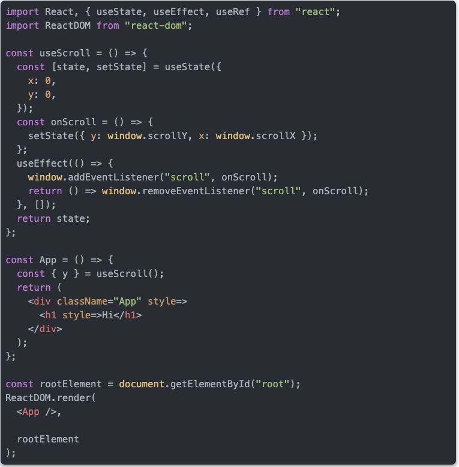

## useFadeIn
h1 태그와 p 태그에 각 **duration과 delay**를 주어 애니메이션을 구현하는 코드입니다.

```javascript
import React, { useState, useEffect, useRef } from "react";
import ReactDOM from "react-dom";

const useFadein = (duration = 1, delay = 0) => {
  if (typeof duration !== "number" || typeof delay !== "number") {
    return;
  }

  const element = useRef();
  useEffect(() => {
    if (element.current) {
      const { current } = element;
      current.style.opacity = 1;
      current.style.transition = `opacity ${duration}s ease-in-out ${delay}s`;
    }
  }, []);
  return { ref: element, style: { opacity: 0 } };
};

const App = () => {
  const fadeInH1 = useFadein(3, 3);
  const fadeInP = useFadein(3, 7);
  console.log(fadeInH1);
  return (
    <div className="App">
      <h1 {...fadeInH1}>Hello</h1>
      <p {...fadeInP}>Wellcome! Nice too meet you!</p>
    </div>
  );
};

const rootElement = document.getElementById("root");
ReactDOM.render(
  <App />,

  rootElement
);
```

---

## useScroll

**Scroll** 시 h1 태그 색상이 변경되는 코드입니다

```javascript
const useScroll = () => {
  const [state, setState] = useState({
    x: 0,
    y: 0
  });
  const onScroll = () => {
    setState({y: window.scroll Y, x: window.scroll X});
  };
  useEffect(() => {
    window.addEventListener("scroll", onScroll);
    return () => window.removeEventListener("scroll", onScroll);
  }, []);
  return state;
};
```

`useScroll()` 함수를 만들고 return으로 state 값을 주며 `useState()`를 사용하여 state의 기본값으로 x, y에 0을 준다 마운트 되었을 때 이벤트가 실행되도록 `useEffect()`를 활용하며 한 번만 사용하기 위해 []를 추가하고 페이지 변경 시 이벤트가 삭제하게 return에 이벤트 삭제 코드를 추가한다

`useScroll()`에서 y 값을 받아와 h1의 style color에 삼항연산자를 사용하여 색상을 추가한다 <span style="color: #60b4a6">(div에 1000vh를 추가한 이유는 스크롤을 하기 위해서다)</span>

[최종코드]


