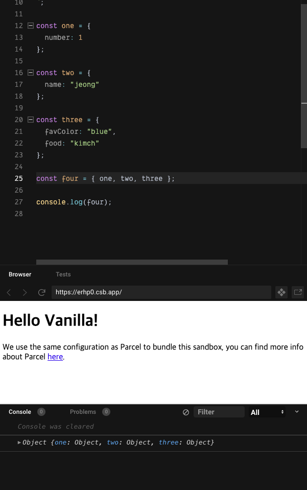
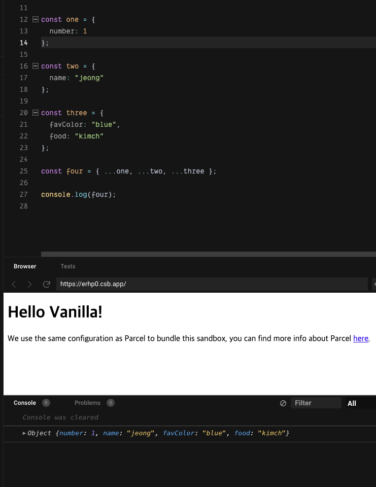

## Spread Operator
**특정 객체, 배열의 값**을 각각 **새로운 객체와 배열**에 복제하는 코드이다


위와 같이 `four`의 객체에 one, two, three를 전부 불러오면 객체 안에 객체 형식으로 담긴다 하지만 **spread Operator**를 사용하면 하나의 객체 안에 값이 다 담긴다


이런 식으로 one, two, three 안에 있는 객체를 하나의 객체로 만들 때 **spread Operator**를 사용한다.


## Redirect
**리다이렉트**는 해당 라우터에서 일치하는 경로가 없으면 to에서 지정한 경로로 보내주는 것이다

```javascript
<Router>
      <Route path="/" exact component={Home} />
      <Route path="/tv" exact component={TV} />
      <Route path="/search" exact component={Search} />
      <Redirect from="*" to="/" />
  </Router>
```

하지만 위와 같이 사용을 하게 되면 에러가 난다 그 이유는 Rotue Home의 경로와 `Redirect`가 출력하는 경로  같기 때문인데 이럴 땐 `Switch`를 사용하는데 한번 에 오직 하나만의 Router만 렌더링 해준다

```javascript
<Router>
    <Switch>
      <Route path="/" exact component={Home} />
      <Route path="/tv" exact component={TV} />
      <Route path="/search" exact component={Search} />
      <Redirect from="*" to="/" />
    </Switch>
  </Router>
```


## Styled-Component
CSS in JS의 일종으로 말 그대로 JS 안에 CSS 를 작성하는 것을 의미한다 클래스를 만들 필요도 css 파일을 따로 만들 필요도 없으므로 편리하다

```javascript
const List = styled.ul'
  display: flex;
  &:hover {
    background-color: blue;
  }`

  <List>
      <Item current={pathname === "/"}>
        <Link to="/">Movies</Link>
      </Item>
  </List>
```
`styled` 뒤에 HTML_TAG를 작성한 후 백틱(``)안에 원하는 스타일 값을 작성하면 된다


