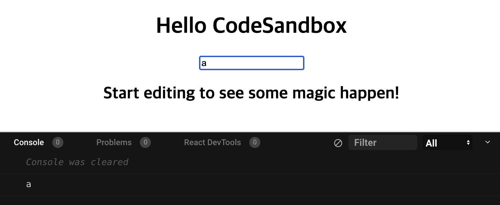
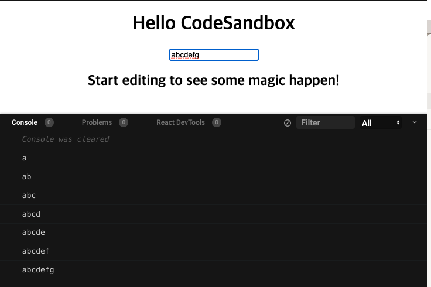

### 논리연산자
- NOT연산자 (!)
NOT 연산자로 입력 값이 true 이면 false로 false 면 true로 리턴이 된다

```jsx
const !true // false

const !false // true
```


- AND연산자 (&&)

AND연산자로 두 개의 입력 값을 취해 두 개의 입력이 모두 true인 경우에만 true를 리턴한다

```jsx
const true && true // true

const true && false // false

const false && false // false
```


- OR연산자 (ㅣㅣ)

OR 연산자로 두 개의 입력 값 중 어느 하나라도 true 이면 true를 리턴한다

```jsx
const true || true // true

const true || false // true

const false || false // fasle
```


### onchange

`onChange` 함수는 우리가 작성한 자바스크립트를 통해 변화가 일어났는지 탐지해 주는 역할을 한다.

```jsx
import React from "react";

function App() {
  const onChange = (e) => {
     console.log(e.target.value)
  }
  return (
    <div className="App">
      <h1>Hello CodeSandbox</h1>
      <input onChange={onChange}></input>
      <h2>Start editing to see some magic happen!</h2>
        
    </div>
  );
}
```

아래 사진을 확인해보자






이렇게 `input`에 변화가 될 때마다 console.log에 변화된 값이 출력이 된다.


### try catch finally


```jsx
try {

// 프로그램 실행 로직

} catch(error) {

// 예외발생 시의 로직

} finally {

```

**간단하게 실행 순서를 살펴보자면**

1. 먼저, `try {...}` 안의 코드가 실행된다
2. 에러가 없다면, `try` 안의 마지막 줄과 finally 안의 코드가 실행된 후 `catch` 블록은 건너뛴다
3. 에러가 있다면, `try` 안 코드의 실행이 중단되며  `catch(err)`와 finally 안의 코드가 실행되고 블록으로 제어 흐름이 넘어간다. 변수 `err`(아무 이름이나 사용 가능)는 무슨 일이 일어났는지에 대한 설명이 담긴 에러 객체를 포함

이렇게 `try {…}` 블록 안에서 에러가 발생해도 `catch`에서 에러를 처리하기 때문에 스크립트는 죽지 않는다