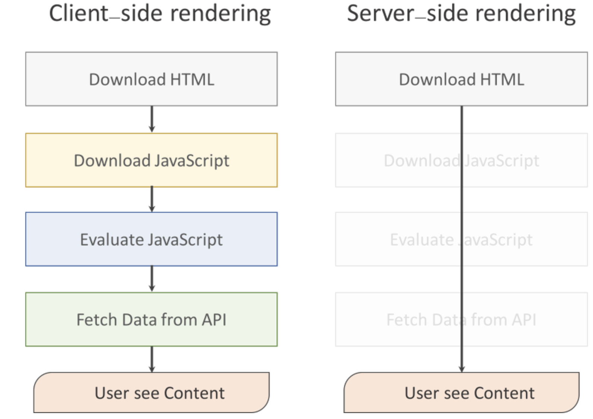

### 서버사이드렌더링이란?

전통적으로 웹페이지를 구동하는 방식이며  클라이언트 에서 작업하던 <u>View와 Controller를 서버에서 직접 작업하는 것이며</u> 브라우저에 나타나는 형태 그대로를 HTML로 만들어 제공하고, 브라우저는 HTML을 표시하는 방식이었다. 이런 방식을 사용하다가 일부 HTML과 Script만 브라우저로 전달하고, 브라우저에서 Script를 실행시켜 서버에서 데이터를 조회하여 HTML을 생성하는 방식을 사용하게 되었다.

하지만 시대가 변할수록 웹에서 제공되는 정보가 점점 더 많아지기 때문에 전통적인 방식은 성능 문제에 이슈를 낳았다. 그래서 기존에 있던 방식과는 다른 접근이 필요해 나온 것이 <u>클라이언트사이드렌더링(CSR) SPA(Single page web Application)</u>이다 

이것은 사용자의 행동에 따라 필요한 부분만 다시 읽어들이기 때문에 서버 측에서 렌더링 하여 전체 페이지를 다시 읽어들이는 것보다 빠르다 그렇다고 `CSR` 방식이 `SSR` 보다 더 좋은 것은 아니다 두 가지 중 각각의 장, 단점이 있으며 상황에 맞게 사용을 하면 된다 장, 단점을 알아보자

***

### 서버사이드렌더링(SSR) 

**장점**

- 화면에 보이는 View를 서버에서 렌더링을 하여 가져오므로 <u>초기 구동 속도가 빠르다</u>

- SEO(검색엔진)을 최적화가 가능하다 View를 서버 측에서 받아오기 때문에 <u>검색엔진에 유리하다</u>

**단점**

- 매번 페이지를 서버 측에서 받아와야 하므로 페이지 이동 시 화면이 깜빡이며 작은 데이터 수정에도 <u>서버를 거쳐야 하므로 속도가 느리다</u>

- 초기 구동 속도는 빠르지만 연속적으로 렌더링 할 경우 <u>서버에 과부하가 올 수 있다</u>

***

### 클라이언트사이드렌더링(CSR)

**장점**

- 필요한 데이터 와 변경된 데이터만 받으면 되기 때문에 <u>트래픽이 감소된다</u>

**단점**

- 페이지, JS, 서버에 있는 자료들을 모두 가져와야 렌더링이 되므로 초기 구동 속도가 느리다

- <u>SEO(검색엔진) 최적화에 문제가 있다</u> 일반적인 웹크롤러, 봇들은 HTML 내용만 수집하기에 빈 페이지로 인식한다. js가 실행이 완료되어 렌더링이 되기 전까지 HTML은 빈 화면이기 때문이다. 하지만 구글의 검색엔진은 자바스크립트 엔진이 내장되어 있지만 국내 포털사이트인 네이버, 다음 등의 검색엔진은 제대로 크롤링 하지 못하기 때문에 서버사이드렌더링을 따로 구현해야 한다.

- <u>보안 문제가 생긴다</u> SSR의 경우 사용자 정보들을 서버 측에 보내 세션으로 안전하게 관리하지만 CSR은 쿠키 말고는 사용자 정보들을 저장할 공간이 없다.

렌더링이란? - 어떤 웹 페이지에 접속 시 그 페이지를 화면에 보여주는 것