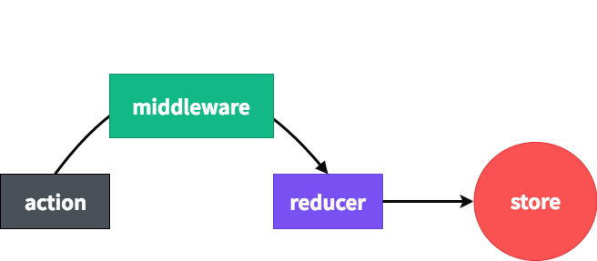

### 미들웨어란?



미들웨어는, **액션이 디스패치(dispatch) 되어서 리듀서에서 이를 처리하기 전에 사전에 지정된 작업들을 설정하는 곳이다** 즉 액션과 리듀서의 중간자라고 보면 된다. 네트워크 요청의 상태 관리와 전달받은 데이터 상태 관리를 더욱 효율적이고 쉽게 할 수 있도록 도와준다

## 미들웨어의 역할

- 단순히 전달받은 액션을 콘솔에 기록할 수가 있다
- 전달받은 액션을 기반으로 액션을 취소하거나 다른 종류의 액션을 추가적으로 디스패치 할 수 있다
- 액션 정보를 중간에 가져가 수정하여 리듀서로 전달할 수 있다
- 특정 액션이 발생하면 특정 JS 함수를 실행할 수 있다

이렇게 미들웨어는 리듀서의 중간자로서 액션 리듀서의 중간에서 많은 역할을 한다 그래서 비동기 작업을 할 때 많이 유용하다

**[미들웨어의 기본 구조]**

```jsx
const loggerMiddleware = store => next => action => {};

export default loggerMiddleware;
```

**[미들웨어 기본 구조 (함수형)]**

```jsx
const loggerMiddleware = function loggerMiddleware(store) {
  return function(next) {
    return function(action) {};
  };
};
```

미들웨어는 **결국 함수를 반환하는 함수이다.** 매개변수로 받아오는 `store`는 리덕스 스토어 인스턴스를, `action`은 디스패치된 액션을 가리킨다. 

next 파라미터는 함수 형태이며, `store.dispatch`와 비슷한 역할을 한다. 차이점은 `next(action)`을 호출하면 그다음 처리해야 할 미들웨어에게 액션을 넘겨주고, 만약 다음 미들웨어가 없다면 리듀서에게 액션을 넘겨준다.

미들웨어 내부에서 `store.dispatch`를 사용하면 첫 번째 미들웨어부터 다시 처리한다. `next`를 사용하지 않으면 액션이 리듀서에 전달되지 않는다.

**[콘솔로 흐름 파악]**

```jsx
const loggerMiddleware = store => next => action => {
  console.group(action && action.type); // 액션 타입으로 log를 그룹화
  console.log('이전상태', store.getState());
  console.log('액션', action);
  next(action); //다음 미들웨어 혹은 리듀서에게 전달
  console.log('다음 상태', store.getState());
  console.groupEnd(); // 그룹 끝
};

export default loggerMiddleware;
```

**[스토어에 미들웨어 적용]**

```jsx
import React from 'react';
import ReactDOM from 'react-dom';
import App from './App';
import { createStore, applyMiddleware } from 'redux';
import { Provider } from 'react-redux';
import rootReducer from './modules';
import loggerMiddleware from './lib/loggerMiddleware';

const store = createStore(rootReducer, applyMiddleware(loggerMiddleware));

ReactDOM.render(
  <Provider store={store}>
    <App />
  </Provider>,
  document.getElementById('root')
);
```

미들웨어는 스토어를 생성하는 과정에서 적용할 수 있다.

***

### redux-saga

공식 문서에서 정리 하기를 아래와 같이 설명이 되어있다

>redux-saga는 리액트/리덕스 애플리케이션의 사이드 이펙트, 예를 들면 데이터 fetching이나 브라우저 캐시에 접근하는 순수하지 않은 비동기 동작들을, 더 쉽고 좋게 만드는 것을 목적으로 하는 라이브러리입니다.


redux-saga는 Generator 함수를 이용하여 사용할 수 있는데 Generator 함수를 짧게 소개하자면 이 함수는 코드 진행 중 yield 키워드를 만나면 일단 멈춘다 그리고 계속 진행하라는 지시가 전달되어야 다음 yield 키워드까지 코드를 진행 시킨다

```jsx
import { delay } from 'redux-saga'
import { put, takeEvery } from 'redux-saga/effects'

// 1초 뒤 "INCREMENT" 액션이 실행된다
export function* incrementAsync() {
  yield delay(1000)
  yield put({ type: 'INCREMENT' })
}

// "INCREMENT_ASYNC" 액션이 실행되면 "incrementAsync" 함수가 실행된다
export function* watchIncrementAsync() {
  yield takeEvery('INCREMENT_ASYNC', incrementAsync)
}
```

이렇게 **Generator** 함수를 사용하며 이펙트라는 것을 같이 사용하는데 이펙트는 미들웨어에 의해 수행되는 명령을 담고 있는 간단한 JS 객체이다

아래는 Saga과 관련 메소드와 **Generator(Saga의 주가 되는 함수)** 함수에 대해 정리해보았다

- <span style="color:#f6b93b">:</span> 함수 뒤에 *를 선언하여 Generator 함수라는 것을 선언해 준다.
- <span style="color: #f6b93b">yield</span> : 키워드 뒤에 있는 값들을 순서대로 넘겨준다.
- <span style="color: #f6b93b">next</span> : 이 메소드는 다음 두 속성을 갖는 객체를 반환해야 한다.
- <span style="color: #f6b93b">done</span> : 반복이 모두 끝났는지를 나타낸다.
- <span style="color: #f6b93b">value</span> : 현재 순서의 값을 나타낸다.
- <span style="color: #f6b93b">call</span> : 첫 번째 파라미터로 전달한 함수에 그 뒤에 있는 파라미터들은 전달하여 호출해 준다. 이를 사용하면 나중에 테스트를 작성할 때 용이하게 사용하며 동기적으로 실행한다.
- <span style="color: #f6b93b">delay</span> : 해당 메소드를 실행하기 전에 대기하는 메소드
- <span style="color: #f6b93b">takeEvery</span> : 특정 액션을 모니터링을 하고, 발생하면 특정 함수를 발생시킨다. takeEvery을 통해 액션을 바라보고 액션이 dispatch 될때마다 action을 실행하기 위해 takeEvery핼퍼 함수를 사용한다.
- <span style="color: #f6b93b">takeLatest</span> : 같은 종류의 액션이 여러 번 요청된다면 가장 마지막 액션에 대해서만 동작을 실행한다. 즉 이전 액션 요청이 끝나지 않았음에도 불구하고 같은 종류의 액션이 여러 번 요청된다면 이전 요청을 취소한다
- <span style="color: #f6b93b">all</span> : Redux-Saga를 여러 개를 묶어서 사용할 때 사용한다.
- <span style="color: #f6b93b">put</span> : 우리가 이펙트라고 부르는 예중 하나이다. 이펙트는 미들웨어에 의해 수행되는 명령을 담고 있는 간단한 객체이다.(디스패치로 생각하면 된다)
- <span style="color: #f6b93b">fork</span> : call과 같이 함수를 실행시켜준다 다만 fork는 비동기적으로 실행한다

***

## 참고자료

[참고 BLOG](https://github.com/reactkr/learn-react-in-korean/blob/master/translated/deal-with-async-process-by-redux-saga.md)<br>
[참고 BLOG2](https://mskims.github.io/redux-saga-in-korean/)
