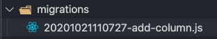

## <span style="color : #184C88 ">10월 22일(목) 오늘 한 일</span>

***

### FormData

보통 HTML에서 form 태그를 사용해서 submit 버튼을 만들어서 전송을 한다  파일이나 이미지를 비동기로 전송할 때는 `FormData`를 이용한다  쉽게 말해 페이지 전환(새로 고침) 없이 폼 데이터를 제출할 때 사용한다 FormData 객체는 XMLHttpRequest를 사용하여 전송할 수 있도록 키/값 쌍들의 집합을 컴파일 해 준다. 

아래는 `FormData`에 사용할 수 있는 메소드들이다.

**append(key, value)**

데이터 키와 값을 추가합니다. 입력폼에 값을 쉽게 추가할 수 있다

**delete(key)**

추가된 데이터를 삭제합니다.

**has(key)**

특정 값을 가지고 있는지 확인할 때 사용한다

**entries()**

현재 가지고 있는 데이터의 값을 배열로 반환한다

**values()**

이것도 가지고 있는 값을 모두 반환한다

**get(key)**

키와 매핑된 값을 가져온다

**set(key, value)**

데이터의 값을 설정하고 기존 설정된 값을 변경할 수도 있으며 append()는 안되므로 set()을 사용한다

***

### 유사 배열

nodes, els처럼 []로 감싸져 있지만 배열이 아닌 것을 유사 배열이라고 한다 

```jsx
var array = [1, 2, 3, 4]; 
var node = document.querySelector('div'); 
var els = document.body.children; 

console.log(array); // [1, 2, 3, 4] 
console.log(node); // NodeList [div, div, div] 
console.log(els); // HTMLCollection [noscript, div, div, script, ...]
```

node나 els와 같은 유사 배열 객체를 가지고 Array라고 착각하고 많이 실수한다. 겉으로만 봐서는 length 속성도 있고, []로 감싸져 있기 때문에 배열과 유사 배열객 체의 차이를 구별하기 어렵다 **하지만 유사 배열일 때 배열의 메소드를 사용할 수 없어서 배열 메소드를 바로 사용할 수는 없고 빌려서 쓸 수 있는 방법이 있는데 배열 프로토타입에서 forEach메소드를 빌려와야 해서 call, apply를 사용한다**

<span style="color: #60b4a6">(배열 = 객체 + length + 메서드)</span><br>
<span style="color: #60b4a6">(유사 배열 = 객체 + length)</span>

```jsx
[].forEach.call(els, function(element, index, array){ 
  console.log(element, index); 
 }); 
// element, index ...
```

call을 활용하여 유사 배열 객체를 call의 첫 번째 인자로 넘겨줘야 한다

<span style="color: #60b4a6"><u>그렇다면 유사 배열은 왜 사용할까?</u></span> 이유는 어떤 함수에서 실행 결과로 배열 값을 돌려주고 싶을 때, 원래의 배열 객체가 가지고 있는 기능(함수)를 제공하고 싶지 않거나 원래의 배열 객체에 없는 기능을 제공하고 싶을때 유사배열을 사용한다. 즉 원래의 배열과 다른 배열을 사용하고 싶을 때 유사 배열을 이용한다

***

### Sequelize-cli

models 폴더에 직접 작성하지 않고 터미널 창에서 명령어를 통해서도 테이블을 정의할 수 있다. 즉 터미널에서 명령어를 사용해 데이터베이스 작업을 할 수 있게 만들어주는 툴이다.

아래는 migrations을 사용하여 이미 정의된 모델에 칼럼을 추가하는 과정이다

<span style="color: #60b4a6"><u>(migrations 이란 git과 비슷하게, 데이터베이스 변화하는 과정들을 추적해나가는 정보로, 실제 데이터베이스에 반영할 수도 있고 변화를 취소할 수도 있다.)</u></span>

⭐️ 우선 먼저 migrations 폴더에 add-column인 파일을 만든다 ⭐️
```jsx
./node_modules/.bin/sequelize migration:generate --name add-column
```



그럼 위 사진과 같이 날짜와 add-column파일이 생길 것이다 그럼 이제 이 파일을 보면

```jsx
module.exports = {
  up: async (queryInterface, Sequelize) => {
    queryInterface.addColumn(
      'Users', // name of Target model
      'avatar', // name of the key we're adding
      {
        type: Sequelize.STRING,
        defaultValue: 'https://placeimg.com/140/140/any',
      }
    )
  
    /**
     * Add altering commands here.
     *
     * Example:
     * await queryInterface.createTable('users', { id: Sequelize.INTEGER });
     */
  },

  down: async (queryInterface, Sequelize) => {
    queryInterface.removeColumn(
      'Users', // name of the Target model
      'avatar' // key we want to remove
    )
    /**
     * Add reverting commands here.
     *
     * Example:
     * await queryInterface.dropTable('users');
     */
  }
};
```

추가할 부분을 up 쪽에 입력하는데 나는 user 모델에<span style="color: #60b4a6">(참고로 sequelize-cli로 만들면 테이블은 복수형이 된다 -users)</span> avatar 컬럼을 추가하려고 한다 type과 기본값을 up부분에 작성하면 되는데 up 과 down
어디에 작성하냐에 따라 다른 기능을 제공한다 

**sequelize db:migrate**를 실행하면 `up`의 내용을 실행하고<br>
**sequelize db:migrate:undo**를 실행하면 `down의` 내용을 실행하게 된다.

⭐️ 이제 마지막으로 아래의 명령어를 이용해 컬럼을 만들어보자 ⭐️

```jsx
./node_modules/.bin/sequelize db:migrate
or
npx sequelize db:migrate
```

<span style="border-bottom: 2px solid red"> ✔️ 입력이 완료되면 이제 워크벤치에서 확인해보면 새 칼럼이 생성이 되었다 하지만 여기서 끝이 아니라
migrations 폴더 파일과 models 폴더에 있는 파일 내용과 반드시 내용을 일치시켜줘야 한다 그래야 데이터를 인식할 수 있다!</span>