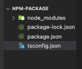
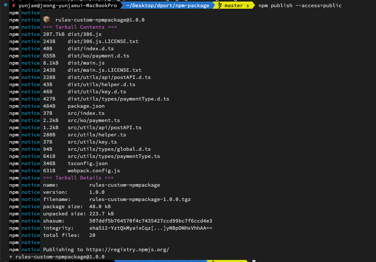

### **초기설정**

---

프로젝트 경로에 `npm init`을 입력하여 **package.json**을 생성합니다. 명령어를 입력할 경우 아래와 같이 입력해 주시면 됩니다.


크게 **package-name**과 **description** 정도만 작성해 주면 됩니다. 나중에 package.json 파일에서 수정이 가능합니다. 여기서 주의할 점은 package-name은 npm에 있는 다른 모듈과 이름이 같으면 안 됩니다. 설정이 완료되면 root에 package.json 파일이 생성이 됩니다.

### **TypeScript 설정**

---

이제 타입스크립트를 사용하기 위해 설치하고 설정을 합니다.

`npm install typescript --save-dev` 명령어를 통해 타입스크립트를 설치한 후 `npx tsc --init` 명령어를 입력할 경우 **tsconfig.json** 파일이 생성됩니다.



이제 **tsconfig.json** 을 통해 타입스크립트를 설정하겠습니다. 설정한 각 옵션에 대해서 간단하게 어떤 역할을 하는지 알아보겠습니다.

```json
{
  "compilerOptions": {
    "target": "es5", //빌드의 결과물 es 버전. 해당 버전으로 트랜스파일링 된다
    "module": "commonjs", // 빌드시 모듈 방식을 무엇으로 할 것인지 지정한다
    "declaration": true, // .d.ts 파일 생성 여부
    "outDir": "./dist", // 컴파일 결과물이 담길 폴더 주소
    "strict": true, // 엄격모드 사용여부
    "esModuleInterop": true, // 모든 imports에 대한 namespace 생성, commonjs와 상호운용 여부
    "forceConsistentCasingInFileNames": true, // 파일 이름의 대소문자 일관성을 강제하는 옵션
    "baseUrl": "./" // 모듈 해석을 위한 기본 경로
  },
  "include": ["src/**/*"], // 컴파일할 팔일의 목록을 지정하는 옵션
  "exclude": ["__test__", "./**/*.spec.ts", "dist"] //   컴파일하지 않을 파일의 목록을 지정하는 옵션
}
```

#### **코드 작성**

root에 src 폴더를 만든 후 **index.ts** 파일을 생성합니다.

유틸리티관련 함수를 만들어 파일에 추가합니다. 필요한 유틸리티 함수가 있다면 더 추가를 해주시면 됩니다.

```ts
// index.ts

/**
 * 주어진 문자열이 유효한 이메일 주소인지 확인합니다.
 * @param email 이메일 주소 문자열
 * @returns 유효한 이메일 주소면 true, 아니면 false를 반환합니다.
 */
export function isValidEmail(email: string): boolean {
  const emailRegex = /^[^\s@]+@[^\s@]+\.[^\s@]+$/
  return emailRegex.test(email)
}

/**
 * 주어진 문자열이 유효한 전화번호인지 확인합니다.
 * @param phoneNumber 전화번호 문자열
 * @returns 유효한 전화번호면 true, 아니면 false를 반환합니다.
 */
export function isValidPhoneNumber(phoneNumber: string): boolean {
  const phoneRegex = /^\d{3}-\d{3,4}-\d{4}$/
  return phoneRegex.test(phoneNumber)
}

/**
 * 주어진 문자열에서 모든 공백을 제거합니다.
 * @param str 문자열
 * @returns 공백이 제거된 문자열을 반환합니다.
 */
export function removeWhiteSpace(str: string): string {
  return str.replace(/\s/g, '')
}

/**
 * 주어진 문자열에서 모든 HTML 태그를 제거합니다.
 * @param html HTML 문자열
 * @returns HTML 태그가 제거된 일반 문자열을 반환합니다.
 */
export function removeHtmlTags(html: string): string {
  return html.replace(/<\/?[^>]+(>|$)/g, '')
}
```

<br/>

### **Webpack 설정**

---

```json
const path = require("path")

module.exports = {
	entry: "./src/index.ts", // 번들링 시작 위치
	target: "node",
	output: {
		path: path.join(__dirname, "dist"), // 번들 결과물 위치
		filename: "[name].js",
		libraryTarget: "umd"
	},
	module: {
		rules: [
		  {
			test: /\.ts$/, // .ts 에 한하여 ts-loader를 이용하여 transpiling
			exclude: /node_module/,
			use: {
			  loader: "ts-loader"
			}
		}
	]
},
	resolve: {
	  extensions: [".ts", ".js"]
	},
	mode: "production",
	optimization: {
	   splitChunks: {
		 chunks: "all"
		}
	}
}
```

[Webpack이 해결하는 문제](https://looksmyblog.netlify.app/JavaScript/webpack/) 에서 웹팩의 핵심 구성요소 들인 **entry**, **output**, **module**, **plugin**에 대해 설명을 하여서 한번 읽어 보시면 도움이 됩니다. 위 글에서 설명하지 않았던걸 중점적으로 설명하겠습니다.

#### output.libraryTarget

빌드된 모듈을 어떤 형태로 내보낼지 설정하는 옵션입니다. 이 옵션의 종류들은 아래와 같습니다.

- `var` : 브라우저에서 `script` 태그로 불러오면 전역 변수에 할당됩니다.
- `commonjs` : Node.js의 CommonJS 모듈 시스템을 사용할 수 있는 환경에서 불러오기 위한 모듈 형식으로 내보냅니다.
- `commonjs2` : `commonjs`와 유사하지만, `module.exports` 대신 모듈 객체를 반환합니다.
- `this` : 브라우저에서 `script` 태그로 불러오면 `this`에 할당됩니다.
- `window` : `var`와 동일합니다.
- `global` : 브라우저와 Node.js 모두에서 전역 객체인 `global`에 할당됩니다.
- `commonjs-module` : CommonJS 모듈 시스템에서 사용하는 것과 동일한 모듈 형식으로 내보냅니다.
- `amd` : AMD 모듈 시스템을 사용할 수 있는 환경에서 불러오기 위한 모듈 형식으로 내보냅니다.
- `umd` : 모든 환경에서 사용할 수 있는 라이브러리 형식으로 내보냅니다. 이는 `amd`, `commonjs`, `commonjs2`, `root`, `window`, `this` 및 브라우저에서 `script` 태그로 불러올 수 있습니다.

#### resolve

모듈 해석 방식을 설정하는 데 사용되며 그중 **extensions**는 웹팩이 모듈을 해석할 때 파일 확장자를 생략할 수 있도록 해주는 옵션입니다. 즉 어떤 파일들을 import 할 때 확장자를 생략하고 불러올 수 있습니다.

#### optimization

번들링 된 결과물의 최적화를 담당하는 옵션으로써 빌드 된 파일의 크기를 줄이고 로딩 속도를 개선할 수 있습니다.

위 코드에서 사용한 **spliteChunks**에 **chunks**는 중복되는 모듈을 분리하여 별도의 청크파일로 만들어주는 옵션입니다. 해당 옵션에서 "all"을 입력할 경우 초기 로딩에 필요한 모든 chunk 파일에 대해 공통으로 사용되는 모듈을 추출하여 별도의 chunk로 만들게 되며 브라우저 캐시를 활용해서 다른 페이지에서도 재사용이 가능하게 되어 초기 로딩 속도가 개선됩니다.

예를 들어, 어떤 애플리케이션에서 `page1.js`와 `page2.js` 두 개의 페이지가 있다고 가정해 보겠습니다. `page1.js`에서는 `lodash` 라이브러리를 사용하고, `page2.js`에서도 `lodash`를 사용합니다. 이때 `optimization.splitChunks.chunks` 옵션을 `all`로 설정하면, webpack은 `lodash`를 별도의 `vendors.js` 파일로 추출하여 이 파일을 `page1.js`와 `page2.js`에서 모두 사용합니다. 따라서 브라우저에서 이 라이브러리를 한 번 다운로드하면, 다른 페이지에서도 캐시를 활용하여 재사용할 수 있으므로 초기 로딩 속도가 개선됩니다.

> chunk(청크)란?
> 웹에서 로드되는 자바스크립트 파일의 작은 조각이며 chunk는 독립적으로 로드되고 실행될 수 있으며 필요한 경우에만 로드를 할 수 있습니다.
> <br/>

#### ts-loader

Typescript 파일을 JavaScript 파일로 변환해 주는 역할을 합니다. **ts-loader**를 설치 합니다.

```terminal
npm install -D ts-loader
```

설정을 모두 마쳤으면 빌드 할 때 **webpack**을 사용할 수 있도록 package.json에 있는 scripts를 수정합니다

```json
"scripts": {
   "test": "jest",
   "build": "webpack",
}
```

<br/>

### **npm 배포**

---

#### 1. pacakge.json 수정

배포에 앞서 package.json 파일에 `main` 과 `types` 부분을 추가하고 버전을 수정합니다. 아래에서 자세히 알아보겠습니다.

```json
{
  "name": "my-custom-npmpackage",
  "version": "1.0.0",
  "description": "npm 패키지 테스트",
  "scripts": {
    "test": "echo \"Error: no test specified\" && exit 1",
    "build": "webpack"
  },
  "author": "",
  "license": "ISC",
  "main": "dist/index.js", // <-- package의 진입점
  "types": "dist/index.d.ts", // <-- 타입 정의 파일의 경로
  "devDependencies": {
    "typescript": "^5.0.2",
    "webpack": "^5.76.2",
    "webpack-cli": "^5.0.1"
  }
}
```

**main**
npm package가 설치되었을 때, 패키지의 진입점을 지정하는 역할을 합니다. 즉, 다른 모듈 모듈에서 이 패키지를 불러올 때 어떤 파일을 불러올지 정하는 것을 말합니다.

**types**
TypeScript로 작성된 패키지에서만 사용할 수 있으며, 패키지의 타입 정의 파일(.d.ts)의 경로를 지정합니다. 타입 정의 파일이 위치한 경로를 지정함으로써, 패키지를 다른 TypeScript 프로젝트에서 사용할 때, 타입 정보를 제공할 수 있습니다.

현재 `types` 경로가 `"dist/index.d.ts"`로 지정되어 있는데 이는 패키지의 타입 정의 파일이 `dist` 폴더에 `index.d.ts` 파일이 패키지의 타입 정보를 제공하는 역할을 한다는 것을 의미합니다.

이 부분은 tsconfig.json 설정 파일에서 **"declaration": true** 옵션을 통해 **d.ts** 파일을 만들도록 설정하였습니다.

**버전수정**
패키지를 배포할 때 버전을 수정해야 하는데 크게 2가지 방법이 있습니다. 수동으로 버전을 수정하는 방법과 명령어를 통해 수정하는 방법 이 있습니다. 수동으로는 package.json에서 **version** 부분을 수정하시면 됩니다.

아래와 같이 명령어로 수정하는 방법이 있습니다

```terminal
$ npm version major   # package.json파일 version의 첫 번째 숫자
$ npm version minor   # package.json파일 version의 두 번째 숫자
$ npm version patch   # package.json파일 version의 세 번째 숫자
```

#### 2. 웹팩을 통해 빌드파일 생성

webpack을 통해 build 파일을 생성합니다. 명령어는 아래와 같습니다.

```terminal
npm run build
```

명령어 실행 후 root 경로에 dist 폴더가 제대로 생성되었는지 확인합니다.

#### 3. npm 로그인

npm에서 회원 가입을 한 후 npm login을 실행하여 이메일, 비밀번호 그리고 이메일 인증번호까지 입력하여 로그인을 합니다.


그다음 **npm whoami** 를 통해 제대로 로그인 되었는지 확인합니다. 패키지 버전과 이름이 제대로 되어있다면 패키지를 배포할 준비가 끝났습니다.

#### 4. npm 배포

터미널에서 `npm publish --access=public`를 입력하여 배포를 진행합니다.


하지만 위 사진과 같이 에러가 나는데 이유는 현재 배포 할려고 하는 모듈 이름이 비슷한게 많다고 나는 에러 입니다. 그래서 모듈 이름을 **roules-custom-npmpackage** 로 수정하여 다시 배포를 합니다.

package이름은 **package.json**에서 name 부분을 변경하면 됩니다.



배포가 정상적으로 완료가 되면 npm 홈페이지에서 package 부분을 보면 배포한 모듈이 올라가 있습니다.


이제 해당 모듈을 필요한 프로젝트에 아래의 명령어를 이용하여 설치한 후 사용하면 됩니다.

```terminal
npm i reules-custom-npmpackage
```

추후 코드가 수정되어 다시 배포를 해야 할 경우 반드시 버전을 수정하고 배포를 진행해야 합니다.
<br/><br/>

### **로컬 환경에서 package 테스트 하는법**

---

npm package를 배포하기 전에 로컬 환경에서 먼저 테스트를 해야 할 경우가 있습니다. 이때 `npm link`를 사용하면 로컬에서 개발하고 있는 다른 프로젝트에서 사용할 수 있습니다. 사용법은 다음과 같습니다.

1. 먼저 개발 중인 패키지를 빌드 합니다. 그다음 루트 디렉터리에서 `npm link`를 실행하여 해당 패키지를 전역 npm 모듈로 등록합니다.
2. 그다음 패키지를 사용하는 프로젝트에서 `npm link 패키지명` 을 실행하여 해당 패키지를 로컬 모듈로 등록하고 사용할 수 있습니다. 이렇게 하면, 로컬에서 개발 중인 패키지를 다른 프로젝트에서 바로 사용할 수 있습니다.

`npm link`는 로컬에 존재하는 패키지를 다른 프로젝트에서 사용할 수 있도록 심볼릭 링크를 생성하는 명렁어 입니다. 쉽게 말해 패키지 A가 로컬에 있고 패키지 B가 A를 사용하려고 한다면, B 프로젝트 폴더에 `npm link ../A` 라는 명령어를 실행하여 A 패키지 링크를 생성할 수 있습니다. 이렇게 하면 B 프로젝트에서 A 패키지를 마치 npm으로 설치한 것처럼 사용할 수 있어 로컬에서 테스트가 가능합니다.

> **심볼릭 링크란?** <br/>
> 파일이나 디렉토리를 가리키는 파일입니다. 원본 파일이나 디렉토리의 경로를 가리키고 있으며 실제로 그 위치에 있는 파일이나 디렉토리를 가리킵니다. 원본 파일이나 디렉토리가 수정되면 심볼릭 링크도 자동으로 변경됩니다.

<br/><br/>
