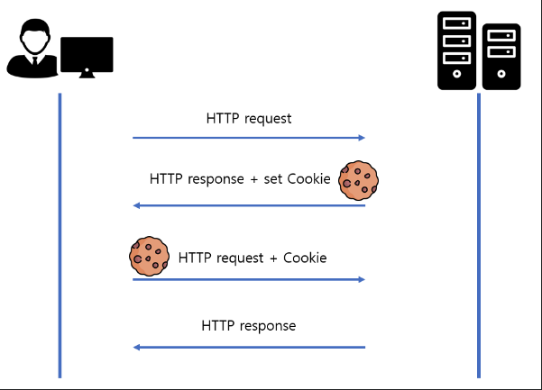
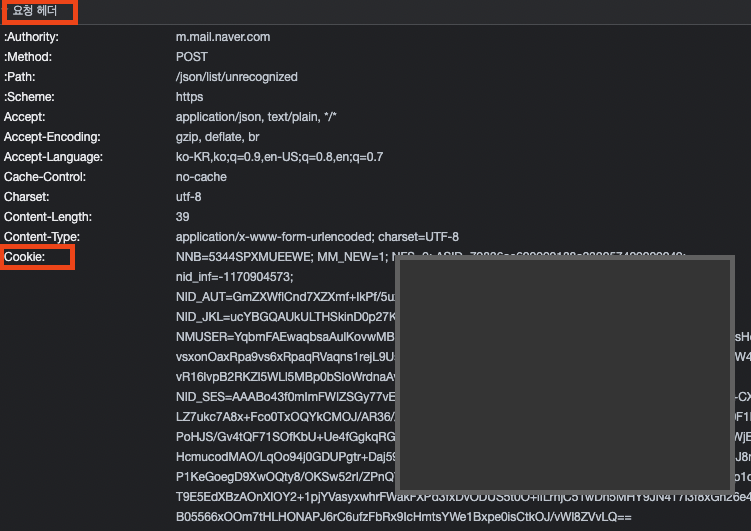

최근에 프로젝트에서 쿠키를 적용해야 할 일이 생겨 적용하였는데 생각보다 많이 어려워 정리 차원에서 글을 남기려고 합니다.
  

### 쿠키란 무엇인가?

---

쿠키란 웹사이트의 정보를 브라우저 쪽에 저장하는 작은 파일입니다 이 파일을 통해 유저 식별과 유저 상태를 관리할 수 있습니다. 유저의 웹 브라우저에 일시적으로 데이터를 저장해두었다가 다음에 유저가 웹에 접속하여도 이 데이터를 그대로 받을 수 있습니다
  

  
이미지 출처 - [stackoverflow](https://stackoverflow.com/questions/44130346/set-cookie-header-does-not-set-cookie-in-internet-explorer)

 

쿠키의 데이터 형태는 **이름(Key)=값(value)** 형식으로 구성되어 있습니다. 그리고 옵션으로 만료 기간, 도메인, 경로 httpOnly 등이 있습니다. 위 사진 빨간색 박스안에 `set-cookie`부분에 **token=RlVuk...**로 추가한 부분이 **key=value** 형식으로 구성된 데이터 형태를 말하며 다양한 옵션을 추가한 예시입니다.

쿠키는 **HTTP Header**를 기반으로 구현이 되어 있어 클라이언트 측에서 서버에게 요청을 하면 서버가 응답할 때 쿠키에 저장하고자 하는 정보를 **Header**의 `Set-Cookie`로 함께 전달하여 클라이언트에게 전달합니다. 그러면 클라이언트는 Header에 있는 Cookie를 브라우저에 저장하여 이후 클라이언트가 매번 요청하지 않아도 브라우저가 자동으로 Header에 `Cookie`를 실어서 서버에 요청을 하게 됩니다.

#### 쿠키를 사용하는 이유?

쿠키를 사용하는 이유는 HTTP의 특징과 관련이 있습니다. HTTP는 **비 연결성** 이라는 특징을 가지며, 클라이언트와 서버가 한 번의 요청과 응답 후 연결이 끊어집니다. 또한, HTTP는 **무 상태성**을 가지고 있어서 서버는 클라이언트의 상태를 기억하지 않고, 클라이언트는 모든 정보를 요청할 때마다 전달해야 합니다.

이러한 특징으로 인해 이전에는 사용자를 식별하고 상태를 유지하기 위해 매번 번거로운 인증 절차를 거쳐야 했습니다. 하지만 쿠키가 등장한 이후로는 웹 브라우저에 간단한 사용자 정보를 저장할 수 있게 되었습니다. 이를 통해 쿠키를 활용하여 간편하게 사용자 인증을 수행할 수 있습니다. 이제 사용자는 매번 번거로운 절차 없이 편리하게 서비스를 이용할 수 있습니다.

#### 쿠키 생성 방식

- 클라이언트가 서버 측에 특정 정보를 요청합니다.
- 서버는 쿠키를 생성합니다.
- 생성한 쿠키를 요청한 정보 헤더 부분에 추가하여 돌려보냅니다.
- 클라이언트는 응답 헤더에 있는 쿠키를 로컬에 저장합니다.
- 재방문 시 브라우저에 쿠키가 있는 경우 서버에 쿠키를 전달합니다.
- 혹시 업데이트할 정보가 있다면 서버는 해당 쿠키를 요청한 정보와 함께 돌려보냅니다.

  

 

### 쿠키의 단점들

---

**용량 문제** 

쿠키는 최대 4킬로바이트 와 사이트당 20개 모두 합쳐 300개가 최대이며 사양이 정해져 있습니다. 쿠키는 요청,응답 헤더에 추가되어 통신을 하기 때문에 통신량이 증가하면 요청과 응답 속도 모두에 영향이 있습니다.

**보안 문제**  

아래 사진과 같이 요청, 응답 시 쿠키 값이 그대로 노출 됩니다.  

  

  

1. XSS 공격 - 자바스크립트가 사용자의 컴퓨터에 실행된다는 점을 이용하여 공격할 수 있습니다. 아래 사진과 같이 개발자 모드에서 콘솔탭에 `document.cookie` 라는 명령어를 사용하면 현재 쿠키 정보들을 조회 할 수 있어 사이트 내에 쿠키 값을 탈취할 수 있습니다.
     

     

2. 스니핑 공격 - 네트워크 중간에 남의 패킷 정보를 도청하는 해킹 유형의 하나입니다 쿠키를 사용할 경우 서버와 클라이언트는 매번 쿠키를 주고받기 때문에 네트워크 상에 전달되는 쿠키가 스니핑 공격으로 탈취당할 수 있습니다.

 

### 어떤 옵션들이 있는가?

---

`[ key=Value ]` 
쿠키의 필수 값으로 key=value 형태로 저장되는 방식을 말한다
 

`[ Domain ]` 
쿠키를 받을 수 있는 클라이언트 도메인을 말한다. 기본 도메인 이외 서브 도메인에서도 쿠키를 전달하고 싶을 경우 해당 도메인 앞에 "." 을 추가하면 된다 (Domain=.cocount.co.kr) 이렇게 되면 서브 도메인에서도 쿠키를 사용할 수 있다. 만약 해당 옵션이 설정되어 있지 않으면 현재 접속하고 있는 도메인에서만 쿠키를 접근 할 수 있습니다

> 도메인이란? 숫자로 이루어진 IP 주소를 알기 쉽게 영문으로 표시된 것을 말하며 우리가 흔히 알고 있는 "www.naver.com" 을 말한다. 하지만 여기서 "www"는 호스트명이고 "naver.com"이 도메인이라고 말할 수 있습니다.
> 서브 도메인이란? 도메인의 일부로 기본 도메인의 앞에 다른 호스트 이름을 붙여 사용하는 것을 말합니다 예를 들어 "naver.com"을 기본 도메인이라고 하면 기본 도메인 앞에 "mail"이라는 호스트명을 추가하여 "mail.naver.com" 서브 도메인 형식으로 이용할 수 있습니다.
> 이렇게 서브 도메인을 사용하는 이유는 기본 도메인을 세분화하여 특정 기능 또는 서비스를 식별하기 위해 사용됩니다. 예를 들어 "mail.naver.com"은 이메일 서비스를 가리키는 서브 도메인이고 "blog.naver.com"은 블로그 서비스를 가리키는 서브 도메인입니다.
>  

`[ Path ]` 
어떤 경로에 해당 Cookie가 적용될지를 의미합니다. Path:/ 라고 한다면 모든 경로에 적용되며 Path=/downlad/라고 한다면 /download/ 이하의 경로에 적용된다
 

`[ Secure ]` 
해당 Cookie는 https 환경에서만 쿠키를 전달할 수 있도록 하는 옵션입니다.
 

`[ Max-Age ]` 
쿠키의 만료 기간을 설정할 수 있는 옵션입니다. 초 단위로 설정 할 수 있습니다
Max-Age=3600 일 경우 쿠키의 만료 기간은 1시간 후가 됩니다.
 

`[ Expires ]` 
쿠키의 유효일자를 설정할 수 있는 옵션입니다. GMT 포맷으로 쿠키의 만료 날짜를 설정할 수 있습니다.
Expires=Wed, 21 Oct, 2023 10:10:00 GMT;

 

`[ httpOnly ]` 
기본적으로 클라이언트에서 쿠키를 조회가 가능합니다 크롬에서 개발자 도구를 열어 콘솔 창에서 `document.cookie`만 검색해도 현재 저장되어 있는 쿠키 모두를 볼 수 있습니다 이렇게 자바스크립트로 쿠키를 접근하여 공격하는 것을 XSS 공격인데 이것을 막을 수 있는 방법이 이 옵션이다 즉 브라우저에서 쿠키 접근을 할 수 없도록 막는 옵션이다
 

`[ samesite ]` 
크게 3가지의 값을 줄 수 있습니다. 
**None** : 도메인이 다른 요청에도 <u>항상 전송할 수 있습니다</u>  
**Strict** : 도메인이 다른 요청에는 항상 전송이 불가능합니다 <u>오직 도메인이 같을 경우에만 전송</u>합니다  
**Lax** : 대부분 전송이 불가능하지만 몇 가지 <u>예외적일 경우 쿠키를 전송</u>할 수 있습니다 예외적인 사항이 GET 메소드이거나 `a`, `link` 링크를 사용할 경우에만 쿠키를 전송하는 것을 말한다 (POST 메소드일 경우에는 쿠키를 전송하지 않는다)   

> 기본적으로 samesite 옵션은 None으로 이용하였지만 **20년 4월 크롬 80 버전**부터는 기본값이 Lax로 변경되었고 None으로 사용 할 경우 **반드시 Secure 옵션**을 추가해주어야 하는 정책으로 변경됐습니다.

 

### 쿠키를 적용하면서 느낀점

---

**Next.js13** 환경에서 서버 컴포넌트에서 인증 인가가 필요한 API를 사용하기 위해서는 쿠키가 필요 했습니다. 기존에는 JWT를 활용하여 LocalStorage에 저장하여 사용하였는데 서버단에서는 LocalStorage에 접근을 할 수가 없다 보니 쿠키가 필요 하였습니다. 쿠키 작업은 생각보다 간단할 거라 생각했는데 그렇지 않았습니다.

로그인 후 서버단에서 set-cookie에 쿠키를 실어서 보내면 클라이언트단에서는 알아서 브라우저에 저장되고 매 요청마다 쿠키를 자동으로 실어서 서버 측에 전달해준다고 생각했습니다. 그리고 서버와 클라이언트의 도메인이 다를 경우 axios 옵션으로 `withcredentials : true` 로 주면 된다고 생각하였습니다.

그래서 처음에는 서버 측에서 `set-cookie`에 **key-value**형태의 값을 실어서 보냈더니 클라이언트에서는 쿠키가 실려 있지가 않았습니다. 왜 전달이 안되는지 찾다가 서로 다른 도메인이 문제인 거 같아서 **samesite** 옵션으로 none을 주고 이 옵션을 추가하였는데 해당 옵션을 사용하기 위해서는 **secure** 옵션을 반드시 추가 해야 했습니다. 그래서 클라이언트 도메인도 **https** 환경으로 변경하였습니다.

이렇게 하니 쿠키는 제대로 실려서 왔지만 이번엔 브라우저에 저장이 제대로 되지 않았는데 분명 `set-cookie`에 쿠키가 담겨서 왔지만 브라우저 단에서 저장이 되지 않아 찾아보던 중 **domain** 옵션에 클라이언트단 도메인을 추가해야 한다고 하여 추가 후 확인을 해보니 정상적으로 쿠키가 실려 왔고 저장 정상적으로 작동되었습니다.

한가지 의문 사항은 `samesite=none; secure=true;` 옵션을 추가하였는대 왜 다른 도메인에서 쿠키가 저장이되지 않는지 잘 모르겠습니다..

  
